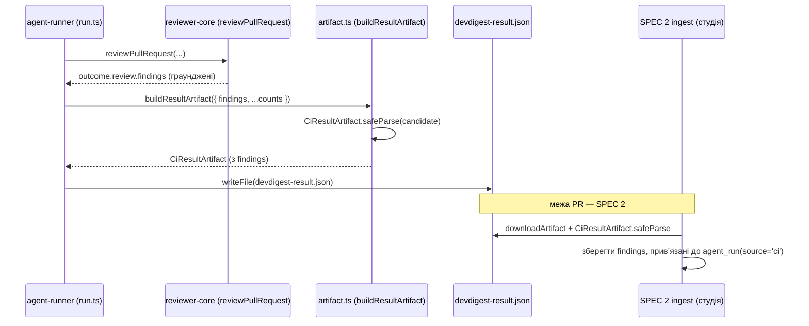

# Spec: agent-runner emits findings in result artifact | SPEC-2026-07-19-agent-runner-findings-artifact | Status: draft

Supersedes: N/A
Related: [SPEC-2026-07-12-export-to-ci](../../specs/SPEC-2026-07-12-export-to-ci.md) — попередній монолітний дизайн Export-to-CI; його рішення про поле `verdict` в артефакті ЗАМІНЕНО (див. `EXPORT_TO_CI_PLAN.md`, SPEC 2 Q11): CI Runs використовує STATUS + FINDINGS, без `verdict`. Цей spec — SPEC 1 з трьох (SPEC 1 agent-runner → SPEC 2 Export to CI → SPEC 3 Memory), що мапляться 1:1 на три послідовні PR.

## Проблема й навіщо

`agent-runner` уже повністю реалізований: він проганяє той самий `reviewer-core` engine, що й локальний прогін студії (grounding-gate + детермінований вердикт), і пише `devdigest-result.json` — артефакт, який студія пізніше підтягне (SPEC 2). Проте цей артефакт сьогодні містить лише **агреговані лічильники** findings (`findings_count`, `critical`, `warning`, `suggestion`), але не самі findings. Через це майбутній CI-ingest (SPEC 2) не зможе показати повні деталі кожного finding (title, category, file:line, confidence, rationale) — тобто CI-прогони будуть біднішими за локальні. Єдина зміна цього spec — почати **емітити самі findings** у результат-артефакт, щоб CI досяг паритету з локальними прогонами.

## Goals / Non-goals

**Goals:**

- Розширити контракт `CiResultArtifact` полем `findings: Finding[]` (переіспользуючи наявний `Finding` з `contracts/findings.ts`), синхронно в обох дзеркалах (`server/…` і `client/…`).
- `agent-runner/src/artifact.ts` (`buildResultArtifact`) — включити в артефакт саме той масив `findings`, що вже передається на вхід (grounded findings, з яких рахуються лічильники), і провалідувати проти того самого `CiResultArtifact` Zod-контракту.
- `agent-runner/src/run.ts` — протягнути `outcome.review.findings` у побудову артефакту (вже передаються для лічильників; тепер вони ще й потраплять у вихід).
- Зберегти паритет: findings в артефакті = ГРАУНДЕНІ findings (той самий масив, що йде в лічильники й у GitHub-постинг), а не сирий self-report моделі.
- Тести `agent-runner/src/run.test.ts` перевіряють, що `artifact.findings` присутній і має правильну форму.

**Non-goals:**

- **НЕ** додавати поле `verdict` будь-де (ні в контракт, ні в артефакт, ні в БД): CI Runs оперує STATUS + FINDINGS, не вердиктом (SPEC 2 Q11). Це явно скасовує рішення попереднього spec.
- **НЕ** змінювати review-engine (`reviewer-core`): grounding-gate, `toReviewPayload`, `countBlockers`, `gateTriggered` лишаються як є.
- **НЕ** чіпати модуль `reviews/` та локальний review-пайплайн сервера.
- **НЕ** реалізовувати ingest / `ci_runs` / сторінку CI Runs / Export Wizard — це SPEC 2.
- **НЕ** знімати чи послаблювати grounding: findings, що потрапляють в артефакт, — це вже відгрануджений результат.
- Жодних інших полів на `CiResultArtifact` не додається/не видаляється; усі наявні поля зберігаються.

## User stories

- Як розробник студії, я хочу, щоб CI-артефакт містив повні деталі кожного finding, щоб (у SPEC 2) сторінка CI Runs показувала per-finding деталі з тим самим UX, що й локальні прогони.
- Як мейнтейнер `agent-runner`, я хочу, щоб емітований масив findings був тим самим граундженим масивом, з якого рахуються лічильники, щоб між `findings` та `findings_count` не було розбіжностей.

## Acceptance criteria (EARS)

### Контракт

- **AC-1:** КОЛИ вносяться контрактні зміни, система повинна (shall) розширити `CiResultArtifact` полем `findings: Finding[]`, переіспользуючи наявний `Finding` з `contracts/findings.ts` (не вводячи нового типу), синхронно в обох дзеркалах `server/src/vendor/shared/contracts/eval-ci.ts` і `client/src/vendor/shared/contracts/eval-ci.ts`, зберігаючи всі наявні поля (`findings_count`, `critical`, `warning`, `suggestion`, `cost_usd`, `duration_ms`, `agent`, `version`, `pr_number`) без змін.
  `observable: diff обох eval-ci.ts — додано лише findings; typecheck server + client зелений; жодне наявне поле не видалене`
- **AC-2:** КОЛИ обидва дзеркала `eval-ci.ts` порівнюються, вони повинні (shall) лишатися ідентичними за формою `CiResultArtifact` (той самий набір і той самий тип полів).
  `observable: diff між server/…/eval-ci.ts і client/…/eval-ci.ts у частині CiResultArtifact — порожній`

### Побудова артефакту

- **AC-3:** КОЛИ `buildResultArtifact` (`agent-runner/src/artifact.ts`) будує артефакт, він повинен (shall) включити у вихідний об'єкт поле `findings`, рівне вхідному масиву `input.findings` (тому самому, з якого обчислюються лічильники severity), і провалідувати кандидата проти того самого `CiResultArtifact` Zod-схеми, що й раніше.
  `observable: unit artifact.test — buildResultArtifact з N findings → result.findings має довжину N і дорівнює входу; safeParse success`
- **AC-4:** ЯКЩО побудований кандидат-артефакт не проходить `CiResultArtifact.safeParse` (внутрішня помилка форми), ТОДІ система повинна (shall) кинути `RunnerError`, а НЕ повернути частково-валідний артефакт (наявна поведінка зберігається і поширюється на нове поле).
  `observable: unit — підсунутий некоректний finding (напр. severity поза enum) → buildResultArtifact кидає RunnerError`
- **AC-5:** Система повинна (shall) підтримувати інваріант `artifact.findings.length === artifact.findings_count` — тобто емітований масив і агрегований лічильник рахують той самий набір findings.
  `observable: unit + run.test — для будь-якого прогону findings.length === findings_count`

### Оркестрація (run.ts) і паритет

- **AC-6:** КОЛИ `runCi` (`agent-runner/src/run.ts`) успішно завершує review, він повинен (shall) передати у `buildResultArtifact` саме `outcome.review.findings` (граунджені findings після `reviewPullRequest`), так що емітовані findings — це ГРАУНДЖЕНИЙ результат (той самий масив, що вже йде в `countBlockers`/`toReviewPayload`), а НЕ сирий self-report моделі.
  `observable: run.test — стаб віддає grounded+hallucinated review; після прогону artifact.findings містить лише граунджений(і) finding (id "f1"), halлюцинований (line 999) відсутній`
- **AC-7:** ЯКЩО прогін hard-fail (невалідний маніфест, відсутній скіл-файл, нерозв'язний CI-контекст, помилка diff-fetch чи помилка виклику LLM), ТОДІ система повинна (shall) НЕ писати артефакт і повернути `{ exitCode: 1, artifact: null }` (наявна поведінка Q5 зберігається — нове поле її не змінює).
  `observable: run.test — стаб LLM кидає → result.artifact === null, файл devdigest-result.json не створено`

### Форма записаного артефакту

- **AC-8:** КОЛИ `runCi` записує `devdigest-result.json`, записаний JSON повинен (shall) проходити `CiResultArtifact.safeParse` з непорожнім/порожнім (за наявності findings) масивом `findings`, кожен елемент якого відповідає `Finding` (id, severity, category, title, file, start_line, end_line, rationale, confidence, …).
  `observable: run.test — прочитати файл з диску → CiResultArtifact.safeParse success; parsed.findings[0].id === "f1"; findings[0].severity === "CRITICAL"`

## Edge cases

- **Нуль findings:** граунджений review без жодного finding → `findings: []`, `findings_count: 0`. Артефакт валідний; STATUS у SPEC 2 виведеться як `no_findings`. (AC-5, AC-8)
- **Усі findings відкинуті grounding-gate:** валідний zero-finding success (не помилка) → `findings: []`. (AC-6, AC-22-паритет наявних тестів)
- **Hard-fail до наявності граунджу:** артефакт не пишеться взагалі → `findings` не існує, бо файлу немає. (AC-7)
- **Некоректний finding у вході:** `safeParse` падає → `RunnerError`; це трактується як внутрішній баг рантайму, не як помилка користувача. (AC-4)
- **Старіші (pre-SPEC-1) артефакти без `findings`:** accepted risk — таких немає: SPEC 1 мержиться ПЕРШИМ (PR 1), до появи будь-якого CI-export (SPEC 2, PR 2), тож жоден реальний артефакт не передує цьому полю. `findings` робимо обов'язковим.

## Data model / Schema

Змін у БД немає (контракт-only). Форма `CiResultArtifact` після цього spec:

**CiResultArtifact**: findings_count, critical, warning, suggestion, cost_usd, duration_ms, agent, version, pr_number, **findings** (масив `Finding`).

**Finding** (переіспользується без змін): id, severity (CRITICAL|WARNING|SUGGESTION), category (bug|security|perf|style|test), title, file, start_line, end_line, rationale, suggestion?, confidence (0–1), kind?, trifecta_components?, evidence?.

## Service communication

`agent-runner` не перетинає межі модулів у рантаймі — він самодостатній у CI. Потік даних (для контексту SPEC 2):



## Contracts (high-level)

`devdigest-result.json` (без нового API-ендпоінта; це артефакт CI-job):

```
{
  findings_count: number,
  critical?: number, warning?: number, suggestion?: number,
  cost_usd: number | null,
  duration_ms?: number,
  agent: string,
  version?: string,
  pr_number?: number,
  findings: Finding[]        // ← нове; решта незмінна
}
```

## Non-functional

- **Паритет (Reliability):** система повинна (shall) емітити ті самі граунджені findings, що студія показала б для локального прогону того самого review — без додаткового виклику LLM і без окремого проходу grounding (переіспользується `outcome.review.findings`). `[перевірка: AC-6]`
- **Розмір бандла:** цей spec не додає рантайм-залежностей до `agent-runner`; `dist/index.js` (ncc) перебудовується `pnpm --dir agent-runner build`, бандл gitignored. Приросту залежностей бути не повинно (shall not). `observable: package.json agent-runner без нових deps`

## Inputs (provenance)

- Масив findings у побудові артефакту — [reused: AC-6] з `outcome.review.findings`, вже обчислений `reviewPullRequest` у наявному пайплайні. Жодного нового виклику LLM.
- Лічильники severity — [deterministic: agent-runner] обчислюються з того самого масиву (`severityCounts`).

## Untrusted inputs

N/A для цього spec: findings, що потрапляють в артефакт, — це вже відгрануджений, структурований результат `reviewer-core` (Zod-типізовані `Finding`), а не сирий зовнішній текст. Обгортання недовіреного вводу (`wrapUntrusted` diff / PR body) уже відбувається всередині `reviewPullRequest` перед формуванням findings і цим spec не зачіпається.

## Verification hints

- AC-1/AC-2 → grep `findings` в обох `eval-ci.ts`; `pnpm typecheck` у `server/` і `client/`; візуальний diff форми `CiResultArtifact`.
- AC-3/AC-4/AC-5 → unit на `buildResultArtifact`: подати N findings → перевірити `result.findings` (довжина, рівність входу, `findings_count`); подати некоректний finding → очікувати `RunnerError`.
- AC-6 → `run.test.ts`: стаб `GROUNDED_PLUS_HALLUCINATED_REVIEW` → після `runCi` перевірити, що `artifact.findings` містить лише граунджений finding (`id "f1"`), а halлюцинований (line 999) відсутній.
- AC-7 → `run.test.ts`: стаб LLM `'throw'` → `result.artifact === null`, файл не створений.
- AC-8 → `run.test.ts`: прочитати `devdigest-result.json` з диску → `CiResultArtifact.safeParse` success; перевірити форму `findings[0]`.

## [NEEDS CLARIFICATION]

- Порядок findings в артефакті: наразі не специфіковано детермінований сорт; SPEC 2 ingest не має покладатися на порядок. Якщо CI Runs потребує стабільного впорядкування — визначити в SPEC 2 на боці рендеру, не в артефакті.
