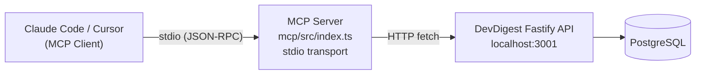
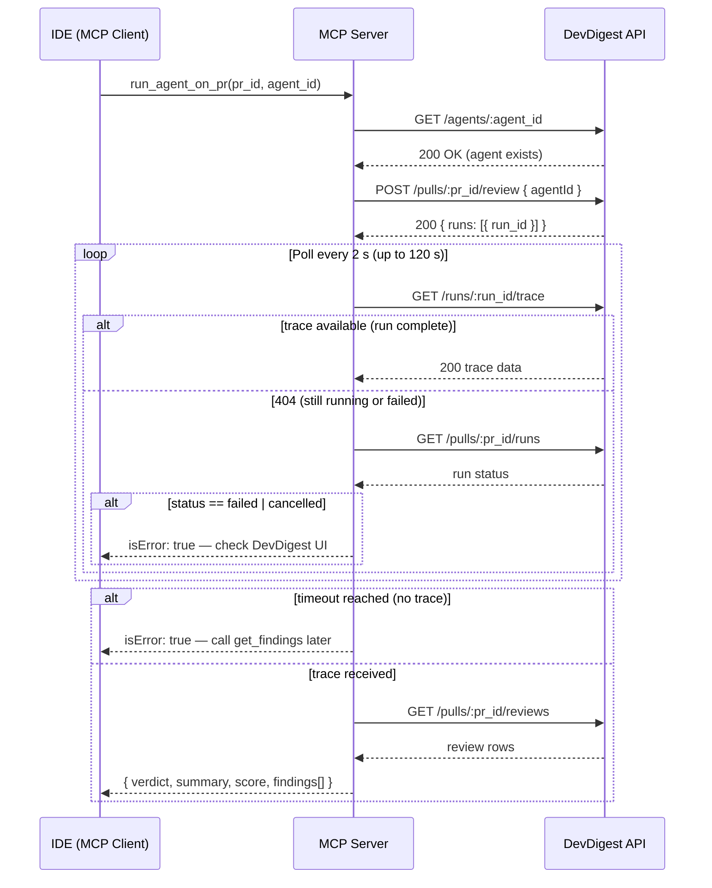

# DevDigest MCP Server

A standalone [Model Context Protocol](https://modelcontextprotocol.io/) server that exposes DevDigest review tools to AI assistants — Claude Code, Cursor, and any other MCP-capable client.

The server runs over **stdio transport**, communicates with the DevDigest Fastify API over HTTP, and provides five tools that let an AI assistant trigger code reviews, read findings, and inspect repository conventions directly from the editor.

---

## Architecture

**Figure 1: Request path from IDE to database**



---

## Tools

| Tool | Description | Read / Write |
|------|-------------|-------------|
| `list_agents` | List configured review agents with their IDs, models, and enabled status | Read |
| `run_agent_on_pr` | Run a single agent on a PR, poll until complete, return verdict + findings | Write |
| `get_findings` | Get all review verdicts and findings for a PR (for previously run reviews) | Read |
| `get_conventions` | Get accepted coding conventions for a repository | Read |
| `get_blast_radius` | Impact map for a PR (stub — coming soon) | Read |

---

## Prerequisites

- Node >= 22
- pnpm >= 10
- DevDigest API running on `:3001`

Start the full stack (API + database) with:

```bash
./scripts/dev.sh
```

---

## Installation

Run once from the `mcp/` directory:

```bash
cd mcp
pnpm install
cp .env.example .env   # adjust DEVDIGEST_API_URL if needed
pnpm typecheck
```

---

## Configuration — IDE Setup

### Claude Code

Add to `~/.claude/settings.json`:

```json
{
  "mcpServers": {
    "devdigest": {
      "type": "stdio",
      "command": "npx",
      "args": ["tsx", "/absolute/path/to/dev-digest/mcp/src/index.ts"],
      "env": {
        "DEVDIGEST_API_URL": "http://localhost:3001"
      },
      "timeout": 150000
    }
  }
}
```

> `timeout: 150000` is required. `run_agent_on_pr` polls up to `MCP_POLL_TIMEOUT_MS` (default 120 s) before returning, so the client timeout must be larger than the poll window.

### Cursor

Add to `.cursor/mcp.json` using the same structure, omitting the `"type"` field:

```json
{
  "mcpServers": {
    "devdigest": {
      "command": "npx",
      "args": ["tsx", "/absolute/path/to/dev-digest/mcp/src/index.ts"],
      "env": {
        "DEVDIGEST_API_URL": "http://localhost:3001"
      }
    }
  }
}
```

---

## On-Demand Toggle

By default the MCP server is **disabled** to avoid token usage on every session. Enable it only when you intend to use the review tools.

```bash
# Enable — then restart your Claude Code / Cursor session
./scripts/mcp-on.sh
# or, from the mcp/ directory:
pnpm on

# Disable
./scripts/mcp-off.sh
# or:
pnpm off
```

---

## Manual Testing with MCP Inspector

```bash
cd mcp
npx @modelcontextprotocol/inspector npx tsx src/index.ts
```

This opens the browser UI. Click **Connect**, then browse **Tools** to invoke any tool interactively.

---

## `run_agent_on_pr` Flow

**Figure 2: Polling sequence for run_agent_on_pr**



---

## Environment Variables

| Variable | Default | Description |
|---|---|---|
| `DEVDIGEST_API_URL` | `http://localhost:3001` | DevDigest API base URL |
| `MCP_POLL_INTERVAL_MS` | `2000` | Polling interval for `run_agent_on_pr` |
| `MCP_POLL_TIMEOUT_MS` | `120000` | Max wait time for `run_agent_on_pr` |

All three are validated at startup via Zod in `src/config.ts`. The server exits immediately if `DEVDIGEST_API_URL` is not a valid URL.

---

## Actionable Error Messages

Each tool returns errors that tell the AI what to do next rather than raw HTTP status codes.

| Situation | Error text |
|---|---|
| Agent ID not found | `Agent '<id>' not found. Call list_agents to get valid IDs.` |
| PR ID not found | `PR '<id>' not found. Check the pr_id or import PRs via the DevDigest UI.` |
| Review run failed | `Review run failed with status 'failed'. Check DevDigest UI for details.` |
| `run_agent_on_pr` times out | `Run timed out after 120s. Check run status later via get_findings with pr_id='<id>'.` |
| No reviews exist for a PR | `No reviews found for PR '<id>'. Run a review first with run_agent_on_pr.` |
| API unreachable | `Cannot reach DevDigest API at <url>. Is the server running?` |

---

## Package Structure

```
mcp/
  src/
    index.ts          # entry point — composition root (config, client, server, transport)
    config.ts         # reads env vars, validates with Zod, exports McpConfig
    server.ts         # McpServer factory — registers all five tools
    api-client.ts     # DevDigestClient (fetch wrapper) + mcpError / mcpSuccess helpers
    tools/
      list-agents.ts       # GET /agents
      run-agent-on-pr.ts   # POST /pulls/:id/review + polling loop
      get-findings.ts      # GET /pulls/:id/reviews
      get-conventions.ts   # GET /repos/:id/conventions (accepted only)
      get-blast-radius.ts  # stub — returns { stub: true }
```
