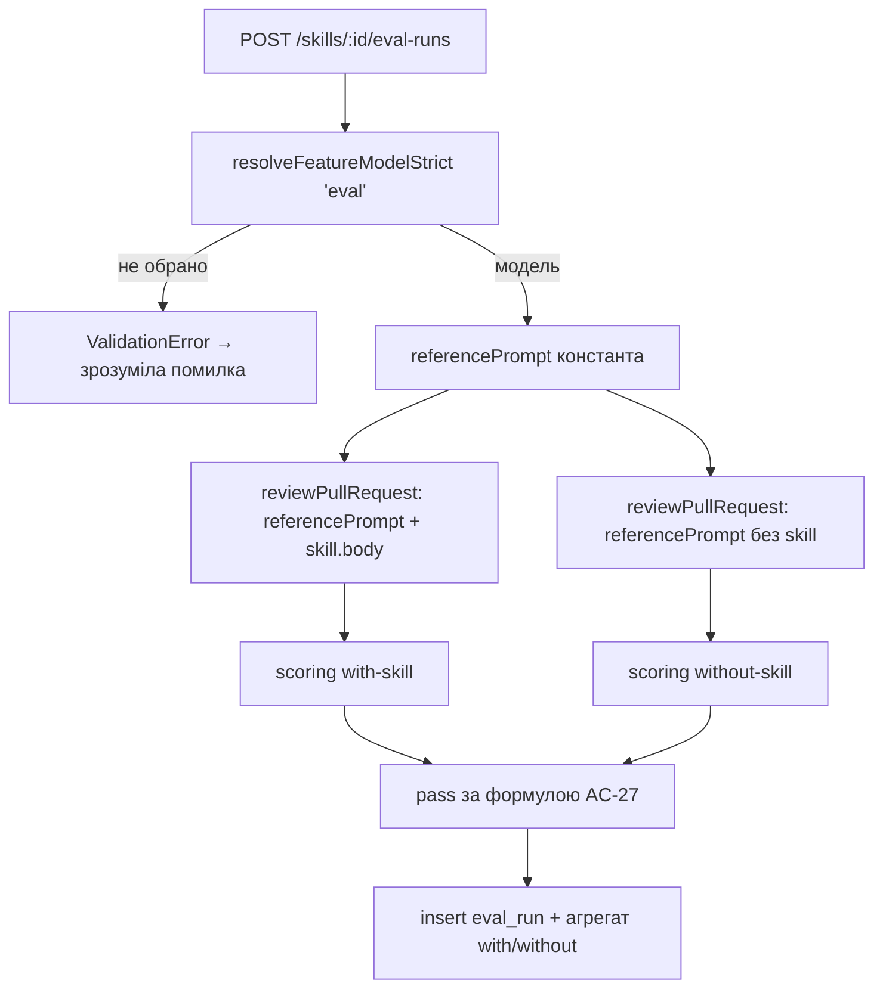

# Spec: Eval Pipeline | SPEC-2026-07-06-eval-pipeline | Status: draft
Supersedes: N/A
Related: N/A

## Проблема й навіщо
Команда правит system prompt агента-ревʼюера «на відчуття» — немає обʼєктивної цифри, чи стало краще. При цьому щоденна рутина ревʼю вже породжує розмічені приклади: Accept на finding = «агент ПОВИНЕН це знаходити», Dismiss = «агент НЕ повинен цього флагувати». Ці рішення нікуди не капіталізуються. Ця фіча перетворює accepted/dismissed findings на постійний регресійний gold set, проганяє агента по всьому набору й показує recall / precision / citation_accuracy та їхній зсув між двома прогонами. Важливо: пайплайн **нічого не покращує сам** — це вимірювальний прилад (як `npm test`), поведінку агента змінює лише ручна правка промпта в уже наявному Config-табі. Значна частина інфраструктури вже заскаффолджена в попередньому уроці й ніколи не була підключена — ця фіча про «підключити проводку», а не «винайти її».

## Goals / Non-goals
**Goals:**
- Розширити наявну таблицю `eval_runs` двома nullable-колонками (`batch_id uuid`, `agent_version integer`) для групування прогонів у batch і привʼязки до знімка версії агента. Нової таблиці немає.
- Новий серверний модуль `server/src/modules/evals/` (Onion, за образцом `reviews/`): routes / service / repository / **чистий scoring без жодного LLM-виклику** / diff-slice / helpers.
- «Turn into eval case» на `FindingCard`: активна лише для вже вирішеного finding, відкриває **предзаповнену** `EvalCaseModal` (не тиха вставка в БД).
- `EvalsTab` — **один** переіспользуваний компонент, змонтований і в `AgentEditor`, і в `SkillEditor`.
- Eval Dashboard: лендинг `/eval` (лише агенти) + детальна сторінка агента `/eval/[agentId]` з трендом, alert-баннером, таблицею прогонів і `CompareRunsModal` (GitHub-style дифф system prompt + Promote).
- Скіл-кейси проганяються через **reference-agent** (константний текст промпта + модель з Feature Models `"eval"`) з **обовʼязковим with/without** порівнянням.
- Новий скрипт `pnpm verify:l06` (у `evals/package.json`) як зелений сквозний чек.

**Non-goals:**
- Нової таблиці для batch/summary немає — `EvalBatchSummary` рахується агрегацією `eval_runs` по `batch_id`, не зберігається окремо.
- У скілів **немає** окремої detail-сторінки дашборда (`/eval/[skillId]` не існує), немає `CompareRunsModal`, немає Promote — лише таб Evals з плитками метрик.
- Лендинг `/eval` — **тільки про агентів**; секції зі скілами туди не додаються.
- Пайплайн не пише й не редагує промпти автоматично; єдина мутація конфігу — ручний Promote (тільки `system_prompt`).
- Колонка зворотного посилання `finding_id` у `eval_cases` не додається (походження не грейдиться, дедуп не потрібен).
- Accessibility (A11y) — не в scope цього проєкту.
- Бонус-скоуп (статистика на картках агента/скіла) — **окремий, нижчого пріоритету** тир критеріїв, поза грейдинговою рубрикою домашки.

## User stories
- Як ревʼюер, я хочу одним кліком з вирішеного finding створити регресійний eval-кейс, щоб зафіксувати реальний приклад як тест.
- Як ревʼюер, я хочу задавати кейси обох типів — «MUST FIND» (позитивний) і «MUST NOT FLAG» (негативний), щоб ловити і пропуски, і хибні спрацювання.
- Як інженер, я хочу натиснути «Run all evals» і отримати recall / precision / citation_accuracy по всьому gold set, щоб мати обʼєктивну цифру замість відчуття.
- Як інженер, я хочу відредагувати system prompt і побачити, що метрики між двома прогонами реально зсунулись, щоб довіряти зміні.
- Як інженер, я хочу порівняти два прогони з побудовним GitHub-style діффом промпта й за потреби «Promote» кращу версію, щоб застосувати її до живого агента.
- Як автор скіла, я хочу прогнати кейси скіла з обовʼязковим with/without порівнянням, щоб виміряти саме внесок скіла, а не збіг зі здібностями моделі.
- Як інженер, я хочу довіряти, що scoring рахує арифметику без жодного LLM-виклику, щоб цифри були детермінованими й дешевими.

## Acceptance criteria (EARS)

### Core — грейдингова рубрика L06

- **AC-1:** КОЛИ застосовується нова міграція, система повинна (shall) додати до таблиці `eval_runs` колонки `batch_id` (uuid, nullable) та `agent_version` (integer, nullable) і індекс по `batch_id`, не змінюючи `eval_cases` і не редагуючи наявні файли міграцій.
  `observable: перевірити згенеровану міграцію 0018_* + \d eval_runs у Postgres після pnpm db:migrate`
- **AC-2:** КОЛИ викликається `POST /eval-cases` з тілом `EvalCaseInput`, система повинна (shall) вставити рядок `eval_cases` з розвʼязаними `owner_kind`/`owner_id` і повернути `EvalCase`; походження («Seeded from a accepted/dismissed finding») записується у наявне текстове поле `notes`, а не в нову колонку.
  `observable: curl POST /eval-cases → 200 EvalCase; рядок у БД має notes`
- **AC-3:** КОЛИ scoring рахує метрики одного кейса, система повинна (shall) обчислити `recall`/`precision`/`tp`/`fp`/`fn` **без жодного LLM-виклику**, де збіг = однаковий `file` І перетин інтервалів `[start_line, end_line]` через переіспользувану `rangeIntersects` з `reviewer-core/src/grounding.ts`.
  `observable: hermetic unit scoring.test.ts — лічильник LLM-адаптера = 0; арифметика recall/precision на фіксованих входах`
- **AC-4:** Система повинна (shall) визначати `recall = 1.0`, коли `expected.length === 0`, і `precision = 1.0`, коли `actual.length === 0`.
  `observable: unit — порожній expected → recall 1.0; порожній actual → precision 1.0`
- **AC-5:** КОЛИ виконується `POST /eval-cases/:id/run` для кейса з `owner_kind='agent'`, система повинна (shall) прогнати `reviewPullRequest` з `systemPrompt`/`model`/`provider` агента-власника (рівно **1** LLM-виклик), порахувати через scoring і вставити рядок `eval_runs` з новим `batch_id` та `agent_version = agent.version`.
  `observable: it — POST /eval-cases/:id/run → рядок eval_runs з batch_id+agent_version; лічильник LLM = 1`
- **AC-6:** КОЛИ виконується `POST /agents/:id/eval-runs` («Run all evals»), система повинна (shall) під одним спільним `batch_id` прогнати всі `eval_cases` цього агента, обчислити **macro-average** агрегат (середнє метрик по кейсах, НЕ сумарний перерахунок TP/FP/FN) і повернути `EvalBatchSummary` + масив `EvalRunResult`.
  `observable: it — 3 кейси → 1 batch_id на всі 3; recall_batch = mean(recall кейсів)`
- **AC-7:** КОЛИ агент має ≥8 eval-кейсів (мікс `must_find`/`must_not_flag`) і його system prompt редагується між двома прогонами «Run all evals», система повинна (shall) відобразити **різні** агреговані recall/precision у двох послідовних batch-прогонах (правка промпта дає вимірюваний зсув).
  `observable: it — засіяти ≥8 кейсів, batch#1 → правка systemPrompt → batch#2 → recall_batch#1 ≠ recall_batch#2`
- **AC-8:** ДЕ finding вже вирішено (`acceptedAt != null` АБО `dismissedAt != null`), клієнт повинен (shall) показати активну кнопку «Turn into eval case» на `FindingCard`; ЯКЩО finding ще не вирішено, ТОДІ кнопка повинна (shall) бути disabled.
  `observable: component — accepted/dismissed finding → кнопка enabled; невирішений → disabled`
- **AC-9:** КОЛИ користувач натискає «Turn into eval case», система повинна (shall) викликати `POST /findings/:id/eval-case`, який **не вставляє рядок**, а повертає предзаповнений `EvalCaseInput` (для accepted → `expected_output` з одним finding `{file,start_line,end_line,severity,category,title}`; для dismissed → `expected_output: []`), і відкрити `EvalCaseModal` з цими даними; реальне збереження йде через звичайний `POST /eval-cases`.
  `observable: it — POST /findings/:id/eval-case на accepted → EvalCaseInput з непорожнім expected_output, у БД нового рядка немає`
- **AC-10:** КОЛИ `EvalCaseModal` відкрито, клієнт повинен (shall) показати обчислюваний (не збережений окремим полем) баннер: `expected_output.length > 0` → «POSITIVE CASE — MUST find …»; `expected_output.length === 0` → «NEGATIVE CASE — must NOT flag …».
  `observable: component — expected з елементом → POSITIVE банер; порожній → NEGATIVE банер`
- **AC-11:** КОЛИ прогін кейса типу `must_find` (непорожній `expected_output`), scoring повинен (shall) виставити `pass = (recall === 1 && precision === 1)`; КОЛИ кейс типу `must_not_flag` (порожній `expected_output`), `pass` повинен (shall) бути true лише якщо фактичних збігів у регіоні кейса немає (`precision === 1`, false-flag відсутній).
  `observable: unit — must_find зі збігом → pass=true; must_not_flag зі спрацюванням у регіоні → pass=false`
- **AC-12:** КОЛИ обчислюється `citation_accuracy` кейса, система повинна (shall) переіспользувати результат обовʼязкового `groundFindings` з `reviewPullRequest` як `findings.length / (findings.length + dropped.length)`, без другого проходу grounding.
  `observable: unit — outcome з N findings + M dropped → citation = N/(N+M)`
- **AC-13:** КОЛИ завантажено `/eval`, клієнт повинен (shall) показати **кожного** агента (навіть без кейсів / без прогонів): агент без прогонів → плейсхолдер «Not run yet» замість чисел і плоский спарклайн; агент без кейсів → приглушена строка «0 eval cases · configure to get started» без метрик; клік по строці веде на `/eval/[agentId]`.
  `observable: component — агент без прогонів → "Not run yet"; без кейсів → приглушена строка; клік → навігація на /eval/[id]`
- **AC-14:** КОЛИ викликається `GET /eval-dashboard`, система повинна (shall) повернути `{ agents: EvalDashboard[], recent_runs: EvalBatchSummary[] }`, де `agents` містить сводку на кожного агента (включно з такими, що без кейсів/прогонів), а `recent_runs` — плоский список останніх N batch-ів по всіх агентах, відсортований за `ran_at`.
  `observable: it — GET /eval-dashboard → agents покриває всіх агентів; recent_runs відсортовано desc за ran_at`
- **AC-15:** ЯКЩО по всьому workspace ще немає жодного batch-прогону, ТОДІ `recent_runs` повинен (shall) бути `[]`, а клієнт повинен (shall) показати `EmptyState` «No eval runs yet».
  `observable: component — recent_runs=[] → EmptyState видно`
- **AC-16:** КОЛИ натиснуто «Run all agents» на лендингу, система повинна (shall) викликати `POST /eval-runs/all`, що проганяє тільки `enabled=true` агентів з `eval_cases.count > 0` (свій `batch_id` на агента), мовчки пропускає агентів без кейсів і повертає масив `EvalBatchSummary` по одному на реально прогнаного агента.
  `observable: it — 2 агенти з кейсами + 1 без → 2 EvalBatchSummary`
- **AC-17:** КОЛИ відкрито `/eval/[agentId]`, клієнт повинен (shall) показати 3 плитки `MetricCard` (Recall/Precision/Citation) зі стрілками-дельтами (**останній batch мінус передостанній**, macro-average), `LineChart` тренду з 3 серій і таблицю прогонів з чекбоксами (макс. 2 вибрані), де `pass`-колонка форматується як «X/Y», а `cost` — сума `cost_usd` batch-а.
  `observable: component — mock EvalDashboard з ≥2 batch → дельти показано; ≤1 batch → голе число без стрілки`
- **AC-18:** ЯКЩО для агента існує менше двох batch-прогонів, ТОДІ дельта/стрілка **не показується** (лише голе число); колонка «TRACES PASSED» ніколи не має стрілки-дельти.
  `observable: component — 1 batch → без стрілок; traces passed завжди без дельти`
- **AC-19:** ДЕ сервер виявляє помітну зміну агрегатів між двома останніми batch-ами, `EvalDashboard.alert` повинен (shall) містити шаблонну фразу про конкретний кейс, чий `pass` перевернувся (must_not_flag → новий false positive; must_find → пропущено finding); інакше `alert = null` і клієнт баннер не показує.
  `observable: it — перевернути один кейс між batch → alert != null з посиланням на кейс; без змін → null`
- **AC-20:** КОЛИ у `CompareRunsModal` вибрано два прогони, клієнт повинен (shall) показати дельти метрик (recall/precision/citation/cost, старе→нове з кольоровими стрілками) і **побудовний GitHub-style дифф** (зелене/красне) `system_prompt` двох `agent_versions`, згенерований чистою LCS-утилітою й відрендерений через наявні `parsePatch` + `CodeLine` (`client/src/components/diff-viewer/`), без npm diff-залежності й без двох окремих текстових блоків.
  `observable: component — два прогони з різними промптами → рядкова підсвітка +/− через CodeLine`
- **AC-21:** КОЛИ натиснуто «Promote {права версія}», система повинна (shall) застосувати **тільки** `system_prompt` вибраної версії через наявний `PATCH /agents/:id` (не чіпаючи model/skills/strategy); ЯКЩО права версія вже дорівнює поточній `agent.version`, ТОДІ кнопка повинна (shall) бути disabled.
  `observable: component — selectedRun.agent_version === agent.version → Promote disabled; інакше клік шле PATCH лише з system_prompt`
- **AC-22:** КОЛИ виконується `pnpm verify:l06` (у `evals/package.json`), система повинна (shall) послідовно прогнати typecheck `server` → typecheck `client` → hermetic scoring unit-тест → інтеграційний тест, що засіює ≥8 кейсів і доводить зсув recall/precision між двома batch-прогонами після правки промпта, і завершитися з кодом 0, якщо всі кроки зелені.
  `observable: cd evals && pnpm verify:l06 → exit 0; будь-який червоний крок → ненульовий код`

### Extended — скіли (поза грейдинговою рубрикою, узгоджено в тій же сесії)

- **AC-23:** КОЛИ `EvalsTab` монтується, він повинен (shall) бути **одним** компонентом, що приймає `ownerKind`/`ownerId` пропами й підключається і в `AgentEditor` (нова вкладка `"evals"` у `TABS`/`VALID_TABS`), і в `SkillEditor` (нова вкладка `"evals"` у наявному `TAB_DEFS`).
  `observable: component — один і той самий EvalsTab рендериться під agent і під skill з різними пропами`
- **AC-24:** КОЛИ виконується прогін кейса з `owner_kind='skill'`, система повинна (shall) виконати **два** LLM-виклики `reviewPullRequest` через reference-agent: (а) `${referencePrompt}\n\n${skill.body}` (with-skill), (б) той самий `referencePrompt` без скіла (without-skill), обидва пораховані через scoring, з збереженням обох пар метрик.
  `observable: it — POST /skills/:id/eval-runs → лічильник LLM = 2 на кейс; збережено with/without метрики`
- **AC-25:** КОЛИ визначається модель reference-agent, система повинна (shall) взяти її з Feature Models через `resolveFeatureModelStrict(container, workspaceId, "eval")` (новий 6-й елемент `FeatureModelId`/`FEATURE_MODELS`), а **не** хардкодити модель і не брати `provider`/`model` реального прикріпленого агента; текст reference system prompt лишається константою в коді модуля (`reference-prompt.ts`).
  `observable: it — модель прогону = обрана в Settings для "eval"; текст промпта = константа`
- **AC-26:** ЯКЩО модель для фічі `"eval"` не обрана в Settings, ТОДІ `resolveFeatureModelStrict` повинен (shall) кинути `ValidationError`, а ендпоінт `POST /skills/:id/eval-runs` повинен (shall) повернути зрозумілу помилку валідації (не 500 / не stack trace).
  `observable: it — без вибору моделі "eval" → 4xx з повідомленням «choose one in Settings → Feature Models»`
- **AC-27:** КОЛИ рахується `pass` для скіл-кейса `must_find`, система повинна (shall) вважати `pass = true` лише якщо with-skill проходить критерій кейса (`recall_with === 1 && precision_with === 1`) І without-skill той самий критерій **не** проходить (`recall_without < 1 || precision_without < 1`) — тобто скіл реально вніс різницю; для `must_not_flag` скіл-кейса `pass = true`, якщо with-skill не дає false-flag у регіоні кейса. (Порогова формула v1, тонко налаштовується пізніше.)
  `observable: unit — with проходить, without не проходить → pass=true; обидва проходять → pass=false`
- **AC-28:** КОЛИ відкрито таб Evals у `SkillEditor`, клієнт повинен (shall) показати лише список кейсів + агреговані плитки метрик (поточне with/without) і НЕ повинен (shall not) рендерити графік тренду, таблицю історії прогонів, `CompareRunsModal`, кнопку Promote чи посилання «View full dashboard →»; для `ownerKind === 'agent'` посилання «View full dashboard →» на `/eval/[agentId]` показується.
  `observable: component — ownerKind='skill' → немає тренду/Compare/Promote/лінка; ownerKind='agent' → лінк присутній`
- **AC-29:** КОЛИ `GET /skills/:id/eval-dashboard` викликано, система повинна (shall) повернути `EvalDashboard`, з якого клієнт скіла використовує тільки `current`/`delta`/`alert`; поля `trend`/`recent_runs` для скілів не рендеряться (форма відповіді переіспользується як є, без обрізання контракту).
  `observable: it — GET /skills/:id/eval-dashboard → валідний EvalDashboard; клієнт скіла ігнорує trend/recent_runs`

### Bonus — статистика на картках (нижчий пріоритет, поза рубрикою L06)

- **AC-30:** КОЛИ рендериться `AgentCard` у списку `/agents`, клієнт повинен (shall) показати нижню строку статистики «N runs · X% accept · $Y avg», де значення надходять з `AgentsService.list()`/`get()` через новий батч-метод `AgentsRepository.statsForWorkspace()` (один запит, без N+1), і де `accept_rate` = % **findings** з `acceptedAt != null` серед усіх вирішених findings агента (свідомо на рівні findings, не вердиктів).
  `observable: component — Agent зі stats → строка "N runs · X% accept · $Y avg"; it — statsForWorkspace один запит на всіх агентів`
- **AC-31:** КОЛИ рендериться `SkillCard` у списку `/skills`, клієнт повинен (shall) показати бейдж «N agents» і строку «X% pull · Y% accept», де значення надходять з переписаного `SkillsRepository.listWithStats()` (реальний батчевий розрахунок замість захардкоджених `0`, ті самі формули, що в наявному `stats()`, `GROUP BY skill.id` без N+1) + нового `agentCountsForWorkspace()`.
  `observable: component — Skill зі stats → "N agents" + "X% pull · Y% accept"; it — listWithStats повертає ненульові реальні числа`

## Edge cases
- **0 eval-кейсів у агента** — строка на `/eval` приглушена «0 eval cases · configure to get started», метрики не рендеряться (AC-13); `POST /agents/:id/eval-runs` повертає порожній агрегат без падіння.
- **Кейси є, прогонів немає** — «Not run yet» + плоский спарклайн; клік усе одно веде на detail-сторінку (там є кнопка Run) (AC-13).
- **Рівно 1 batch** — дельти/стрілки не показуються, лише голі числа (AC-18).
- **must_not_flag кейс без `expected_output[0]`** — плашка severity·category відсутня, показується «assert empty».
- **Кейс без жодного прогону** — входить у `total`, але не в `ranCount`/`passed` у заголовку списку «Eval cases · {passed}/{ranCount} passing · {total} cases».
- **Видалення кейса** — `DELETE /eval-cases/:id` каскадно видаляє історію прогонів (`eval_runs.onDelete: cascade` уже в схемі).
- **Модель `"eval"` не обрана** — скіл-прогін повертає зрозумілу `ValidationError`, не 500 (AC-26).
- **Скіл прикріплений до кількох агентів** — reference-agent усуває неоднозначність: скіл завжди міряється проти фіксованого еталону, не проти якогось із реальних агентів. `[accepted decision: рішення №11]`
- **Промоут коли права версія === live** — кнопка disabled, промоутити нічого (AC-21).
- **Diff finding-а нарізається на межах файлу** — `diff-slice.ts` ріже `UnifiedDiff.raw` по `--- a/<file>` / `+++ b/<file>`; ЯКЩО файл finding-а відсутній у raw-діффі → предзаповнюється порожнім `input_diff`, користувач редагує вручну. `[accepted risk]`
- **Скіл-кейс, де модель ловить finding і без скіла** — `pass=false` за AC-27 (скіл не вніс різниці); це навмисна поведінка, не баг (аналог «викидайте практики, які пройде будь-яка модель без скіла»).
- **Дорожчі скіл-кейси (2 виклики)** — свідомо прийнято як ціна вимірювання саме внеску скіла.

## Data model / Schema
**`eval_runs`** (наявна таблиця, розширюється — див. AC-1):
- наявні: `id`, `case_id`(FK→eval_cases, cascade), `ran_at`, `actual_output`, `pass`, `recall`, `precision`, `citation_accuracy`, `duration_ms`, `cost_usd`
- **нові**: `batch_id` (uuid, nullable — спільний для всіх кейсів одного «Run all»; одиночний прогін отримує власний однорядковий batch), `agent_version` (integer, nullable — знімок `agents.version`, джойниться з `agent_versions` для діффу промпта)

**`eval_cases`** (наявна, без змін): `id`, `workspace_id`, `owner_kind`(skill|agent), `owner_id`, `name`, `input_diff`, `input_files`(jsonb), `input_meta`(jsonb), `expected_output`(jsonb), `notes`. Походження кейса пишеться в `notes`; `finding_id` не додається.

**`EvalBatchSummary`** (нова Zod-форма — одна строка «Recent Runs», агрегується по `batch_id`, окремо НЕ зберігається): `batch_id`, `agent_id`, `agent_version`, `ran_at`, `cases_total`, `recall`, `precision`, `citation_accuracy`, `traces_passed`, `cost_usd`.

**Контракти (аддитивно, конвенція «EXTEND the barrel»)** у `server/src/vendor/shared/contracts/eval-ci.ts` (дзеркалиться вручну в `client/src/vendor/shared/`):
- `EvalRunRecord` отримує `batch_id: string | null` і `agent_version: number | null`.
- Нова `EvalBatchSummary` (форма вище).
- `EvalDashboard` переіспользується як є — і для глобального (`owner_id: null`), і для агента, і для скіла (клієнт скіла бере лише `current`/`delta`/`alert`).

**Feature Models** (`server/src/vendor/shared/contracts/platform.ts`): додати `"eval"` як 6-й елемент `FeatureModelId` та `FEATURE_MODELS` (з розумними `defaultProvider`/`defaultModel` для відображення). `SettingsModels.tsx` generic — рендерить ряд автоматично, руками в клієнті нічого не дописується.

## Workflows

### Прогін batch-а для агента («Run all evals»)
```mermaid
sequenceDiagram
    actor U as Інженер
    participant C as client (EvalsTab / detail)
    participant E as server (evals module)
    participant R as reviewer-core (reviewPullRequest)
    participant L as LLM (provider агента)
    participant S as scoring.ts (0 LLM)
    participant DB as eval_runs

    U->>C: Run all evals
    C->>E: POST /agents/:id/eval-runs
    E->>E: batch_id = new uuid; знайти eval_cases (owner_kind=agent, owner_id=:id)
    loop кожен кейс
        E->>R: reviewPullRequest({ systemPrompt, model, diff, llm })
        R->>L: 1× LLM-виклик
        L-->>R: review + dropped (groundFindings уже застосовано)
        R-->>E: outcome
        E->>S: scoreCase(expected, actual)
        S-->>E: recall/precision/tp/fp/fn + citation
        E->>DB: insert eval_run (batch_id, agent_version=agent.version)
    end
    E->>E: macro-average агрегат по кейсах
    E-->>C: EvalBatchSummary + EvalRunResult[]
    C->>U: оновлені плитки метрик + дельти
```

### Прогін скіл-кейса (with/without через reference-agent)


## Service communication
Новий модуль `evals` (`server/src/modules/evals/`, Onion за образцом `reviews/`) читає інші частини системи через їхні публічні інтерфейси:
- `client` → `POST /agents/:id/eval-runs` / `POST /skills/:id/eval-runs` / `GET /eval-dashboard` → `server (evals module)`
- `evals` → **agents** (рядок `agents`: `systemPrompt`/`model`/`provider`/`version`) — `[deterministic]`
- `evals` → **skills** (`skill.body` для with-skill конфігурації) — `[deterministic]`
- `evals` → **git diff-parser** (`server/src/adapters/git/diff-parser.ts`: `input_diff` → `UnifiedDiff`) — `[deterministic]`
- `evals` → **reviewer-core** `reviewPullRequest` через `container.llm(provider)` — `[new: 1 LLM call agent / 2 LLM calls skill]`
- `evals` → **settings** `resolveFeatureModelStrict(container, wsId, "eval")` (тільки для скіл-прогонів) — `[deterministic]`
- `evals.scoring` → **reviewer-core** `rangeIntersects` (`grounding.ts`) — `[deterministic, reused]`
- `CompareRunsModal` (client) → `PATCH /agents/:id` (наявний) для Promote лише `system_prompt` — `[deterministic]`
- Реєстрація модуля в `server/src/modules/index.ts`; геттер `evalsRepo` у `server/src/platform/container.ts` за образцом `agentsRepo`/`reviewRepo`.

## Contracts (high-level)
```
POST   /eval-cases                       body: EvalCaseInput            → EvalCase
GET    /eval-cases?owner_kind&owner_id                                  → EvalCase[]
GET    /eval-cases/:id                                                  → EvalCase
PATCH  /eval-cases/:id                    body: Partial<EvalCaseInput>  → EvalCase
DELETE /eval-cases/:id                                                  → 204
POST   /eval-cases/:id/run                                              → EvalRunResult
POST   /agents/:id/eval-runs                                            → { summary: EvalBatchSummary, runs: EvalRunResult[] }
POST   /skills/:id/eval-runs                                            → { summary: EvalBatchSummary, runs: EvalRunResult[] }  (with/without)
GET    /agents/:id/eval-dashboard                                       → EvalDashboard
GET    /skills/:id/eval-dashboard                                       → EvalDashboard
GET    /eval-dashboard                                                  → { agents: EvalDashboard[], recent_runs: EvalBatchSummary[] }
POST   /eval-runs/all                                                   → EvalBatchSummary[]
POST   /findings/:id/eval-case                                          → EvalCaseInput (предзаповнений, НЕ зберігається)

PATCH  /agents/:id                        body: { system_prompt }        // наявний — використовується Promote

// scoring (внутрішній, без HTTP, 0 LLM):
scoreCase(expected: ExpectedFinding[], actual: Finding[]) → { recall, precision, tp, fp, fn }
```

## Non-functional
- **Cost / детермінізм:** scoring повинен (shall) виконувати **0** LLM-викликів (AC-3); прогін agent-кейса = рівно 1 LLM-виклик (AC-5), skill-кейса = рівно 2 (AC-24).
- **Perf (без N+1):** `AgentsRepository.statsForWorkspace()` і `SkillsRepository.listWithStats()` повинні (shall) рахувати статистику **одним батч-запитом** на весь workspace, без виклику per-item методу в циклі (AC-30, AC-31).
- **Reliability:** ЯКЩО модель `"eval"` не обрана, ТОДІ ендпоінт повинен (shall) повернути `ValidationError`-відповідь, а не 500/stack trace (AC-26).
- **Security:** система повинна (shall) обробляти зовнішній текст eval-кейса (`input_diff`, `input_meta.pr_title`/`pr_body`, `skill.body`) як **дані, не як інструкції** LLM (див. Untrusted inputs).

## Inputs (provenance)
- `input_diff`, `input_files`, `input_meta` кейса — `[deterministic: eval_cases]`
- `systemPrompt`/`model`/`provider`/`version` агента — `[deterministic: agents]`
- `skill.body` для with-skill — `[deterministic: skills]`
- модель reference-agent — `[deterministic: settings resolveFeatureModelStrict("eval")]`
- reference system prompt — `[deterministic: константа reference-prompt.ts]`
- результат ревʼю (findings + dropped) — `[new: 1 LLM call agent / 2 LLM calls skill]`
- recall/precision/citation/tp/fp/fn — `[deterministic: scoring, 0 LLM]`
- `EvalBatchSummary`/`EvalDashboard.current`/`delta`/`alert` — `[deterministic: агрегація eval_runs]`
- предзаповнений `EvalCaseInput` з finding-а — `[deterministic: findings + diff-slice]`

## Untrusted inputs
Прогін кейса подає в LLM зовнішній текст: **`input_diff`** (тіло діффа), **`input_meta.pr_title`/`pr_body`** (передаються в `reviewPullRequest` як `prDescription` для точнішого відтворення контексту) і **`skill.body`** (для with-skill конфігурації). Весь цей вміст повинен оброблятися як **дані, а не команди** — обгортатися/маркуватися як untrusted перед LLM-викликом, щоб текст у діффі/PR-меті/скілі не міг перевизначити reference-інструкцію ревʼю. Обовʼязковий `groundFindings()` у `reviewPullRequest` **не обходиться** — findings проходять грундинг як у звичайному ревʼю; `citation_accuracy` переіспользує його результат (AC-12).

## Verification hints
- AC-1 → перевірити згенеровану `0018_*` міграцію + `\d eval_runs` після `pnpm db:migrate`.
- AC-3/AC-4/AC-11/AC-12/AC-27 → hermetic `scoring.test.ts`: фіксовані expected/actual, лічильник LLM-адаптера = 0.
- AC-5/AC-6/AC-7/AC-14/AC-16/AC-19/AC-24/AC-26/AC-29 → `.it.test.ts` (real Postgres): засіяти кейси/прогони, перевірити batch_id/агрегат/alert/with-without/помилку.
- AC-7 → ключовий грейдинг-тест: ≥8 кейсів (мікс), batch#1 → правка systemPrompt → batch#2 → `recall_batch` змінився.
- AC-8/AC-9/AC-10/AC-13/AC-15/AC-17/AC-18/AC-20/AC-21/AC-23/AC-28 → component (RTL) з mock-хуками.
- AC-22 → запустити `cd evals && pnpm verify:l06`, очікувати exit 0; підмінити червоний крок → ненульовий код.
- AC-30/AC-31 → `.it.test.ts`: один батч-запит (перевірити відсутність N+1), ненульові реальні числа; + component на картку.
- Ручний сквозний прогін (`./scripts/dev.sh`): PR з findings → «Turn into eval case» на accepted → Save → таб Evals показує кейс → «Run all evals» → `/eval` оновлені метрики → правка промпта → перезапуск → Compare → дельти + GitHub-style дифф промпта.

## [NEEDS CLARIFICATION]
- **Порогова формула `pass` для скіл-кейсів (AC-27)** зафіксована як v1 (with проходить, without не проходить). Чи потрібен числовий поріг дельти (напр. `recall_with − recall_without ≥ 0.34`) замість булевого «without не пройшов» — уточнити після перших реальних прогонів.
- **`defaultProvider`/`defaultModel` для нового `"eval"` Feature Model** — конкретні значення за замовчуванням для відображення в Settings треба узгодити (лише дефолт відображення; фактичний вибір робить користувач).
- **N для `recent_runs`** у `GET /eval-dashboard` — план пропонує ~20; фінальне число підтвердити на етапі планування.
- **Розміщення `verify:l06`** — план фіксує `evals/package.json` як найближче наявне місце для сквозних чеків; підтвердити, що інтеграційний крок може підняти Postgres (testcontainers) у цьому контексті, чи його виносити в окремий server-таргет.
