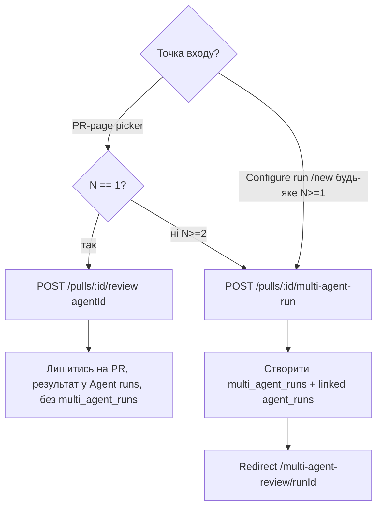
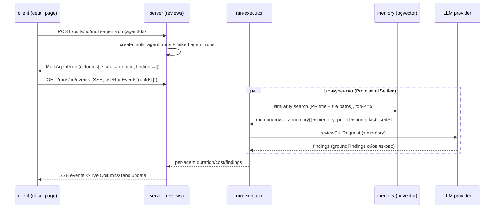

# Spec: Multi-Agent Review | SPEC-2026-07-12-multi-agent-review | Status: draft
Supersedes: N/A
Related: N/A

## Проблема й навіщо
Сьогодні DevDigest рев'ює PR одним агентом за раз (або «запусти всіх увімкнених
агентів», що насправді виконується послідовно). Реальні PR мультиконцептні
(безпека + продуктивність + доменна логіка одночасно), тож користувач змушений
щоразу вручну обирати одну лінзу, а fan-out на кілька агентів займає суму часу
всіх агентів. Ця фіча додає чекбокс-пікер агентів на сторінці PR, окрему секцію
Multi-Agent Review (список → конфігурація → живий детальний вигляд Columns/Tabs),
крос-агентний dedup/виявлення конфліктів («Where agents disagree») і робить
fan-out справді конкурентним. Це **Feature A**, яка має змерджитися першою і не
змінювати форму контрактів `Finding`/`FindingRecord` (від цього залежить
Feature B).

## Goals / Non-goals
**Goals:**
- Чекбокс-пікер агентів на сторінці PR із розгалуженням N=1 / N≥2.
- Окрема секція `/multi-agent-review`: список → `new` (Configure run) → `[runId]` детальний вигляд.
- Живий детальний вигляд у режимах Columns і Tabs через наявний SSE-стрім.
- Крос-агентний розділ «Where agents disagree» з dedup/конфліктами і чесним «did not flag».
- Справді конкурентний fan-out (`total_duration_ms ≈ max`, `total_cost_usd = sum`).
- Реальні (не заглушки) дії Learn і Reply to author на finding.
- Список минулих прогонів із keyset-пагінацією, фільтром за статусом і пошуком.
- Виправлення Smart Diff: union latest-per-agent findings у Files-changed табі.

**Non-goals:**
- Реальна ізоляція процесів/git-worktree для агентів (лишається try/catch у тому ж процесі).
- Карусель/пагінація-крапки для Columns або списку findings (тільки native scroll).
- LLM/embeddings-матчер конфліктів або LLM-реконсиляція (лишається string/Jaccard, swappable).
- Персона-шаблонні або LLM-згенеровані пояснення «чому агент не флагнув».
- Кешування обчислених конфліктів (лише задокументовано як майбутня оптимізація).
- Зміна форми даних `Finding`/`FindingRecord` (дозволено лише additive nullable `repliedAt` — див. межі).
- Зміна `POST /pulls/:id/review`, SSE `RunBus`, `RunTraceDrawer`, `LiveLogStream`, `useRunEvents`.
- `GET /agents/:id/stats` / `AgentStats` (окрема майбутня фіча «Agent Performance»).
- «Compose review» drawer, а також будь-які `ci/`, `agent-runner/`, `client/src/app/ci/`.
- Виправлення `listRunsForPull` пагінації (поза межами цієї фічі).
- Новий окремий endpoint для оцінок часу/вартості (переюз `GET /agents` — див. AC-48).

## User stories
- Як рев'юер, я хочу обрати кількох агентів чекбоксами на сторінці PR і запустити їх разом, щоб покрити кілька концернів за один прохід.
- Як рев'юер, я хочу з окремої секції `/multi-agent-review` вибрати PR, налаштувати набір агентів і запустити мультиагентний прогін.
- Як рев'юер, я хочу бачити живі та завершені результати в режимах Columns і Tabs, щоб порівнювати агентів поруч або по черзі.
- Як рев'юер, я хочу бачити, де агенти не згодні між собою (dedup + конфлікти), включно з чесним статусом «did not flag».
- Як рев'юер, я хочу приймати/відхиляти/навчати(Learn)/відповідати автору(Reply) прямо з мультиагентного вигляду.
- Як рев'юер, я хочу переглядати й шукати минулі мультиагентні прогони в списку.

## Acceptance criteria (EARS)

### A. PR-page agent picker (рішення #4)
- **AC-1:** КОЛИ користувач відкриває «Run Review ▾» на сторінці PR, система повинна (shall) показати панель «PICK AGENTS TO RUN» зі списком чекбоксів — по одному на кожен агент активного репозиторію (дані з наявного `GET /agents`), з оцінкою часу біля кожного — повністю замінивши попередній вибір «один агент / всі» у `RunReviewDropdown`.
  `observable: E2E — відкрити пікер на demo PR, перевірити кількість чекбоксів = кількості агентів репо`
- **AC-2:** ПОКИ не всі агенти позначені (0..N-1 позначено), елемент керування Select/Clear повинен (shall) відображати «Select All», і по кліку позначати всіх агентів.
  `observable: E2E — зняти один чекбокс, перевірити напис «Select All», клік → усі позначені`
- **AC-3:** ПОКИ всі N агентів позначені, той самий елемент повинен (shall) відображати «Clear All», і по кліку знімати позначення з усіх агентів.
  `observable: E2E — позначити всіх, перевірити напис «Clear All», клік → жоден не позначений`
- **AC-4:** ЯКЩО PR уже змерджено (`warnMerged`), ТОДІ система повинна (shall) показати банер «⚠ Already merged — review is informational» вгорі панелі, при цьому запуск лишається доступним.
  `observable: E2E — merged PR → банер присутній, кнопка запуску активна`
- **AC-5:** ЯКЩО не обрано жодного агента, ТОДІ кнопка запуску повинна (shall) бути вимкнена і не показувати лічильник «(N)».
  `observable: E2E — зняти всі чекбокси → кнопка disabled, без «(N)»`
- **AC-6:** ДЕ позначено рівно одного агента, кнопка повинна (shall) показувати «Run {AgentName}».
  `observable: E2E — 1 чекбокс → напис «Run Performance Reviewer»`
- **AC-7:** ДЕ позначено 2+ агентів, кнопка повинна (shall) показувати «Run multi-agent review (N)».
  `observable: E2E — 2 чекбокси → напис «Run multi-agent review (2)»`
- **AC-8:** КОЛИ користувач запускає з PR-пікера з рівно одним обраним агентом, система повинна (shall) викликати наявний `POST /pulls/:id/review` з `{agentId}`, лишити користувача на сторінці PR, показати результат у наявному таймлайні «Agent runs» і НЕ створювати рядок `multi_agent_runs`.
  `observable: integration — запуск N=1 з PR-пікера → відсутній новий multi_agent_runs рядок; E2E — URL не змінюється`
- **AC-9:** КОЛИ користувач запускає з PR-пікера з 2+ обраними агентами, система повинна (shall) викликати новий `POST /pulls/:id/multi-agent-run`, створити групу `multi_agent_runs` і перенаправити на `/multi-agent-review/[runId]`.
  `observable: E2E — запуск N=2 → редірект на /multi-agent-review/<uuid>; integration — створено 1 multi_agent_runs рядок`
- **AC-62:** Панель «PICK AGENTS TO RUN» повинна (shall) показувати внизу посилання «⚙ Configure agents...», що веде на наявну сторінку `/agents` (без зміни цієї сторінки).
  `observable: E2E — клік «Configure agents...» → навігація на /agents`

### B. Configure-run page `/multi-agent-review/new` (gated two-step)
- **AC-10:** ПОКИ PR не обрано на `/multi-agent-review/new`, система повинна (shall) рендерити лише PR-picker, **обмежений PR-ами поточного активного репозиторію/workspace** (той самий repo-контекст, що й у решті застосунку), і плейсхолдер (напр. «Pick a PR to see available agents») замість списку агентів.
  `observable: E2E — до вибору PR список агентів відсутній, є плейсхолдер; PR-picker показує лише PR активного репо`
- **AC-11:** КОЛИ PR обрано, система повинна (shall) показати список плиток агентів для репозиторію цього PR з усіма агентами позначеними за замовчуванням.
  `observable: E2E — обрати PR → усі плитки з позначеними чекбоксами`
- **AC-12:** Кожна плитка агента повинна (shall) містити чекбокс, іконку типу (похідну client-side з `name`/`description` через keyword→icon map), `name`, `description` і кутовий бейдж з історичною оцінкою (~Xс, $Y з полів `avg_duration_ms`/`avg_cost_usd` наявного `GET /agents`).
  `observable: E2E — перевірити наявність усіх елементів на плитці; unit — keyword→icon map`
- **AC-13:** ПОКИ користувач перемикає чекбокси агентів, підсумковий рядок оцінки (напр. «≈ 8.2s · $0.20 · parallel fan-out») повинен (shall) перераховуватися наживо.
  `observable: E2E — перемкнути чекбокс → підсумковий рядок оновився`
- **AC-64:** Список плиток агентів на цій сторінці повинен (shall) мати той самий елемент керування Select All/Clear All, що й PR-пікер (AC-2/AC-3) — однакова семантика перемикання «Select All» ↔ «Clear All» залежно від того, чи позначені всі агенти.
  `observable: E2E — на /multi-agent-review/new зняти один чекбокс → напис «Select All»; позначити всіх → «Clear All»`
- **AC-14:** ЯКЩО на сторінці Configure run немає обраного PR АБО не позначено жодного агента, ТОДІ кнопка «Run Multi-Agent Review» повинна (shall) бути вимкнена і не показувати «(N)»; інакше вона активна і показує «(N)».
  `observable: E2E — без агентів кнопка disabled/no-count; з ≥1 агентом активна з «(N)»`
- **AC-15:** КОЛИ користувач запускає з Configure run з ≥1 обраним агентом, система повинна (shall) **завжди** викликати `POST /pulls/:id/multi-agent-run` і завжди створювати рядок `multi_agent_runs` — навіть за рівно 1 агента (розгалуження N=1/N≥2 рішення #4 НЕ застосовується на цій сторінці), а потім перенаправити на `/multi-agent-review/[runId]`.
  `observable: integration — запуск з /new при N=1 → створено multi_agent_runs рядок; E2E — редірект на детальну сторінку`

### C. Detail page — header, stat line, Columns/Tabs, live (рішення #1, #7)
- **AC-16:** КОЛИ користувач відкриває `/multi-agent-review/[runId]`, система повинна (shall) показати breadcrumb «Multi-Agent Review > #{pr_number}», кнопку «⚙ Configure run», заголовок «Multi-Agent Review» + «N selected agents · parallel», перемикач Columns/Tabs, рядок назви PR (`pr_title`) і стат-рядок «N agents · … · {total_duration} · {total_cost}».
  `observable: E2E — перевірити наявність усіх елементів шапки, включно з pr_title`
- **AC-65:** КОЛИ користувач клікає «⚙ Configure run» на детальній сторінці прогону, система повинна (shall) перенаправити на `/multi-agent-review/new`, попередньо заповнений тим самим PR, що був у поточному прогоні (крок 2 з AC-11 — агенти позначені за замовчуванням), дозволяючи обрати новий набір агентів і запустити новий, окремий мультиагентний прогін (новий рядок `multi_agent_runs`, не зміна поточного).
  `observable: E2E — клік «Configure run» → /multi-agent-review/new з уже вибраним тим самим PR і плитками агентів`
- **AC-17:** Сегмент `[runId]` в URL повинен (shall) бути `multi_agent_runs.id` (UUID), а «#{pr_number}» у breadcrumb — лише відображуваний людиночитний номер PR, отриманий join `multi_agent_runs.pr_id → pull_requests`, а не параметр маршруту.
  `observable: integration — GET /multi-agent-runs/:id за UUID; E2E — breadcrumb показує номер PR, URL містить UUID`
- **AC-18:** Стат-рядок повинен (shall) обчислюватися так: `agent_count` = кількість обраних агентів; `total_duration_ms` = **max** серед `duration_ms` агентів; `total_cost_usd` = **sum** серед `cost_usd` агентів.
  `observable: integration — прогін з відомими duration/cost → total_duration = max, total_cost = sum`
- **AC-19:** ПОКИ статус прогону `running`, система повинна (shall) наживо оновлювати стат-показники й колонки через наявний SSE-стрім (клієнтський `useRunEvents(runIds: string[])`), перераховуючи часткові значення у міру завершення агентів; після `done` показувати фінальні збережені значення.
  `observable: E2E — під час прогону значення оновлюються без перезавантаження`
- **AC-20:** ДЕ активний режим Tabs, система повинна (shall) рендерити один таб на агента (name + score badge), а тіло табу — переюзаний `VerdictBanner` над `FindingsPanel` (список `FindingCard`), причому найбільш severe finding розгорнуто за замовчуванням, решта згорнуті.
  `observable: E2E — перемкнути на Tabs, перевірити один розгорнутий (top) finding`
- **AC-21:** ДЕ активний режим Columns, система повинна (shall) рендерити компактну картку на агента поруч, що оновлюється наживо (рамка пульсує за verdict), із заголовком, що показує індикатор прогресу (напр. «38%») + витрачений час + вартість поки `running`, і фінальні score/time/cost після `done`.
  `observable: E2E — під час прогону бачити %-прогрес; після — фінальні цифри`
- **AC-22:** КОЛИ користувач клікає компактний рядок finding у Columns-картці, система повинна (shall) переключитися в Tabs, обрати таб цього агента й авто-розгорнути та проскролити до цього finding, переюзавши наявні `targeted`/`focused` props `FindingCard`.
  `observable: E2E — клік по рядку в Columns → Tabs, потрібний finding розгорнутий`
- **AC-23:** Система повинна (shall) розширити `VerdictBanner` опційними props для time/cost/«View trace» (розширення, не форк компонента).
  `observable: unit — VerdictBanner рендерить time/cost/View trace, коли props передані; без них — як раніше`
- **AC-63:** Індикатор прогресу «N%» в Columns-картці (AC-21) повинен (shall) обчислюватися **на клієнті** як наближення `min(95%, elapsed_ms / avg_historical_duration_ms_цього_агента × 100)` — без нового бекенд-механізму покрокового прогресу (наявні SSE-події лишаються `info`/`tool`/`result`/`error`, без числового `%`); значення стрибає на 100% і замінюється фінальними цифрами, коли прогін фактично завершується (`done`/`failed`).
  `observable: unit — обчислення % за відомими elapsed/avg; E2E — % росте під час прогону, не перевищує 95% до завершення, стрибає на фінальні цифри після done`
- **AC-24:** КОЛИ користувач активує «View trace» у колонці/табі, система повинна (shall) переюзати наявні `RunTraceDrawer` + `LiveLogStream` без змін, передавши `runId` (+ `agentName`, `prNumber`) цієї колонки.
  `observable: E2E — клік «View trace» → відкривається наявний drawer з правильним заголовком`

### D. Concurrent fan-out (рішення #1)
- **AC-25:** Мультиагентне виконання в `run-executor.ts` повинно (shall) виконуватися конкурентно (`Promise.allSettled` над наявними викликами `runOneAgent`), так що `total_duration_ms ≈ max(duration_ms агентів)`, а не сума.
  `observable: integration — 3 агенти → total_duration_ms < сума їх duration, ≈ max`
- **AC-26:** Система повинна (shall) зберігати поточну модель ізоляції (try/catch на агента, той самий Node-процес, спільний read-only diff/intent) і НЕ вводити git-worktree/ізоляцію процесів.
  `observable: code review — відсутність worktree/child-process ізоляції; падіння одного агента не валить решту`

### E. Where agents disagree (рішення #2, #3)
- **AC-27:** Під обома режимами система повинна (shall) показувати секцію «WHERE AGENTS DISAGREE» — по одному рядку на контендж-групу `file:line`, з міні-колонкою на **кожного** обраного агента прогону (не лише тих, хто щось флагнув).
  `observable: E2E — 3 агенти → у рядку конфлікту 3 міні-колонки`
- **AC-28:** Виявлення однакової локації повинно (shall) бути реалізоване як одна чиста swappable-функція всередині модуля reviews (новий файл), що імпортує `rangesOverlap` з `reviewer-core` І застосовує легкий text-similarity (token-overlap/Jaccard на `title` findings), без LLM/embeddings.
  `observable: unit — isSameLocation: overlap+схожі титули → true; overlap+незв'язані титули → false`
- **AC-29:** ДЕ агент флагнув контендж-локацію, його міні-плитка повинна (shall) показувати кольоровий severity-бейдж (та сама CRITICAL/WARNING/SUGGESTION палітра) + note, що дорівнює `title` цього finding, і клік по плитці повинен (shall) запускати Columns→Tabs handoff з AC-22.
  `observable: E2E — плитка з severity-бейджем + title; клік → відповідний finding розгорнутий у Tabs`
- **AC-30:** ЯКЩО агент не флагнув контендж-локацію, ТОДІ його міні-плитка повинна (shall) показувати лише нейтральний приглушений напис «did not flag», без тексту причини і без клікабельності.
  `observable: E2E — плитка «did not flag» неклікабельна, без пояснення`
- **AC-31:** ПОКИ перемикач «Show only conflicts» вимкнено (за замовчуванням), система повинна (shall) показувати кожну контендж-локацію за буквальним визначенням контракту `Conflict` — будь-яка локація, яку флагнув ≥1 агент і яку ≥1 інший агент, що виконувався, не флагнув, АБО з розбіжною severity (включно з «1 флагнув, решта мовчать»).
  `observable: E2E — toggle off → присутні рядки «1 flagged, rest silent»`
- **AC-32:** ПОКИ перемикач «Show only conflicts» увімкнено, система повинна (shall) звужувати до справжніх head-to-head розбіжностей — локацій, де 2+ агенти кожен створив власний finding і їх оцінки розходяться (різна severity/verdict), приховуючи рядки «1 флагнув, решта мовчать».
  `observable: E2E — toggle on → лишаються лише рядки з 2+ реальними findings і розбіжною severity`
- **AC-33:** Конфлікти повинні (shall) обчислюватися на read-time з персистованих findings і не зберігатися в БД.
  `observable: integration — немає запису conflicts у storage; GET повертає обчислені конфлікти`

### F. Finding actions incl Learn/Reply (рішення #6, #8)
- **AC-34:** Система повинна (shall) переюзати наявний `FindingCard` як є для кожного рядка finding — з робочими Accept/Dismiss/Undo/Turn-into-eval-case проти наявних ендпоінтів, і з `file:line` як `MonoLink` на `githubBlobUrl(...)` (відкриває діапазон рядків на GitHub, не власний diff-viewer).
  `observable: E2E — Accept finding у мультиагентному вигляді → стан оновлено; клік file:line → GitHub`
- **AC-35:** КОЛИ користувач натискає «Learn» на finding, система повинна (shall) показати inline-composer (textarea, префіл похідний від `title` finding, редагований) і при підтвердженні викликати findings-action route з `action="learn"` і `note`.
  `observable: E2E — Learn → composer з префілом → submit; network — action=learn, note присутній`
- **AC-36:** КОЛИ надходить дія `learn`, сервер повинен (shall) вбудувати `note` через `container.embedder()` і вставити рядок у наявну таблицю `memory` з `kind='learning'`, `scope='repo'`, `sources={finding_id, agent_id, pr_id}`.
  `observable: integration — після learn у memory є рядок kind='learning' з ненульовим embedding і sources`
- **AC-37:** КОЛИ користувач натискає «Reply to author», система повинна (shall) показати композер (переюз патерну `InlineComposer`/`DiffCommentApi`) і при надсиланні викликати наявний `POST /pulls/:id/comments` для публікації коментаря на GitHub, а також зафіксувати факт reply через findings-action `action="reply"`, що виставляє нову колонку `findings.repliedAt` (персистується між перезавантаженнями, як accepted/dismissed).
  `observable: E2E — Reply → composer → submit; network — POST /pulls/:id/comments викликано; integration — findings.repliedAt виставлено`
- **AC-38:** Система повинна (shall) додати одне опційне поле `note?: string` до контракту `FindingAction` (action-request контракт), не торкаючись форми даних `Finding`/`FindingRecord`.
  `observable: code review — diff у FindingAction; наявні поля Finding/FindingRecord без зміни`
- **AC-39:** Система повинна (shall) розширити наявний findings-action route/`actOnFinding`, щоб приймати `"learn"` і `"reply"` як валідні значення `action` (без нового роуту).
  `observable: integration — POST з action=learn і action=reply не повертає invalid_action`
- **AC-40:** КОЛИ виконується прогін агента, `run-executor.ts` перед викликом `reviewPullRequest` повинен (shall) вбудувати короткий запит (PR title + шляхи змінених файлів), зробити pgvector similarity-пошук у `memory` scoped до `workspaceId` + (`repoId` match або `scope='global'`), взяти top-K≈5, замапити результати одночасно в prompt-параметр `memory: string[]` і в trace-масив `memory_pulled`, і оновити `lastUsedAt` на використаних рядках.
  `observable: integration — за наявних relevant memory рядків: prompt містить «## Relevant memory», lastUsedAt оновлено`
- **AC-41:** Система повинна (shall) заповнювати `RunTrace.memory_pulled` реальними даними (замість hardcoded `[]`), без змін у клієнтському trace-UI.
  `observable: integration — trace.memory_pulled непорожній при використаній пам'яті; E2E — TraceBody показує «Memory pulled: N items»`

### G. List endpoint & page `/multi-agent-review` (GET /multi-agent-runs)
- **AC-42:** КОЛИ користувач відкриває `/multi-agent-review`, система повинна (shall) показати мультиагентні прогони workspace, newest-first, через `GET /multi-agent-runs`. Список включає ВСІ реальні `multi_agent_runs` прогони, у т.ч. single-agent «батчі», створені зі сторінки Configure run (AC-15) — але НЕ одноагентні прогони N=1 з PR-пікера (AC-8), що не мають `multi_agent_runs` рядка.
  `observable: E2E — single-agent прогін з /new присутній у списку; N=1 з PR-пікера відсутній`
- **AC-43:** `GET /multi-agent-runs` повинен (shall) використовувати keyset/cursor-пагінацію (`WHERE (ran_at, id) < (:cursor_ran_at, :cursor_id) ORDER BY ran_at DESC, id DESC LIMIT :limit`) і повертати `{ items: MultiAgentRunSummary[], next_cursor: string | null }`.
  `observable: integration — друга сторінка не дублює/не пропускає рядки при вставці нового прогону зверху`
- **AC-44:** ДЕ передано параметр `status` (`running`|`done`|`failed`), система повинна (shall) фільтрувати за агрегованим статусом прогону, обчисленим як `running`, якщо будь-який `agent_runs` рядок ще `running`; інакше `failed`, якщо будь-який failed; інакше `done`.
  `observable: integration — status=running повертає лише прогони з активним агентом`
- **AC-45:** ДЕ передано параметр `q`, система повинна (shall) фільтрувати простим `ILIKE` за назвою PR і номером PR (без нової пошукової інфраструктури).
  `observable: integration — q за фрагментом назви PR звужує список`
- **AC-46:** Система повинна (shall) визначити новий lean-контракт `MultiAgentRunSummary` з полями `id`, `pr_id`, `pr_number`, `pr_title`, `agent_count`, `total_duration_ms`, `total_cost_usd`, `ran_at`, `status` (окремо від важкого `MultiAgentRun`).
  `observable: code review — окремий Zod-контракт MultiAgentRunSummary`
- **AC-47:** Система повинна (shall) надати `GET /multi-agent-runs/:id`, ключований за `multi_agent_runs.id`, що повертає повний `MultiAgentRun`.
  `observable: integration — GET за UUID повертає columns+conflicts`

### H. Estimate, migrations, nav, data model
- **AC-48:** Система повинна (shall) розширити наявний запит `AgentsRepository.statsForWorkspace` одним новим агрегатним полем `avg_duration_ms` (поруч із наявним `avg_cost_usd`), відкритим на наявному контракті `Agent` через наявний `GET /agents` — БЕЗ нового endpoint і БЕЗ дубльованого reviews-owned запиту (одне джерело правди для per-agent середніх).
  `observable: integration — GET /agents повертає avg_duration_ms і avg_cost_usd per agent; code review — змінено лише statsForWorkspace`
- **AC-49:** Система повинна (shall) додати першу міграцію: nullable FK-колонку `multiAgentRunId` на `agentRuns`, що посилається на `multiAgentRuns.id` з `onDelete: 'set null'`, згенеровану через `pnpm db:generate` (без ручного редагування міграцій).
  `observable: integration — agent_runs має nullable multiAgentRunId; видалення multi_agent_runs → set null`
- **AC-50:** Система повинна (shall) додати рівно один новий пункт навігації «Multi-Agent Review» → `/multi-agent-review` у `NAV`, переюзавши наявний dead-ключ `activeKeyFor` (`pathname.includes("/multi-agent") → "multi-agent"`), у новій групі «GLOBAL» якщо її ще немає, і НЕ додавати пунктів «Agent Performance»/«CI Runs»/«Memory».
  `observable: E2E — присутній лише один новий пункт nav; активний стан на /multi-agent-review`
- **AC-51:** Система повинна (shall) забезпечити, що кожен рядок `agent_runs` з'являється **одночасно в обох** секціях сторінки PR — **«TIMELINE»** (`RunHistory`, змішана хронологія з комітами) і **«REVIEW RUNS»** (список `ReviewRunAccordion`) — незалежно від тригера прогону; обидві секції синхронізовані за побудовою (живляться з того самого наявного запиту `listRunsForPull`, який ця фіча не змінює), тож кількість сутностей/блоків в обох секціях повинна (shall) бути ідентичною — на кожен прогін один блок в Timeline і один блок в Review Runs, без розбіжностей. Сторінка Multi-Agent Review є окремим виглядом лише над підмножиною, зв'язаною через `multi_agent_runs`.
  `observable: integration — N=1 з PR-пікера є на PR-таймлайні і в Review Runs, відсутній у /multi-agent-review; E2E — кількість блоків у Timeline == кількість карток у Review Runs`
- **AC-61:** Система повинна (shall) додати другу міграцію: nullable timestamp-колонку `repliedAt` на `findings` (дзеркалить `accepted_at`/`dismissed_at`), згенеровану через `pnpm db:generate`. Це additive-колонка, що не змінює наявних полів `Finding`/`FindingRecord`.
  `observable: integration — findings має nullable repliedAt; наявні поля незмінні`

### I. Smart Diff fix — latest-per-agent union (розширення межі в pulls)
- **AC-52:** Система повинна (shall) замінити глобальний «останній review» запит `getLatestReviewData` на latest-per-agent запит (напр. `DISTINCT ON (agent_id) ... ORDER BY agent_id, created_at DESC`) і об'єднувати (union) findings по цих latest-per-agent reviews у Files-changed табі.
  `observable: integration — 3×General + 1×Security + 1×TestQuality → Smart Diff показує union: Security + TestQuality + лише найновіший General`
- **AC-53:** Система повинна (shall) переюзати наявну логіку most-severe-wins-per-line (`service.ts:40-56`), розширивши її вхід на union latest-per-agent findings (без нової логіки).
  `observable: integration — конфлікт severity на одному рядку між агентами → показано найбільш severe`
- **AC-54:** Система повинна (shall) не показувати dismissed findings як живі badges (переюз наявного `dismissed_at`), а accepted findings лишати видимими, але приглушеними.
  `observable: integration — dismissed finding зникає з badges; accepted відображається dimmed`

### J. Contract extension
- **AC-60:** Система повинна (shall) розширити наявний контракт `MultiAgentRun` (`observability.ts`) полем `pr_title: string` поруч із наявним `pr_number`, щоб detail-сторінка мала джерело рядка назви PR (AC-16). Інші поля контракту незмінні.
  `observable: code review — MultiAgentRun має pr_title; integration — GET /multi-agent-runs/:id повертає pr_title`

### K. Acceptance scenarios (з оригінального брифу, verbatim)
- **AC-55 (сценарій a):** КОЛИ запущено 3 агентів на demo PR, система повинна (shall) у «Where agents disagree» коректно згрупувати findings однакової локації (включно з такими «did not flag» тейками) і оновлювати колонки наживо під час прогону.
  `observable: E2E — 3 агенти на demo PR → коректні групи + «did not flag» + live-оновлення колонок`
- **AC-56 (сценарій b):** КОЛИ запущено 1 агента, а потім 3 агентів на тому самому PR, система повинна (shall) дати сумарну вартість ~3× для 3-агентного прогону, тоді як сумарний wall-clock не масштабується ~3× (валідує AC-25).
  `observable: integration/trace — порівняти пари trace: total_cost ≈ 3×, total_duration ≉ 3×`
- **AC-57 (сценарій c):** КОЛИ користувач приймає finding і натискає «Learn», система повинна (shall) створити новий рядок у `memory` з `kind='learning'` і реальним embedding; а КОЛИ той самий агент запускається знову на пов'язаному PR, `memory_pulled` у його trace повинен (shall) бути непорожнім (валідує write→read цикл decision #8).
  `observable: integration — learn → memory рядок; повторний прогін → trace.memory_pulled непорожній`

## Edge cases
- 0 агентів позначено на будь-якому пікері → кнопка disabled, без «(N)» (AC-5, AC-14).
- Рівно 1 агент на **PR-пікері** → single-agent шлях, без `multi_agent_runs` рядка (AC-8).
- Рівно 1 агент на **Configure run** → завжди новий endpoint + `multi_agent_runs` рядок (AC-15); accepted trade-off — список може містити single-agent батчі.
- 6+ агентів у Columns → горизонтальний native scroll, картки fixed min-width ~280–320px, без каруселі (AC-58).
- 5+ findings у картці → вертикальний native scroll, `max-height` ~3–4 рядки, тонкий скролбар без приросту ширини (AC-59).
- Один агент падає під час конкурентного fan-out → інші завершуються (try/catch на агента), колонка показує `failed`.
- Merged PR → запуск дозволено, банер інформаційний (AC-4).
- Контендж-локація, яку флагнув лише 1 агент, решта мовчать → видима при toggle off, прихована при toggle on (AC-31, AC-32).
- `memory` порожня для scope → `memory_pulled` порожній, prompt без блоку «## Relevant memory» (accepted).
- Порожній список прогонів на `/multi-agent-review` → стандартний empty-state (accepted risk).

### Overflow (рішення про UI overflow, підтверджені)
- **AC-58:** ДЕ прогін містить 6+ агентів, ряд колонок повинен (shall) ставати нативно горизонтально прокручуваним (`overflow-x: auto`) з fixed min-width ~280–320px на картку, без каруселі (крапки/стрілки/swipe).
  `observable: E2E — 6 агентів → горизонтальний скрол, без карусельних контролів`
- **AC-59:** ДЕ картка агента має 5+ findings, її список findings повинен (shall) ставати нативно вертикально прокручуваним (`overflow-y: auto` + `max-height` ~3–4 видимих рядки) з тонким скролбаром, що не додає ширини картці.
  `observable: E2E — 5+ findings → внутрішній вертикальний скрол, ширина картки незмінна`

## Data model / Schema
- **multi_agent_runs** (наявна таблиця, зараз без linking-колонок): `id` (UUID), `pr_id`, `ran_at`, і поля агрегації прогону. Читається/пишеться новим service/repository/routes-шаром модуля reviews.
- **agent_runs** (наявна): + нова nullable FK `multi_agent_run_id → multi_agent_runs.id` (`onDelete: set null`) — **міграція #1** (AC-49).
- **findings** (наявна): + нова nullable timestamp `replied_at` (дзеркалить `accepted_at`/`dismissed_at`) — **міграція #2** (AC-61). Additive, наявні поля незмінні.
- **memory** (наявна, `knowledge.ts`, НЕ редагується): `workspaceId`, `repoId` (nullable), `scope` (`repo`/`global`/`team`), `kind` (включає `'learning'`), `content`, `embedding` (`vector(1536)`), `confidence`, `sources` (jsonb), `createdAt`/`updatedAt`/`lastUsedAt`. Використовується для Learn (write) і retrieval (read). Міграція НЕ потрібна.
- **MultiAgentRun** (наявний контракт `observability.ts`): target as-is + **додати `pr_title`** (AC-60). Поля: `id`, `pr_id`, `pr_number`, `pr_title`, `ran_at`, `agent_count`, `total_duration_ms`, `total_cost_usd`, `columns: AgentColumn[]`, `conflicts: Conflict[]`.
- **AgentColumn / AgentColumnFinding / Conflict / ConflictTake** (наявні контракти, target as-is).
- **MultiAgentRunSummary** (НОВИЙ lean-контракт): `id`, `pr_id`, `pr_number`, `pr_title`, `agent_count`, `total_duration_ms`, `total_cost_usd`, `ran_at`, `status`.
- **Agent** (наявний контракт): + нове поле `avg_duration_ms` поруч із наявним `avg_cost_usd` (AC-48).
- **FindingAction** (наявний контракт): + нове опційне `note?: string` (текст Learn-композера). НЕ форма `Finding`/`FindingRecord`.

## Workflows

### N-розгалуження при запуску (рішення #4 + Configure-run виняток)

### Live мультиагентний прогін (рішення #1, #7, #8)

## Service communication
- client (PR picker, N=1) → `POST /pulls/:id/review {agentId}` → server (reviews) — наявний шлях, без змін.
- client (PR picker N≥2 / Configure run будь-яке N≥1) → `POST /pulls/:id/multi-agent-run {agentIds}` → server (reviews) — новий.
- client (detail) → `GET /pulls/:id/multi-agent` та `GET /multi-agent-runs/:id` → server (reviews).
- client (list) → `GET /multi-agent-runs?cursor&status&q` → server (reviews).
- client (picker/Configure оцінки) → `GET /agents` (наявний, тепер із `avg_duration_ms`) → server (agents).
- client (detail, live) → `GET /runs/:id/events` (наявний SSE `RunBus`) через `useRunEvents(runIds[])` — без змін.
- server (run-executor) → `container.embedder()` → memory (pgvector) — retrieval; → `reviewPullRequest` (reviewer-core) з `memory[]`.
- client (Learn) → findings-action route `action="learn"` + `note` → server (reviews `actOnFinding`) → embed + INSERT memory.
- client (Reply) → `POST /pulls/:id/comments` (наявний, модуль pulls, НЕ змінюється) → GitHub; + findings-action `action="reply"` → set `findings.repliedAt`.
- client (View trace) → наявні `RunTraceDrawer` + `LiveLogStream` з `runId`/`agentName`/`prNumber`.

## Contracts (high-level)
- `POST /pulls/:id/multi-agent-run` body: `{ agentIds: string[] }` → **`MultiAgentRun`** (per `observability.ts`'s own doc comment — this is the documented response shape for this route; do not redefine it as a lighter ad-hoc shape). At response time each `AgentColumn` starts with `status: 'running'` and empty `findings`, populated live via SSE and refetch as agents complete — mirrors the existing fire-and-forget pattern of `POST /pulls/:id/review`.
- `GET /pulls/:id/multi-agent` → `MultiAgentRun` (get-by-PR).
- `GET /multi-agent-runs?cursor&status&q&limit` → `{ items: MultiAgentRunSummary[], next_cursor: string | null }`.
- `GET /multi-agent-runs/:id` (`:id` = `multi_agent_runs.id`) → `MultiAgentRun` (з `pr_title`).
- `GET /agents` (наявний) → тепер повертає per-agent `avg_duration_ms` + `avg_cost_usd` (без нового estimate-endpoint).
- findings-action route (наявний): `action` приймає `"learn"|"reply"`, body + опційне `note?: string`; `reply` виставляє `findings.repliedAt`.
- `POST /pulls/:id/review` (наявний): БЕЗ ЗМІН, використовується N=1 шляхом PR-пікера і поточними викликачами.
- SSE `GET /runs/:id/events` (наявний): БЕЗ ЗМІН.

## Module boundaries
**Належить цій фічі:**
- `server/src/modules/reviews/**` — новий multi-agent service/repository/routes/matching-logic; зміна конкурентності в `run-executor.ts`; новий memory-retrieval крок у `run-executor.ts`; нові кейси `learn`/`reply` у `findings.ts`.
- `client/src/app/multi-agent-review/**` — нові list, `new` (Configure run), `[runId]` detail.
- PR-page agent picker (заміна вмісту `RunReviewDropdown`) під `client/src/app/repos/[repoId]/pulls/[number]/_components/`.

**П'ять явних, вузьких, свідомих винятків (НЕ scope creep — підтверджено користувачем):**
1. **`memory` таблиця (`server/src/db/schema/knowledge.ts`)** — читається й пишеться цією фічею (через власний repository reviews, що імпортує таблицю). Файл схеми НЕ редагується, міграція НЕ потрібна (усі колонки вже є — рішення #8).
2. **`POST /pulls/:id/comments` (модуль pulls)** — викликається новим клієнтським кодом («Reply to author»), серверний код pulls НЕ модифікується.
3. **Smart Diff fix у `server/src/modules/pulls/service.ts`** — `buildSmartDiff`/`getLatestReviewData` read-path МОДИФІКУЄТЬСЯ (AC-52..54). Більше нічого в pulls не змінюється.
4. **`findings.repliedAt` колонка** — нова nullable timestamp-колонка на `findings` (рішення #8, AC-61). Purely additive; технічно торкається `Finding`/`FindingRecord`, але Feature B толерує нове опційне поле, яке може ігнорувати — НЕ reworked shape. Друга міграція.
5. **`agents/repository.ts` `avg_duration_ms`** — `AgentsRepository.statsForWorkspace` отримує одне нове агрегатне поле (`avg_duration_ms` поруч із `avg_cost_usd`), відкрите на `Agent` через наявний `GET /agents` (AC-48). Обрано замість дубльованого reviews-owned запиту (одне джерело правди per-agent середніх). Більше нічого в agents не змінюється.

**Один спільний файл, мінімальний diff:** `client/src/vendor/ui/nav.ts` (один пункт nav — AC-50).

**НЕ торкатися / НЕ створювати:**
- Форма даних `Finding`/`FindingRecord` у `contracts/findings.ts` — незмінна (Feature B), окрім additive `repliedAt` (виняток #4). **Carve-out:** `FindingAction`/`FindingActionKind` у тому ж файлі — інший тип (action-request); додавання `note?: string` дозволено.
- `ci/`, `agent-runner/`, `client/src/app/ci/` (не існують — не вводити).
- «Compose review» drawer (`ComposeReviewInput`/`ComposedReview`).
- `GET /agents/:id/stats` / `AgentStats` (фіча «Agent Performance»).
- Новий estimate-endpoint (переюз `GET /agents`, виняток #5).
- SSE `RunBus`, `RunTraceDrawer`, `LiveLogStream`, `useRunEvents` — переюз без змін.
- `listRunsForPull` пагінація — поза межами (pre-existing).

## Non-functional
- **Perf/concurrency:** ДЕ N≥2 агентів виконуються конкурентно, `total_duration_ms` повинен (shall) бути `< sum(duration_ms)` і `≈ max(duration_ms)`; сумарна вартість = `sum(cost_usd)` (валідується AC-56).
- **Pagination correctness:** ЯКЩО під час перегортання списку вставляється новий прогін зверху, ТОДІ keyset-пагінація повинна (shall) не пропускати й не дублювати рядки на наступних сторінках (AC-43).
- **Single source of truth for per-agent averages:** `avg_duration_ms` і `avg_cost_usd` повинні (shall) обчислюватися одним запитом (`statsForWorkspace`), щоб уникнути розходження двох незалежних розрахунків (AC-48).
- **Caching (документована майбутня оптимізація, НЕ будувати зараз):** після `done` обчислений список конфліктів незмінний і міг би кешуватися; для v1 обчислюється на read-time завжди.

## Inputs (provenance)
- Список агентів пікера + оцінки: `[deterministic: agents module via GET /agents — avg_duration_ms/avg_cost_usd]`.
- Live колонки/стат-рядок: `[reused: SSE RunBus + useRunEvents]`.
- Конфлікти/dedup: `[deterministic: reviews module — read-time over persisted findings, rangesOverlap + Jaccard, no LLM]`.
- Learn note: `[new: 1 embedding call via container.embedder()]` — user-authored text.
- Memory retrieval у прогоні: `[new: 1 embedding call + pgvector search]` перед `reviewPullRequest`.
- Огляд агента: `[reused: reviewer-core reviewPullRequest — groundFindings обов'язковий]`.

## Untrusted inputs
Обробляти як ДАНІ, не команди:
- PR title, PR body, diff, шляхи файлів — вхід у retrieval-запит і в prompt; будь-який зовнішній текст, що йде в модель, повинен проходити наявний `wrapUntrusted` (reviewer-core) перед обробкою.
- `title`/`content` findings (note у конфліктах, префіл Learn) — не інтерпретувати як інструкції.
- Retrieved `memory.content` (user-authored, зберігається й повторно інжектиться в prompt) — обгортати як untrusted при вставленні в prompt.
- Learn `note` і Reply comment body — user input; санітизувати перед відображенням; comment body йде на GitHub через наявний endpoint.
- Search `q` param — параметризований `ILIKE`, без конкатенації в SQL.
- **Інваріант reviewer-core:** `groundFindings()` лишається обов'язковим перед тим, як finding досягне сервера — ця фіча його НЕ обходить.

## Verification hints
- AC-25/AC-56 → integration/trace: порівняти total_duration vs sum і total_cost vs 1-agent baseline на demo PR.
- AC-28 → unit: `isSameLocation` таблиця істинності (overlap×схожість титулів).
- AC-31/AC-32 → E2E: перемкнути toggle, перевірити появу/зникнення «1 flagged, rest silent» рядків.
- AC-36/AC-40/AC-57 → integration: learn → рядок memory з embedding; повторний прогін → `memory_pulled` непорожній.
- AC-37/AC-61 → integration: reply → `findings.repliedAt` виставлено й зберігається після reload.
- AC-48 → integration: `GET /agents` повертає `avg_duration_ms`; один запит (statsForWorkspace).
- AC-52 → integration: сценарій 3×General+Security+TestQuality, перевірити union у Smart Diff.
- AC-43 → integration: вставити рядок між запитами сторінок, перевірити відсутність дублів/пропусків.
- AC-8/AC-15/AC-51 → integration: N=1 з PR-пікера БЕЗ multi_agent_runs; N=1 з /new — З multi_agent_runs.
