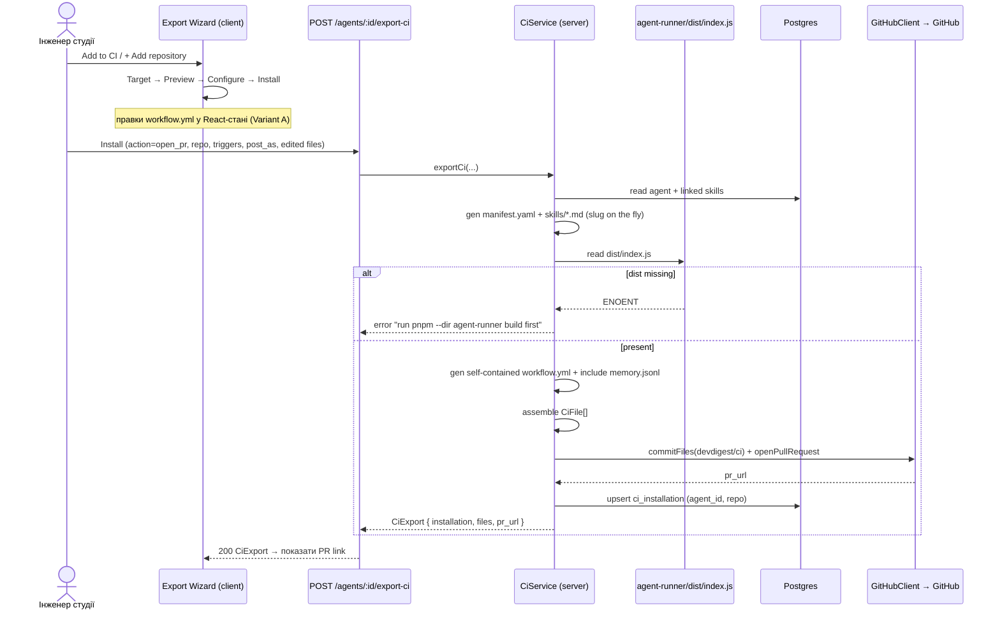
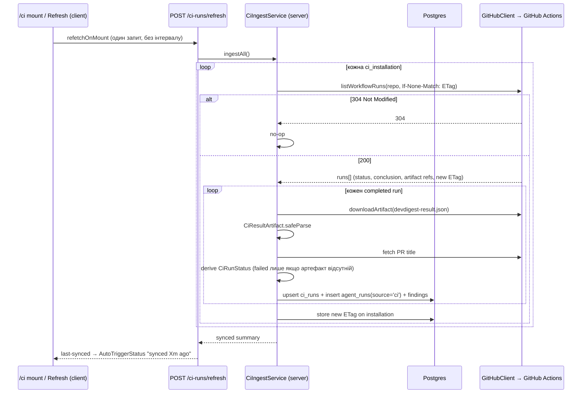

# Spec: Export to CI | SPEC-2026-07-19-export-to-ci | Status: draft

Supersedes: specs/SPEC-2026-07-12-export-to-ci.md (ВИДАЛЕНО — старий verdict-based дизайн; замінюється цим spec. Per Q11: CI Runs показує STATUS + FINDINGS, БЕЗ колонки `verdict`.)
Related:

- [SPEC-2026-07-19-agent-runner-findings-artifact](../agent-runner/specs/SPEC-2026-07-19-agent-runner-findings-artifact.md) — SPEC 1 (PR 1, мержиться ПЕРШИМ): робить так, що runner емітить `findings: Finding[]` у `CiResultArtifact`. Ingest цього spec (SPEC 2) СПОЖИВАЄ ці findings.
- SPEC 3 — Memory subsystem (PR 3, після цього): володіє підсистемою памʼяті. Цей spec лише ВКЛЮЧАЄ файл `.devdigest/memory.jsonl` в export (з наявної памʼяті — можливо порожньої).

## Проблема й навіщо

Сконфігуровані в студії агенти сьогодні прогонюються лише локально (`agent_runs.source = 'local'`) — GitHub не може дотягнутися до студії (локальний інструмент, секрети в `~/.devdigest/secrets.json`, без публічного URL). Немає способу задеплоїти агента в цільовий репозиторій, щоб він авто-рецензував кожен PR тим самим `reviewer-core` engine. Цей spec додає **Export Wizard** (деплой агента в GitHub Actions цільового репо), **CI tab** на сторінці агента (керування per-repo інсталяціями) і сторінку **CI Runs** (`/ci`) для перегляду CI-прогонів. Ingest — pull-based (студія тягне артефакти через GitHub token; жодного webhook). Після фічі команда може одним майстром відкрити PR у чужий репо, що додає self-contained CI workflow, який запускає той самий движок review, і бачити результати цих прогонів у студії з паритетом findings до локальних прогонів.

## Goals / Non-goals

**Goals:**

- Серверний модуль `server/src/modules/ci/` (routes + service + repository) за патерном модуля `reviews/` та onion-architecture: генерація manifest YAML, self-contained `workflow.yml`, збірка `CiFile[]`, export (open_pr | zip), ingest (pull/ETag), репозиторій.
- Export Wizard (4 кроки на `ExportWizardSteps`): Target → Preview → Configure → Install. Тільки GitHub Actions активний; редагування лише `workflow.yml` через CodeMirror-6 YAML-редактор із валідацією.
- CI tab на сторінці агента: «Active in N repos», рядки інсталяцій (repo + target_type + last-run STATUS + ran_at), селектор «Fail CI on» над наявним `AgentManifest.ci_fail_on`, кнопки Add to CI / + Add repository / Update CI config.
- Сторінка CI Runs (`/ci`, нав-пункт під SKILLS LAB): server-side фільтри, таблиця з колонками TIMESTAMP | PULL REQUEST | AGENT | SOURCE | DUR. | FINDINGS | COST | STATUS | Trace; empty-state CTA → `/agents`.
- Pull-based ingest: fetch-on-page-entry + manual Refresh + ETag/If-None-Match; деривація `CiRunStatus`; upsert `ci_runs` + `agent_runs(source='ci')` + збереження findings.
- Розширення порту `GitHubClient`: `listWorkflowRuns` (status + conclusion + artifact refs + ETag) і `downloadArtifact` (+ Octokit-адаптер + mock).
- Міграції: `ci_runs` (+ `pr_title`, `duration_ms`, `critical`, `warning`, `suggestion`) і `ci_installations` (+ `lastSyncedEtag`, `lastSyncedAt` для ETag-ingest стану).
- Security-інваріанти згенерованого `workflow.yml` (для Phase-2 human review): `permissions` лише `contents: read` + `pull-requests: write`; секрет тільки `${{ secrets.OPENROUTER_API_KEY }}`; без `pull_request_target`; PR-текст недовірений; `node .devdigest/runner/index.js` без marketplace-екшену.

**Non-goals:**

- **НЕ** вводити колонку/поле `verdict` ніде (Q11). Блокер-сигнал = STATUS(Failed) + FINDINGS(critical count).
- **НЕ** чіпати `reviews/` core-логіку, multi-agent-review, PR feed / multi-run service.
- **НЕ** реалізовувати підсистему памʼяті — це SPEC 3. Цей spec лише кладе файл `.devdigest/memory.jsonl` (можливо порожній) у бандл.
- **НЕ** реалізовувати CircleCI / Jenkins / Generic CLI (показані DISABLED «Coming soon»).
- **НЕ** webhook / cron / фоновий поллер; **НЕ** ingest незавершених (running) прогонів у v1.
- **НЕ** повний RunTrace-паритет для CI (немає prompt assembly / tool calls / raw output).
- **НЕ** будувати runner у HTTP-хендлері (`child_process`) — читаємо pre-built `dist/index.js` з диска.
- **НЕ** вводити колонки: `workflow_version`, `suspended_at` (v2, deferred).

## User stories

- Як інженер студії, я хочу через майстер задеплоїти агента в GitHub Actions цільового репо, щоб він авто-рецензував кожен PR тим самим движком, що й локально.
- Як інженер студії, я хочу відредагувати згенерований `workflow.yml` у майстрі з підсвіткою синтаксису й валідацією, щоб виправити дрібниці перед відкриттям PR.
- Як інженер студії, я хочу відкрити PR із CI-файлами АБО завантажити zip, щоб задеплоїти навіть коли не хочу давати студії write-токен.
- Як інженер студії, я хочу на сторінці агента бачити, у скількох репо він активний, і статус останнього прогону в кожному, щоб контролювати здоровʼя інтеграції.
- Як інженер студії, я хочу на сторінці CI Runs бачити всі CI-прогони з фільтрами, деталями findings і статусом, щоб рецензувати роботу агентів у CI з паритетом до локальних прогонів.
- Як інженер студії, я хочу натиснути Refresh (або просто зайти на `/ci`), щоб студія підтягнула нові CI-результати з GitHub без фонового поллінгу.

## Acceptance criteria (EARS)

### A. Export service (`server/src/modules/ci/`)

- **AC-1:** КОЛИ надходить `POST /agents/:id/export-ci` з `action="open_pr"`, система повинна (shall) прочитати агента + залінковані скіли з БД, згенерувати manifest YAML (`.devdigest/agents/<slug>.yaml`), по одному `.devdigest/skills/<slug>.md` на скіл, self-contained `.github/workflows/devdigest-review.yml`, включити `.devdigest/memory.jsonl` і бандл runnerʼа `.devdigest/runner/index.js`, зібрати `CiFile[]`, атомарно закомітити їх на гілку `devdigest/ci` цільового репо + відкрити PR, upsert `ci_installation` по (agent_id, repo), і повернути `CiExport { installation, files, pr_url }`.
  `observable: .it.test — export-ci вставляє/оновлює один ci_installation; відповідь містить files[] і pr_url; GitHubClient.commitFiles + openPullRequest викликані з гілкою devdigest/ci`
- **AC-2:** КОЛИ export-service читає бандл runnerʼа, він повинен (shall) прочитати pre-built `agent-runner/dist/index.js` з диска; ЯКЩО файл відсутній, ТОДІ система повинна (shall) повернути помилку з чітким текстом-порадою запустити `pnpm --dir agent-runner build` і НЕ намагатися будувати бандл через `child_process` у HTTP-хендлері.
  `observable: unit — за відсутнього dist/index.js export кидає помилку з інструкцією про build; за наявного — файл потрапляє в CiFile[] за шляхом .devdigest/runner/index.js`
- **AC-3:** КОЛИ генерується slug для агента/скіла, система повинна (shall) обчислити його на льоту як kebab-case з імені агента/скіла з суфіксом `-2`/`-3` при колізії в межах бандла, БЕЗ збереження slug у БД.
  `observable: unit — два скіли з іменами, що дають однаковий kebab → slugи "<name>" і "<name>-2"; жодної нової колонки в схемі`
- **AC-4:** КОЛИ export-service збирає `CiFile[]`, він повинен (shall) виставити `editable=false` для всіх похідних файлів (manifest, skills, memory.jsonl, runner bundle) і `editable=true` ЛИШЕ для `workflow.yml`.
  `observable: unit — у зібраному CiFile[] тільки файл workflow має editable=true`
- **AC-5:** КОЛИ надходить `POST /agents/:id/export-ci` з `action="files"` (zip-шлях), система повинна (shall) згенерувати ТІ САМІ файли, спакувати їх у zip НА СЕРВЕРІ зі збереженням шляхів (`.devdigest/**`, `.github/workflows/**`, включно з runner-бандлом), повернути zip як завантаження, і НЕ створювати `ci_installation`.
  `observable: .it.test — action="files" повертає zip-blob; у ci_installations нового рядка немає; unzip зберігає структуру шляхів`
- **AC-6:** КОЛИ виконується «Update CI config» (той самий серверний op, silent), система повинна (shall) повторно згенерувати й re-export бандл до ВСІХ наявних інсталяцій агента, upsert по (agent_id, repo), БЕЗ відкриття майстра.
  `observable: .it.test — агент з 2 інсталяціями → Update CI config комітить у 2 репо; existing ci_installations оновлені, не задубльовані`
- **AC-7:** Модуль `ci` повинен (shall) бути зареєстрований у `server/src/modules/index.ts` як Fastify-плагін за наявним патерном (один import + один запис), не чіпаючи інші модулі.
  `observable: grep index.ts — присутній ключ `ci`; сервер стартує; маршрути ci доступні`

### B. Export Wizard (client)

- **AC-8:** КОЛИ користувач відкриває майстер (через «Add to CI» АБО «+ Add repository» — обидва відкривають ОДИН майстер), система повинна (shall) показати 4-кроковий stepper на `ExportWizardSteps` з кроками Target → Preview → Configure → Install.
  `observable: E2E — обидві кнопки відкривають той самий 4-step wizard; labels[] = Target/Preview/Configure/Install`
- **AC-9:** На кроці Target система повинна (shall) показати 4 картки (GitHub Actions | CircleCI | Jenkins | Generic CLI), де вибиральна/функціональна ЛИШЕ GitHub Actions, а решта 3 DISABLED з підписом «Coming soon»; `target` дефолтиться `"gha"`.
  `observable: E2E — клік по CircleCI/Jenkins/CLI неможливий (disabled + "Coming soon"); GitHub Actions обрана за замовч.`
- **AC-10:** На кроці Preview система повинна (shall) показати список 5 читабельних файлів (manifest, по одному skills/\*.md, memory.jsonl, workflow.yml) із селектором ліворуч + вмістом обраного праворуч; runner-бандл закомічується, але НЕ показується в preview.
  `observable: E2E — preview list містить 5 читабельних файлів; .devdigest/runner/index.js відсутній у списку preview`
- **AC-11:** На кроці Preview ЛИШЕ `workflow.yml` повинен (shall) бути редагованим — у CodeMirror-6 редакторі з YAML-підсвіткою, auto-indent і номерами рядків; решта файлів — read-only monospace display.
  `observable: E2E — редактор редагований тільки для workflow.yml (badge "editable"); інші файли read-only`
- **AC-12:** ЯКЩО відредагований `workflow.yml` не парситься як YAML (`yaml.parse` кидає), ТОДІ система повинна (shall) HARD-заблокувати Continue/Install і показати помилку синтаксису.
  `observable: E2E — ввести невалідний YAML → Continue/Install disabled + повідомлення про syntax error`
- **AC-13:** ЯКЩО відредагований `workflow.yml` порушує структурний security-lint (permissions ширші за `contents:read`+`pull-requests:write`; наявність `pull_request_target`; хардкод секрета замість `${{ secrets.* }}`; відсутність кроку виклику runnerʼа), ТОДІ система повинна (shall) показати SOFT-warning (не блокуючи Install), обрамлений як асист, а не заміна Phase-2 human review.
  `observable: E2E — додати pull_request_target → зʼявляється soft-warning; Install лишається доступним`
- **AC-14:** Система повинна (shall) утримувати правки `workflow.yml` у React-стані майстра (Variant A: без кнопки Save), зберігати їх при Back/Continue, і коммітити у PR лише на Install (`CiFile[].contents`); ЯКЩО модалку закрито до Install, ТОДІ правки повинні (shall) відкидатися (без draft-persistence).
  `observable: E2E — правка → Back → Continue: правка збережена; закрити модалку → відкрити знову: правка відсутня`
- **AC-15:** На кроці Configure система повинна (shall) показати чекбокси тригерів (opened=on, synchronize=on, reopened=off) → `on.pull_request.types`, і radio «Post results as» (`github_review` | `pr_comment` | `none`) де кожна опція має власний статичний label+опис ПЛЮС динамічний hint-блок під radio, текст якого змінюється за вибором (пояснює наслідок + merge-block implication); знизу — статичний hint про блокування мержів (post_as + Fail CI on + branch protection).
  `observable: E2E — зміна radio змінює динамічний hint; тригери мапляться в on.pull_request.types workflow`
- **AC-16:** На кроці Install система повинна (shall) запропонувати дві опції доставки: «Open a PR with these files» (action=open_pr, у гілку `devdigest/ci`, створює ci_installation) і «Copy files as a zip» (action=files, server-side zip, НЕ створює ci_installation), плюс help-лінк на GitHub Actions docs.
  `observable: E2E — open_pr → PR + рядок в CI tab; zip → завантаження без нового рядка інсталяції; help-лінк веде на docs.github.com/en/actions`

### C. CI tab (agent page)

- **AC-17:** КОЛИ відкривається CI tab агента, система повинна (shall) показати бейдж «Active in N repos», де N = COUNT(`ci_installations`) для цього агента.
  `observable: E2E/.it.test — 3 інсталяції → бейдж "Active in 3 repos"`
- **AC-18:** КОЛИ рендеряться рядки інсталяцій, кожен рядок повинен (shall) показати repo + target_type + STATUS останнього `ci_run` + `ran_at` останнього прогону (join/subquery найсвіжішого прогону на інсталяцію); ЯКЩО прогонів ще не було, ТОДІ рядок повинен (shall) показати «No runs yet».
  `observable: .it.test — рядок з останнім run показує його status+ranAt; інсталяція без runs → "No runs yet"`
- **AC-19:** КОЛИ користувач змінює селектор «Fail CI on» (Critical | Warning+ | Never), система повинна (shall) оновити `AgentManifest.ci_fail_on` на агенті в БД (Critical→`critical`, Warning+→`warning`, Never→`never`), і НЕ робити silent auto-push — нова політика доходить до CI лише на наступному явному «Update CI config».
  `observable: .it.test — зміна селектора оновлює agents.ci_fail_on; жодного commitFiles до наступного Update CI config`
- **AC-43:** ЯКЩО у агента немає жодної `ci_installation`, ТОДІ кнопка «Update CI config» повинна (shall) бути DISABLED із тултипом «No repos yet — use Add to CI» (не silent no-op).
  `observable: E2E — агент без інсталяцій → «Update CI config» задизейблена + тултип; з ≥1 інсталяцією → активна`

### D. CI Runs page (`/ci`)

- **AC-20:** Система повинна (shall) додати нав-пункт «CI Runs» під секцією SKILLS LAB (`nav.ts`), що веде на `/ci`; сторінка повинна (shall) мати заголовок «CI Runs», підзаголовок «Agent reviews executed inside CI · not local runs», індикатор `AutoTriggerStatus` і кнопку manual Refresh.
  `observable: E2E — нав-пункт CI Runs → /ci; заголовок + AutoTriggerStatus + Refresh присутні`
- **AC-21:** КОЛИ надходить `GET /ci-runs` з фільтрами (date range | agent | repo | status | source), сервер повинен (shall) застосувати їх server-side (query params) і повернути відповідний набір прогонів.
  `observable: .it.test — GET /ci-runs?status=failed повертає лише failed; ?agent=X лише прогони агента X`
- **AC-22:** КОЛИ рендериться таблиця CI Runs, вона повинна (shall) мати колонки TIMESTAMP (ranAt) | PULL REQUEST (#num + title) | AGENT (join) | SOURCE (target_type via join) | DUR. | FINDINGS | COST | STATUS | Trace.
  `observable: E2E — заголовки колонок присутні; PULL REQUEST показує #num + pr_title`
- **AC-23:** У колонці FINDINGS система повинна (shall) переіспользувати `SeverityChip` (лічильники → іконки + 12-слотові dots) і `FindingsPopover` (hover → per-finding деталі: title, category, file:line, confidence, rationale), використовуючи інджестені individual findings (з SPEC 1).
  `observable: E2E — hover по FINDINGS показує деталі кожного finding; dots відображають severity-розподіл`
- **AC-24:** КОЛИ findings рендеряться в CI Runs і потрібен стабільний порядок, система повинна (shall) сортувати їх НА БОЦІ РЕНДЕРУ (напр. severity, потім file:line), бо артефакт невпорядкований (SPEC 1).
  `observable: unit — рендер-сорт дає детермінований порядок findings за severity→file:line незалежно від порядку в артефакті`
- **AC-25:** КОЛИ користувач клікає Trace на рядку прогону, система повинна (shall) відкрити lightweight drawer лише з наявними даними (agent, PR #+title, source, status, duration, cost, severity-breakdown findings, timestamp) + помітну кнопку «View full logs on GitHub Actions» → `ci_runs.githubUrl`, БЕЗ prompt assembly / tool calls / raw output.
  `observable: E2E — Trace drawer показує лише перелічені поля + кнопку-лінк на githubUrl`
- **AC-26:** ЯКЩО CI-прогонів ще немає, ТОДІ сторінка повинна (shall) показати empty-state «No CI runs yet» + пояснення + CTA «+ Set up CI for an agent», що навігує на `/agents`.
  `observable: E2E — порожня таблиця → empty-state з CTA → клік веде на /agents`

### E. Ingest (Refresh)

- **AC-27:** КОЛИ користувач заходить на `/ci` (mount) АБО натискає manual Refresh, система повинна (shall) зробити ОДИН ingest-запит (TanStack `refetchOnMount`), БЕЗ рекурентного інтервалу чи фонового поллера; ЯКЩО користувач ніколи не відкриває `/ci`, ТОДІ авто-запитів має бути НУЛЬ.
  `observable: E2E — на mount /ci один POST refresh; немає повторних запитів через інтервал`
- **AC-28:** КОЛИ виконується ingest, система повинна (shall) на кожну `ci_installation` надіслати conditional-запит з `If-None-Match` (збережений ETag / last-seen run id); ЯКЩО GitHub відповідає `304 Not Modified`, ТОДІ система повинна (shall) не робити нічого (no-op); ЯКЩО `200`, ТОДІ інджестити й оновити збережений ETag.
  `observable: .it.test — 304 → жодних змін у ci_runs; 200 → нові рядки + оновлений ETag на інсталяції`
- **AC-29:** КОЛИ ingest тягне прогони, `listWorkflowRuns` повинен (shall) повертати status + conclusion, і система повинна (shall) інджестити ЛИШЕ completed прогони (пропускати in-progress/queued у v1).
  `observable: .it.test — набір з running+completed → у ci_runs потрапляють лише completed`
- **AC-30:** КОЛИ інджеститься completed прогін, система повинна (shall) завантажити `devdigest-result.json` (`downloadArtifact`), провалідувати через `CiResultArtifact.safeParse`, upsert `ci_runs`, створити `agent_runs(source='ci')` і зберегти individual findings, привʼязані до цього agent_run.
  `observable: .it.test — з CiResultArtifact ingest дає рядок ci_runs + agent_runs(source='ci') + збережені findings`
- **AC-31:** КОЛИ інджеститься прогін, система повинна (shall) отримати PR title з GitHub і зберегти його у `ci_runs.pr_title`.
  `observable: .it.test — mock GitHub повертає title "Fix X" → ci_runs.pr_title === "Fix X"`
- **AC-32:** Система повинна (shall) деривувати `CiRunStatus` так: in_progress/queued → `running`; completed + артефакт ВІДСУТНІЙ + conclusion=failure → `failed`; completed + артефакт + findings_count>0 → `succeeded`; completed + артефакт + findings_count===0 → `no_findings`.
  `observable: unit — таблиця вход→статус покриває 4 випадки`
- **AC-33:** ЯКЩО completed-прогін має артефакт, АЛЕ job червоний через gate-block (REQUEST_CHANGES → exit 1), ТОДІ система повинна (shall) вивести статус `succeeded` (з блокерами), а НЕ `failed` — `failed` ЛИШЕ коли артефакт ВІДСУТНІЙ.
  `observable: unit — completed + conclusion=failure + артефакт присутній → succeeded, не failed`
- **AC-34:** Індикатор `AutoTriggerStatus` повинен (shall) показувати час last-synced (напр. «synced 2m ago»), а НЕ стан «polling».
  `observable: E2E — після ingest індикатор показує "synced ... ago", без слова polling`

### F. Migration (`ci_runs`)

- **AC-35:** КОЛИ застосовується міграція, система повинна (shall) додати до `ci_runs` колонки `pr_title`, `duration_ms`, `critical`, `warning`, `suggestion`, і НЕ додавати колонки `verdict`, `agent`, `source-as-column` (agent + source показуються через join), `workflow_version`, `suspended_at`.
  `observable: db:generate + db:migrate — ci_runs має нові 5 колонок; verdict/workflow_version відсутні`
- **AC-36:** КОЛИ ingest мапить `CiResultArtifact` у `ci_runs`, він повинен (shall) заповнити `critical`/`warning`/`suggestion`/`duration_ms`/`findings_count`/`cost_usd`/`pr_number` з артефакту, і зберегти individual findings окремо (привʼязка до agent_run).
  `observable: .it.test — після ingest ci_runs.critical === artifact.critical; findings збережені`
- **AC-42:** КОЛИ застосовується міграція ingest-стану, система повинна (shall) додати до `ci_installations` колонки `lastSyncedEtag` (text, nullable) і `lastSyncedAt` (timestamp, nullable) — ОКРЕМОЮ міграцією від `ci_runs`; ingest читає/оновлює їх для conditional-запитів (AC-28).
  `observable: db:migrate — ci_installations має lastSyncedEtag + lastSyncedAt; після 200-відповіді ingest оновлює lastSyncedEtag`

### G. GitHubClient port

- **AC-37:** Система повинна (shall) розширити інтерфейс `GitHubClient` методами `listWorkflowRuns` (повертає runs зі status + conclusion + artifact refs + ETag, підтримка conditional-запитів) і `downloadArtifact`, з реалізацією в Octokit-адаптері та в mock-адаптері.
  `observable: typecheck — обидва методи в інтерфейсі + Octokit + mock реалізують їх; .it.test використовує mock`
- **AC-38:** Система повинна (shall) підтримувати паритет обох дзеркал контрактів (`server/…` і `client/…` `eval-ci.ts`) для будь-яких змін форми `CiRun`/`CiResultArtifact`, потрібних цьому spec.
  `observable: diff обох eval-ci.ts у частині CiRun — ідентичні; typecheck server + client зелений`

### H. Security (generated workflow.yml)

- **AC-39:** Згенерований `workflow.yml` повинен (shall) містити `permissions:` ЛИШЕ `contents: read` + `pull-requests: write` і НІЧОГО ширшого.
  `observable: unit — parse згенерованого workflow → permissions рівно {contents:read, pull-requests:write}`
- **AC-40:** Згенерований `workflow.yml` повинен (shall) отримувати секрет ЛИШЕ через `${{ secrets.OPENROUTER_API_KEY }}` (не хардкодити, не класти в manifest) і НЕ використовувати `pull_request_target` (щоб fork-PR не отримували секрет).
  `observable: unit — grep workflow: секрет через ${{ secrets.* }}; відсутній pull_request_target; manifest не містить ключа`
- **AC-41:** Згенерований `workflow.yml` повинен (shall) запускати runner кроком `node .devdigest/runner/index.js` (без marketplace-екшену / без `npm install` в CI-рантаймі).
  `observable: unit — workflow містить крок node .devdigest/runner/index.js; жодного uses: <marketplace> для запуску runnerʼа`

## Edge cases

- **Відсутній `agent-runner/dist/index.js`:** export кидає чітку помилку-пораду (build first), не 500 без пояснення. (AC-2)
- **Колізія slug у бандлі:** два скіли → один kebab → суфікси `-2/-3`. (AC-3)
- **Zip-шлях не створює інсталяцію:** рядок у CI tab зʼявиться лише коли перший реальний прогін прийде через Refresh. (AC-5, accepted: чесно — підтвердження неможливе)
- **Update CI config без інсталяцій:** кнопка DISABLED + тултип «No repos yet — use Add to CI» (не no-op). (AC-43)
- **304 на всіх інсталяціях:** ingest — повний no-op, індикатор лише оновлює «synced … ago». (AC-28, AC-34)
- **Completed + артефакт відсутній + conclusion=success:** трактувати як `failed` (артефакт мав бути завантажений — аномалія конфігурації, немає інджестибельного результату). (рішення v1)
- **Gate-blocked run (червоний job, але артефакт є):** `succeeded` з блокерами, НЕ `failed`. (AC-33)
- **In-progress/queued прогони:** пропускаються у v1. (AC-29)
- **Порожній `memory.jsonl`:** валідний (SPEC 3 ще не наповнив памʼять) — файл присутній у бандлі, можливо порожній. (Goal)
- **Fork-PR:** без секрета (немає `pull_request_target`) → review-крок падає/скіпається на fork-PR; accepted (safety over coverage). (AC-40)
- **Невалідний відредагований YAML:** hard-block Install. (AC-12)
- **0 findings у прогоні:** STATUS `no_findings`; FINDINGS-колонка порожня. (AC-32)
- **Findings без стабільного порядку в артефакті:** сорт на рендері. (AC-24)

## Data model / Schema

**ci_installations** (розширюється — AC-42): id, agentId, repo, targetType (gha|circle|jenkins|cli), installedAt, **lastSyncedEtag** (text, nullable — нове), **lastSyncedAt** (timestamp, nullable — нове). ETag / last-seen стан ingest зберігається тут, per-installation (НЕ в `ci_runs`).

**ci_runs** (розширюється — AC-35): id, ciInstallationId, prNumber, ranAt, status, findingsCount, costUsd, githubUrl, source, **prTitle** (нове), **durationMs** (нове), **critical** (нове), **warning** (нове), **suggestion** (нове). Agent + source відображаються через join (без окремих колонок).

**agent_runs** (наявна): ingest створює рядок із `source='ci'`, до якого привʼязуються individual findings (паритет з локальними прогонами).

**Ingest-стан на інсталяцію:** ETag / last-seen run id зберігається у колонках `ci_installations.lastSyncedEtag` + `ci_installations.lastSyncedAt` (per-installation; окрема міграція від `ci_runs` — AC-42).

**CiFile** (наявний контракт): path, contents, editable (дефолт true; export override → false для похідних).

**CiRunStatus** (наявний enum): succeeded | failed | no_findings | running.

## Workflows

### Export flow (open_pr)



### Ingest flow (Refresh)



## Service communication

- client (Export Wizard) → `POST /agents/:id/export-ci` → server (ci module) → `GitHubClient.commitFiles`/`openPullRequest` → GitHub.
- client (Export Wizard, zip) → `POST /agents/:id/export-ci` (action=files) → server генерує zip-blob → download (без GitHub, без ci_installation).
- client (CI tab) → `GET /agents/:id/ci-installations` (+ COUNT / last-run join) → server (ci module) → DB.
- client (CI tab, Fail CI on) → існуючий agents-update шлях → оновлює `agents.ci_fail_on` у DB.
- client (CI tab, Update CI config) → `POST /agents/:id/export-ci` (silent, до всіх інсталяцій) → server → GitHub.
- client (/ci) → `GET /ci-runs?filters` → server (ci module) → DB (join agent + installation).
- client (/ci Refresh / mount) → `POST /ci-runs/refresh` → server (ci ingest) → `GitHubClient.listWorkflowRuns`/`downloadArtifact` → GitHub → DB.
- Не перетинає: `reviews/` core, multi-agent-review, PR feed. `reviewer-core` — лише всередині runnerʼа в CI-рантаймі (не викликається студією для CI).

## Contracts (high-level)

```
POST /agents/:id/export-ci
  body: CiExportInput { repo, target=gha, action=open_pr|files, post_as, triggers[], base=main }
  action=open_pr → 200 CiExport { installation, files: CiFile[], pr_url }
  action=files   → 200 zip-blob (application/zip; НЕ створює ci_installation)
  error (dist відсутній) → 4xx/5xx з текстом-порадою про build

GET  /agents/:id/ci-installations
  → 200 { installations: (CiInstallation + last_run_status + last_ran_at)[], active_count }

GET  /ci-runs?from&to&agent&repo&status&source
  → 200 { runs: CiRun[] }   (CiRun + join: agent, target_type; incl. pr_title, duration_ms, critical/warning/suggestion, findings[])

POST /ci-runs/refresh
  → 200 { synced_at, ingested, installations_checked }   (ETag-conditional; 304-per-installation = no-op)
```

Форма `CiRun`/`CiResultArtifact` — синхронно в обох дзеркалах `eval-ci.ts` (AC-38). Точні Zod-схеми — implementer detail.

## Non-functional

- **Security (workflow permissions):** згенерований workflow повинен (shall) мати `permissions` рівно `{contents:read, pull-requests:write}` — нічого ширшого. `[перевірка: AC-39]`
- **Security (fork-PR / secret):** система повинна (shall) НЕ використовувати `pull_request_target` і брати секрет лише з `${{ secrets.OPENROUTER_API_KEY }}`, тож fork-PR не отримують секрет. `[перевірка: AC-40]`
- **Security (supply-chain):** CI-рантайм повинен (shall) запускати `node .devdigest/runner/index.js` без `npm install`/marketplace-екшену. `[перевірка: AC-41]`
- **Reliability (rate limit):** ingest повинен (shall) використовувати ETag/If-None-Match так, що `304` не рахується проти GitHub rate limit і не змінює стан. `[перевірка: AC-28]`
- **Reliability (no background load):** ЯКЩО користувач не відкриває `/ci`, ТОДІ система повинна (shall) робити НУЛЬ авто-ingest запитів (жодного інтервалу/поллера). `[перевірка: AC-27]`
- **Bundle (client deps):** додаються лише CodeMirror 6 (`@codemirror/lang-yaml`) + `yaml` для редактора/валідації — НЕ Monaco, НЕ JSZip (zip генерується на сервері). `observable: client/package.json — додано codemirror + yaml; немає monaco/jszip`

## Inputs (provenance)

- Manifest / skills-контент — [deterministic: ci module] з `agents` + залінкованих `skills` у DB. Жодного LLM.
- `workflow.yml` — [deterministic: ci module] згенерований шаблон + правки користувача (React-стан).
- Runner-бандл — [deterministic: disk] pre-built `agent-runner/dist/index.js`.
- `memory.jsonl` — [deterministic: SPEC 3 export] знімок памʼяті (можливо порожній).
- Findings у CI Runs — [reused: SPEC 1] з `CiResultArtifact.findings` (граунджені у runnerʼі, без нового LLM у студії).
- STATUS / метрики прогону — [deterministic: ci module] з workflow-run status+conclusion + вмісту артефакту.
- PR title — [deterministic: GitHub] fetch під час ingest.

## Untrusted inputs

Цей spec читає зовнішній контент — обробляти як ДАНІ, не як команди:

- **PR text (title/body):** інджеститься у `ci_runs.pr_title` та відображається у CI Runs — потрібно санітизувати/екранувати при рендері (без інтерпретації як HTML/markup-команд). У CI-рантаймі PR-текст уже недовірений і обгортається `wrapUntrusted` всередині `reviewer-core` (не змінюється тут).
- **`devdigest-result.json` (артефакт із GitHub):** зовнішній ввід — валідувати через `CiResultArtifact.safeParse` перед будь-яким записом у DB; невалідний артефакт → пропустити прогін, не падати.
- **Fork-PR:** згенерований workflow НЕ дає секрет fork-PR (без `pull_request_target`) — жодні дії не тригеряться з коментарів/тексту PR.
- **Відредагований `workflow.yml`:** структурний security-lint (soft-warn) + YAML-syntax (hard-block) перед Install; фінальне рішення за Phase-2 human review PR.

## Verification hints

- AC-1/AC-5/AC-6 → `.it.test` (real PG, GitHub mocked): export open_pr вставляє один ci_installation + повертає files/pr_url; files-шлях повертає zip і НЕ вставляє інсталяцію; Update CI config комітить у всі інсталяції.
- AC-2/AC-3/AC-4 → unit генераторів: відсутній dist → помилка-порада; slug kebab+колізія; editable лише workflow.
- AC-12/AC-13/AC-14 → E2E редактора: невалідний YAML → Install disabled; pull_request_target → soft-warn; правка переживає Back/Continue, гине при закритті модалки.
- AC-27/AC-28/AC-29/AC-32/AC-33 → `.it.test` + unit ingest: mount = один запит; 304 = no-op; лише completed; таблиця деривації статусу; gate-blocked+артефакт=succeeded.
- AC-30/AC-31/AC-36 → `.it.test`: з CiResultArtifact → ci_runs + agent_runs(source='ci') + findings; pr_title з GitHub; critical/warning/suggestion змаплені.
- AC-35 → `pnpm db:generate` + `pnpm db:migrate`, потім перевірити наявність 5 нових колонок і відсутність verdict.
- AC-39/AC-40/AC-41 → unit: parse згенерованого workflow → перевірити permissions, секрет-джерело, відсутність pull_request_target, крок node runner.
- AC-37/AC-38 → typecheck + diff обох eval-ci.ts.

## Out of scope (явно)

- **НЕ** колонка/поле `verdict` (Q11) — CI Runs = STATUS + FINDINGS.
- **Підсистема памʼяті** (запис/навчання/Memory page/дистиляція) — SPEC 3. Тут лише файл `memory.jsonl` у бандлі.
- **`reviews/` core, multi-agent-review, PR feed / multi-run service** — не чіпаються.
- **CircleCI / Jenkins / Generic CLI** — DISABLED «Coming soon».
- **Webhook / cron / фоновий поллер**; **ingest running-прогонів**; **повний RunTrace-паритет для CI**.
- **Колонки `workflow_version`, `suspended_at`**; live CI retrieval; per-agent memory (v2/deferred).

## Clarifications (RESOLVED)

- **ETag / last-seen storage:** колонки `ci_installations.lastSyncedEtag` + `lastSyncedAt` (окрема міграція від `ci_runs`). (AC-42, AC-28)
- **`GET /ci-runs` filters:** `from`/`to` (ISO datetimes) для діапазону дат + `agent`, `repo`, `status`, `source` (=target_type). UI обчислює from/to з пресета «Last 7 days». (AC-21, Contracts)
- **Completed + артефакт відсутній + conclusion=success:** трактувати як `failed` у v1. (Edge cases)
- **Ingest endpoint:** `POST /ci-runs/refresh`, global (всі інсталяції); може приймати опційний repo-фільтр для CI tab. (Contracts, AC-27)
- **«Update CI config» без інсталяцій:** DISABLED-кнопка + тултип (не no-op). (AC-43)
