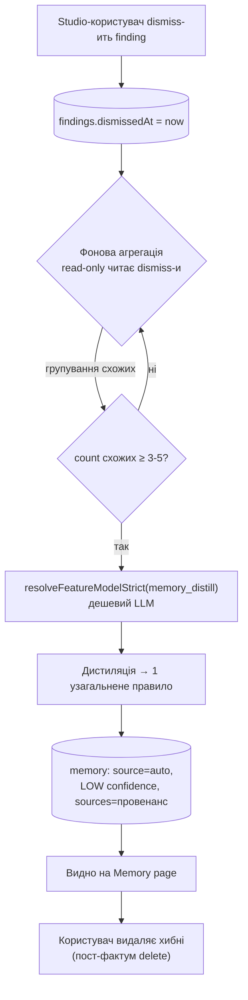
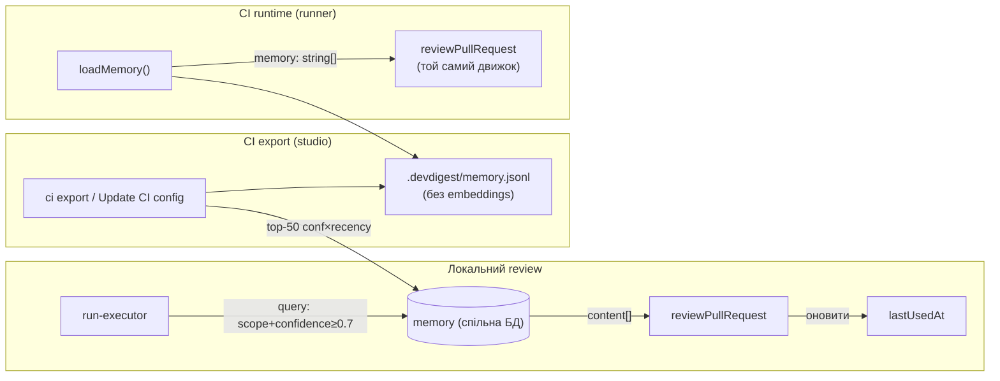

# Spec: Memory subsystem | SPEC-2026-07-19-memory-subsystem | Status: draft

Supersedes: N/A
Related:

- [SPEC-2026-07-19-agent-runner-findings-artifact](../agent-runner/specs/SPEC-2026-07-19-agent-runner-findings-artifact.md) — SPEC 1 (PR 1). Runner-зміна `loadMemory()` цього spec МОЖЕ жити тут або в PR1 (див. Read path — CI).
- [SPEC-2026-07-19-export-to-ci](SPEC-2026-07-19-export-to-ci.md) — SPEC 2 (PR 2). **Залежність:** SPEC 2 вже кладе файл `.devdigest/memory.jsonl` у CI-бандл (можливо порожній). Цей spec (SPEC 3, PR 3, мержиться ОСТАННІМ) наповнює його курованим снепшотом і будує саму підсистему памʼяті.

## Проблема й навіщо

Таблиця `memory` (`server/src/db/schema/knowledge.ts`) існує, але НЕ використовується: `run-executor.ts` захардкодив `memory: null`, тому агенти нічого не памʼятають про кодову базу і повторюють ті самі помилкові finding-и, які користувач уже відхиляв (dismiss). `reviewer-core` уже вміє приймати `memory?: string[]` і вставляти блок `## Relevant memory` у промпт — але його ніхто не годує. Цей spec робить памʼять живою: агенти ЧИТАЮТЬ спільну памʼять під час локальних і CI-review, користувач може ПРОАКТИВНО додати правило, а система мінімально ВЧИТЬСЯ з відхилених finding-ів (дешевий LLM дистилює ≥3-5 схожих dismiss-ів в одне узагальнене правило). Памʼять лишається суто СПІЛЬНОЮ (workspace/repo/global), без per-agent прив'язки.

## Goals / Non-goals

**Goals:**

- **Read path (local):** розстабити `run-executor.ts` — замість `memory: null` передавати реальні memory-рядки у `reviewPullRequest`, читаючи спільну БД read-only (без зміни core-логіки reviews).
- **Read path (CI):** експортувати курований снепшот памʼяті (`≤50` записів, scope global + target repo, ранжування `confidence × recency`, без embeddings) у `.devdigest/memory.jsonl`; runner додає `loadMemory()` (дзеркало `loadSkillBodies`) і передає `memory: string[]` у движок.
- **Write path (explicit):** форма `+ Add memory` (content + kind + scope) → `source=explicit`, активний негайно, без LLM.
- **Write path (auto-learning):** фонова агрегація читає dismiss-и read-only, групує схожі; при ≥3-5 — дешевий LLM (Feature Model `memory_distill`) дистилює їх в ОДНЕ правило `source=auto` з LOW confidence; апрув пост-фактум (видалення поганих на Memory page), БЕЗ pending-gate.
- **Governance (v1):** поріг confidence (~0.7) для включення в промпт; провенанс (`source` + `sources` jsonb); пост-фактум delete.
- **Memory page (нова):** одна ГЛОБАЛЬНА сторінка в сайдбарі — header + фільтри + таблиця active memory + empty-state.
- **Feature Model:** новий `memory_distill` у `FeatureModelId` (server + client mirror) + запис у `FEATURE_MODELS` (дешевий default); Settings → Feature Models авто-рендерить picker.
- **Schema:** додати мінімальні поля до `memory` (`source` explicit|auto; можливо `status`).

**Non-goals:**

- **НЕ** вводити `agentId` / per-agent памʼять / гібрид — памʼять СУТО спільна (Q17).
- **НЕ** робити per-agent Memory tab — лише одна глобальна сторінка.
- **НЕ** модифікувати core-логіку модуля reviews — dismiss/accept споживаються READ-ONLY.
- **НЕ** генерувати embeddings у v1 (поле `embedding` лишається nullable, не заповнюється).
- **НЕ** робити pending-approval gate для auto-памʼяті — апрув пост-фактум.
- **НЕ** відправляти embeddings у CI-снепшот (тільки content + metadata).
- **НЕ** рахувати CI-використання в `lastUsedAt` (оновлюється лише локальними review).
- **v2 deferred:** decay, повний audit-log, dedup, генерація embeddings, per-agent памʼять, live CI retrieval.

## User stories

- Як studio-користувач, я хочу, щоб агент памʼятав рішення про кодову базу, щоб локальні й CI-review були точніші й не повторювали відхилені finding-и.
- Як studio-користувач, я хочу вручну додати правило («ми навмисно не використовуємо X»), щоб агент одразу його враховував без чекання на навчання.
- Як studio-користувач, я хочу, щоб система сама вчилася з моїх dismiss-ів, коли я багато разів відхиляю схожий finding, щоб не пояснювати це вручну.
- Як studio-користувач, я хочу бачити все, що агент «вивчив», з провенансом і видаляти хибні правила, щоб памʼять не отруювалась.
- Як studio-користувач, я хочу керувати тим, яка (дешева) модель робить дистиляцію, у Settings → Feature Models.

## Acceptance criteria (EARS)

### A. Read path — local reviews (розстабити run-executor)

- **AC-1:** КОЛИ стартує локальний review-run для PR у workspace, система повинна (shall) вибрати memory-записи, де (`scope='global'`) АБО (`scope='repo'` І `repoId` = репозиторій цього PR), із `confidence ≥ 0.7`, і передати їхні `content`-рядки в `reviewPullRequest` як `memory: string[]` замість `memory: null`.
  `observable: unit/it-test run-executor — memory-рядки досягають виклику reviewPullRequest; прайм-промпт містить "## Relevant memory"`
- **AC-2:** ЯКЩО жоден memory-запис не проходить фільтр (порожня таблиця або всі нижче порогу), ТОДІ система повинна (shall) передати відсутній/порожній `memory` і НЕ падати — промпт ідентичний поточному (без блоку `## Relevant memory`).
  `observable: unit-test — 0 записів → reviewPullRequest викликається без memory; run завершується успішно`
- **AC-3:** КОЛИ memory-запис реально включено в промпт локального review, система повинна (shall) оновити його `lastUsedAt` на час цього прогону.
  `observable: it-test — після локального run у використаних записів lastUsedAt оновлено`
- **AC-4:** Система повинна (shall) читати finding-и (accept/dismiss) та memory ВИКЛЮЧНО через read-only запити до спільної БД і НЕ змінювати core-логіку/схему модуля reviews.
  `observable: code review — reviews/ core не змінено; лише інжекція на call-site run-executor`

### B. Read path — CI export snapshot

- **AC-5:** КОЛИ агента експортують у CI (`POST /agents/:id/export-ci` або «Update CI config»), система повинна (shall) згенерувати вміст `.devdigest/memory.jsonl` як JSONL зі записів scope `global` + target repo, `confidence ≥ 0.7`, впорядкованих за `confidence × recency(COALESCE(lastUsedAt, createdAt))` спадаюче.
  `observable: unit-test генератора снепшоту — правильний фільтр + порядок; запис із lastUsedAt=null ранжується за createdAt`
- **AC-6:** ЯКЩО кандидатів більше 50, ТОДІ система повинна (shall) включити лише топ-50 за цим ранжуванням.
  `observable: unit-test — 60 кандидатів → рівно 50 рядків, топові за score`
- **AC-7:** ДЕ немає жодного запису, що проходить фільтр, система повинна (shall) згенерувати порожній `memory.jsonl` (0 рядків) і НЕ ламати export (сумісно зі SPEC 2, який кладе можливо порожній файл).
  `observable: unit-test — 0 кандидатів → порожній рядковий вміст; export не падає`
- **AC-8:** Кожен рядок `memory.jsonl` повинен (shall) бути валідним JSON з полями `content`, `kind`, `scope`, `confidence`, `source` і НЕ містити `embedding`.
  `observable: unit-test — JSON.parse кожного рядка; відсутність поля embedding`
- **AC-9:** КОЛИ CI-runner стартує, `loadMemory()` повинен (shall) прочитати `.devdigest/memory.jsonl` (якщо існує), витягнути `content` кожного запису і передати `memory: string[]` у `reviewPullRequest`; ЯКЩО файл відсутній або порожній → передати відсутній `memory` і НЕ падати; ЯКЩО окремий рядок — невалідний JSON, ТОДІ пропустити його (skip) і продовжити, НЕ ламаючи review. Розміщення цієї runner-зміни — у PR1 (agent-runner), бо `loadMemory` толерантний до порожнього/відсутнього файлу й безпечний до появи контенту.
  `observable: agent-runner unit-test loadMemory — файл→масив; відсутній файл→[]; биті рядки пропущені, валідні збережені`

### C. Write path — explicit (+ Add memory)

- **AC-10:** КОЛИ користувач сабмітить форму `+ Add memory` з `content` + `kind` + `scope`, система повинна (shall) створити memory-запис зі `source='explicit'`, активний НЕГАЙНО (без LLM, без pending), доступний для read-path з наступного review.
  `observable: it-test — POST → запис у БД source=explicit; наступний локальний review його підхоплює`
- **AC-11:** ЯКЩО `scope='repo'`, ТОДІ система повинна (shall) вимагати `repoId`; ЯКЩО `scope='global'|'team'`, ТОДІ `repoId` має бути null.
  `observable: it-test — scope=repo без repoId → 422; scope=global з repoId → repoId ігнорується/null`
- **AC-12:** ЯКЩО `content` порожній/пробіли, ТОДІ система повинна (shall) відхилити запит (422) без створення запису.
  `observable: it-test — порожній content → 422`
- **AC-13:** Система повинна (shall) присвоювати explicit-запису `confidence = 0.9` за замовчуванням (вище порогу 0.7), щоб він одразу впливав на review.
  `observable: it-test — explicit-запис має confidence=0.9 і проходить фільтр AC-1 одразу`

### D. Write path — auto-learning (distillation)

- **AC-14:** КОЛИ фонова агрегація виявляє ≥ порогу (3-5) схожих dismiss-ів, система повинна (shall) викликати ДЕШЕВИЙ LLM (Feature Model `memory_distill`) для дистиляції цих dismiss-ів в ОДНЕ узагальнене правило і додати memory-запис зі `source='auto'`.
  `observable: it-test (LLM stubbed) — 3 схожі dismiss-и → 1 auto memory-запис`
- **AC-15:** КОЛИ створюється auto-запис, система повинна (shall) присвоїти `confidence = min(0.45 + 0.06 × dismiss_count, 0.9)` (3→~0.63, 5→~0.75, cap 0.9), монотонно зростаючу з кількістю dismiss-ів.
  `observable: unit-test функції confidence — 3→~0.63, 5→~0.75, cap 0.9, монотонність`
- **AC-16:** КОЛИ auto-запис створено, система повинна (shall) додати його ПОСТ-ФАКТУМ (активним, видимим на Memory page) БЕЗ pending-approval gate.
  `observable: it-test — auto-запис одразу query-абельний як активний; немає стану "pending"`
- **AC-17:** Система повинна (shall) заповнити поле `sources` (jsonb) провенансом (ідентифікатори finding-ів/PR-ів, що породили правило) для кожного auto-запису.
  `observable: it-test — sources містить finding ids/PR посилання`
- **AC-18:** Дистиляція повинна (shall) резолвити модель через `resolveFeatureModelStrict(container, wsId, "memory_distill")`; ЯКЩО модель не сконфігурована → поводитись як інші feature-model call-sites (422/ValidationError), не ламаючи інші, вже успішні, дистиляції в тій самій пачці.
  `observable: it-test — unconfigured → ValidationError; батч ізолює падіння однієї групи`
- **AC-19:** Система повинна (shall) тримати ВЛАСНИЙ watermark (`last_processed_at`) у memory-модулі й обробляти лише dismiss-и з `dismissedAt > watermark`, потім просувати watermark — щоб не ре-дистилювати ті самі dismiss-и (reviews лишається read-only, без запису маркерів у findings).
  `observable: it-test — повторний прогон над тими самими dismiss-ами не створює дубль; watermark просунуто`

### E. Governance / anti-poisoning

- **AC-20:** ПОКИ memory-запис має `confidence < 0.7`, система повинна (shall) виключати його як з локального промпту (AC-1), так і з CI-снепшоту (AC-5).
  `observable: it-test — запис confidence=0.5 не потрапляє ні в локальний review, ні в memory.jsonl`
- **AC-21:** КОЛИ користувач видаляє memory-запис на Memory page, система повинна (shall) видалити його з БД так, що він більше НЕ потрапляє в жоден наступний локальний review чи CI-снепшот.
  `observable: it-test — DELETE → наступний review/export його не містить`
- **AC-22:** Система повинна (shall) породжувати auto-памʼять ВИКЛЮЧНО з довірених сигналів (dismiss-и, зроблені studio-користувачем) і НІКОЛИ безпосередньо з недовіреного PR-контенту (diff, PR body, коментарі).
  `observable: code review — вхід дистиляції = рядки finding-ів, відхилених user-ом, не сирий PR-текст`
- **AC-23:** Система повинна (shall) зберігати `source` (`explicit|auto`) для кожного запису, щоб провенанс було видно на Memory page («added by you» vs «learned from N dismisses»).
  `observable: unit-test — source присутній у DTO та відображенні`

### F. Memory page UI (нова, глобальна)

- **AC-24:** Система повинна (shall) показати сторінку Memory у сайдбарі з header «Memory» + subtitle «What your agents have learned about this codebase» + кнопкою `[+ Add memory]` + кнопкою `[Refresh]`.
  `observable: E2E/ручна — сторінка відкривається з цими елементами`
- **AC-25:** ЯКЩО memory-записів немає, ТОДІ система повинна (shall) показати empty-state «No memories yet» + пояснення + `[+ Add memory]`.
  `observable: E2E — порожня БД → empty-state`
- **AC-26:** Таблиця active memory повинна (shall) мати колонки CONTENT | KIND | SCOPE | SOURCE | CONF | USED | ⋯; для `scope=repo` колонка SCOPE показує «repo · owner/name», для `global` — «global».
  `observable: E2E — repo-запис показує "repo · owner/name"; global-запис показує "global"`
- **AC-27:** КОЛИ користувач натискає `[Refresh]`, система повинна (shall) ре-читати ЛОКАЛЬНУ БД (НЕ GitHub) і показати нові auto-learned рядки.
  `observable: E2E — після auto-навчання Refresh показує новий рядок; жодного GitHub-запиту`
- **AC-28:** Фільтри scope | kind | source | текстовий пошук повинні (shall) звужувати таблицю відповідно до вибору.
  `observable: E2E — фільтр source=auto показує лише auto-записи; пошук фільтрує по content`
- **AC-29:** Колонка USED повинна (shall) відображати `lastUsedAt` (напр. «2d ago»); CI-використання НЕ впливає на це значення.
  `observable: it/E2E — CI-снепшот не змінює lastUsedAt; локальний review змінює`
- **AC-30:** Меню `⋯` повинно (shall) надавати дії Edit / Delete / view provenance для запису.
  `observable: E2E — три дії доступні; Delete видаляє (AC-21)`

### G. Feature Model для дистиляції

- **AC-31:** Система повинна (shall) додати `"memory_distill"` до `FeatureModelId` enum (server `contracts/platform.ts` + client mirror `lib/utils/featureModels.ts`) і запис у `FEATURE_MODELS` `{ id: "memory_distill", label: "Memory · Learning", description: "Distills dismissed findings into memory rules.", defaultProvider: "openrouter", defaultModel: <дешева модель, напр. "deepseek/deepseek-v4-flash"> }`.
  `observable: typecheck + unit — enum і registry містять memory_distill в обох дзеркалах`
- **AC-32:** ПОКИ `memory_distill` присутній у registry, Settings → Feature Models повинна (shall) авто-рендерити його picker без додаткового UI-коду.
  `observable: E2E/ручна — picker "Memory · Learning" зʼявляється в Settings`

## Edge cases

- Порожня таблиця памʼяті → локальний review без блоку memory (AC-2); CI-снепшот = порожній файл (AC-7).
- Усі записи нижче порогу 0.7 → нічого не потрапляє в промпт/снепшот (AC-20).
- Кандидатів рівно 50 / 51 → відсічка топ-50 (AC-6).
- `lastUsedAt` = null (жодного локального використання) → ранжування використовує `COALESCE(lastUsedAt, createdAt)` (свіжостворений запис ранжується за датою створення). (AC-5)
- Дистиляція для однієї групи впала (LLM error / unconfigured model) → інші групи в пачці не страждають (AC-18).
- Схожі dismiss-и по РІЗНИХ репозиторіях → НЕ групувати разом (правило repo-scoped); групування за `(category + file-path pattern)` у межах одного репо.
- Дистильоване правило дублює наявне explicit-правило → dedup deferred (v2) → приймається ризик дубля (accepted risk у v1; user видаляє вручну).
- `scope='team'` існує в enum, але форма `+ Add memory` у v1 пропонує ЛИШЕ `global` + `repo`; `team` лишається в enum на майбутнє.
- CI-runner: `memory.jsonl` присутній, але рядок невалідний JSON → `loadMemory` пропускає биті рядки (skip) і продовжує, НЕ падаючи. (AC-9)

## Data model / Schema

Існуюча таблиця **memory** (`server/src/db/schema/knowledge.ts`) — БЕЗ `agentId`:

- id, workspaceId, repoId (nullable → `null` = global), scope (`repo|global|team`), kind (`decision|convention|preference|fact|learning`), content, embedding vector(1536) **(nullable; НЕ заповнюється у v1)**, confidence (0–1), sources (jsonb), createdAt, updatedAt, lastUsedAt.

**Додаються цим spec (мінімальні поля):**

- **source**: `explicit | auto` — провенанс запису (обовʼязкове).
- (Поле `status` НЕ додається — апрув пост-фактум, запис активний одразу; governance тримається на `source` + `confidence` + пороговому фільтрі 0.7.)

**Read-only споживані сутності (НЕ змінюються):**

- **finding** (`server/src/db/schema/reviews.ts`): id, reviewId, file, startLine, endLine, severity, category, title, rationale, confidence, `acceptedAt`, `dismissedAt`. Джерело dismiss-сигналу для auto-learning.

**CI snapshot record** (рядок `memory.jsonl`, БЕЗ embedding): `content`, `kind`, `scope`, `confidence`, `source`.

## Workflows

### Навчальний цикл (auto-learning)

### Read / retrieval flow

## Service communication

- client (Memory page) → `POST /memory` (explicit add), `GET /memory` (list+filters), `DELETE /memory/:id`, `PATCH /memory/:id` (edit), `POST /memory/refresh` (ре-читання LOCAL DB) → server (memory module).
- server (reviews `run-executor`) → read-only query `memory` (спільна БД) → інжекція `memory: string[]` у `reviewPullRequest` (reviewer-core).
- server (auto-learning) → read-only query `findings` (dismiss-и, reviews module) → `resolveFeatureModelStrict(container, wsId, "memory_distill")` → cheap LLM provider → INSERT `memory (source=auto)`.
- server (ci export, SPEC 2 module) → read `memory` → серіалізація снепшоту ≤50 → `.devdigest/memory.jsonl` у `CiFile[]`.
- agent-runner (`loadMemory`) → читає `.devdigest/memory.jsonl` з диска → `memory: string[]` у `reviewPullRequest`.
- client (Settings) → picker `memory_distill` через наявний Feature Models UI (авто-рендер із registry).

## Contracts (high-level)

- `POST /memory` body: `{ content, kind, scope, repoId? }` → 201 `{ id, ... }` (source=explicit, активний).
- `GET /memory?scope=&kind=&source=&q=` → `{ items: MemoryItem[] }` (server-side фільтри).
- `PATCH /memory/:id` body: часткові поля → 200 оновлений запис.
- `DELETE /memory/:id` → 204.
- `POST /memory/refresh` → ре-читання LOCAL DB (не GitHub) І тригер фонової агрегації auto-learning (on-demand, без cron).
- Тригер auto-learning: on-demand при завантаженні Memory page / `POST /memory/refresh` (у проєкті немає cron; прецедент manual refresh — `polling`).
- CI: снепшот памʼяті вкладається в `CiFile[]` існуючого `POST /agents/:id/export-ci` (SPEC 2).
- Feature Model: наявний `PUT /settings` → `feature_models.memory_distill` (provider+model).

## Non-functional

- **Perf (prompt cost):** ДЕ CI-снепшот генерується, кількість записів повинна (shall) бути ≤ 50, щоб бюджет промпту лишався в межах ~30-40 токенів/запис незалежно від росту таблиці.
- **Cost (learning):** дистиляція повинна (shall) використовувати виключно модель, розвʼязану через `memory_distill` Feature Model (дешеву за замовчуванням), і НЕ використовувати review-модель.
- **Retrieval filter:** локальна вибірка й CI-снепшот повинні (shall) фільтрувати `confidence ≥ 0.7` на рівні запиту (WHERE), не в памʼяті застосунку.
- **Reliability:** ЯКЩО дистиляція однієї групи падає (LLM/unconfigured), система повинна (shall) ізолювати збій — інші групи в пачці обробляються (AC-18).
- **Local-only data:** сторінка Memory та Refresh повинні (shall) читати ТІЛЬКИ локальну БД; жодного мережевого GitHub-запиту з цієї сторінки (AC-27).

## Inputs (provenance)

- Локальна вибірка памʼяті — [deterministic: memory table] (read-only DB, без LLM).
- Оновлення `lastUsedAt` — [deterministic: memory table] (write на call-site локального review).
- CI-снепшот — [deterministic: memory table] (ранжування studio-side, без LLM, без embeddings).
- Explicit add — [deterministic: user input] (без LLM).
- Auto-learning вхід — [reused: reviews findings.dismissedAt] (довірений сигнал) → дистиляція = [new: 1 LLM call на групу] через `memory_distill`.
- CI-runtime memory — [reused: memory.jsonl зі студії] (файл з диска, без DB у runner).

## Untrusted inputs

Памʼять — це вплив на промпт review; отруєна памʼять = вектор prompt-injection на всі майбутні review. Тому:

- **Джерело auto-навчання — лише ДОВІРЕНИЙ сигнал:** dismiss-и, зроблені studio-користувачем (локальний інструмент), НЕ автори PR. Дистиляція НІКОЛИ не бере на вхід сирий недовірений PR-контент (diff, PR body, коментарі) — тільки текст finding-ів, які студіо-користувач свідомо відхилив (AC-22).
- **Поріг confidence (~0.7):** свіжі auto-правила зʼявляються нижче порогу (3 dismiss-и → ~0.6 < 0.7) і НЕ впливають на review, доки не наберуть підтверджень (більше dismiss-ів → вища confidence) — природний карантин (AC-15, AC-20).
- **Пост-фактум delete:** головний антидот — усе вивчене видиме на Memory page з провенансом; хибне правило видаляється одним кліком і зникає з наступних review/снепшотів (AC-21).
- **CI-снепшот — тільки content+metadata, без embeddings:** зменшує поверхню й тримає снепшот людино-читабельним для перегляду в PR-дифі (SPEC 2 Phase-2 human review бачить `.devdigest/memory.jsonl`).
- **CI-runner ставиться до `memory.jsonl` як до даних, не команд:** рядки стають блоком `## Relevant memory` (той самий шлях, що й локально); це trusted-снепшот, згенерований студією, а не зовнішнім джерелом.

## Verification hints

- AC-1/AC-2/AC-3 → unit/it-test `run-executor`: memory-рядки досягають `reviewPullRequest`; 0 записів → без блоку; використані записи → `lastUsedAt` оновлено.
- AC-5..AC-8 → unit-test генератора снепшоту: фільтр scope+confidence, порядок conf×recency, cap 50, JSON без embedding, порожній вхід.
- AC-9 → agent-runner unit-test `loadMemory` (дзеркало `loadSkillBodies`): файл→масив, відсутній→[].
- AC-10..AC-13 → it-test: POST explicit → активний; scope/repoId валідація; порожній content→422.
- AC-14..AC-19 → it-test (LLM stubbed): 3 dismiss-и→1 auto-запис; confidence 3→~0.6/5→~0.75; sources заповнено; unconfigured→ValidationError; повторний прогон→без дубля.
- AC-20/AC-21 → it-test: confidence<0.7 виключено; DELETE → зникає з review/снепшоту.
- AC-24..AC-30 → E2E/ручна: header/empty-state/колонки/SCOPE-формат/Refresh-local/фільтри/⋯-меню.
- AC-31/AC-32 → typecheck + E2E: enum+registry в обох дзеркалах; picker у Settings.

## Clarifications (RESOLVED)

1. **Тригер фонової агрегації:** on-demand при завантаженні Memory page / `POST /memory/refresh` (без cron). Refresh ре-читає LOCAL DB І тригерить агрегацію.
2. **Групування схожих dismiss-ів:** за `(category + file-path pattern, напр. directory-level)`; НЕ між репозиторіями (repo-scoped).
3. **Ідемпотентність:** власний watermark `last_processed_at` у memory-модулі; читати dismiss-и `dismissedAt > watermark`, просувати. Reviews read-only. (AC-19)
4. **Дефолтна explicit confidence:** `0.9`. (AC-13)
5. **Крива auto confidence:** `min(0.45 + 0.06 × count, 0.9)` → 3≈0.63, 5≈0.75, cap 0.9. (AC-15)
6. **Поле `status`:** НЕ потрібне (post-hoc, запис активний одразу). Governance = `source` + `confidence` + поріг 0.7.
7. **`scope='team'` у v1:** форма `+ Add memory` пропонує лише `global` + `repo`; team залишається в enum.
8. **`lastUsedAt = null` у ранжуванні:** `COALESCE(lastUsedAt, createdAt)`. (AC-5)
9. **Толерантність `loadMemory` до битих рядків:** пропускати (skip), не падати. (AC-9)
10. **Розміщення `loadMemory`:** у PR1 (agent-runner). (AC-9)
