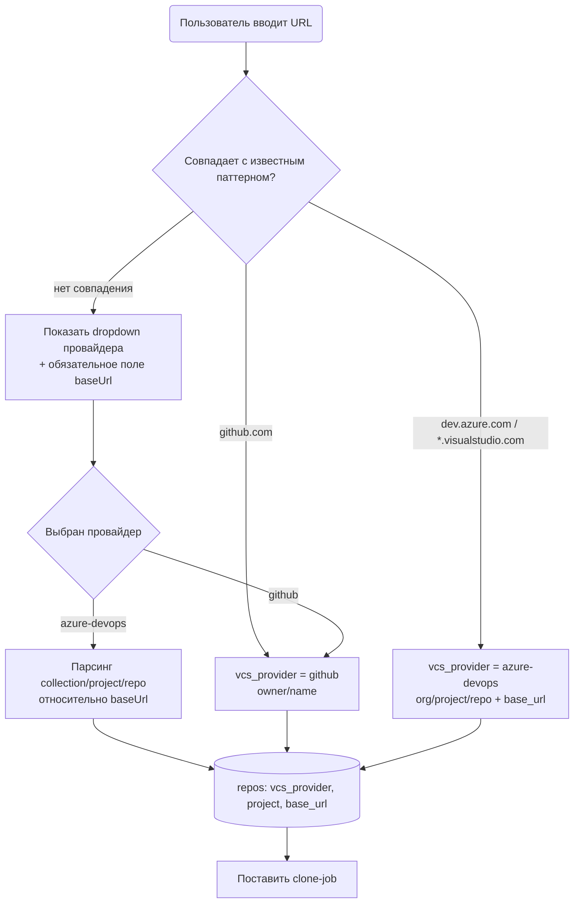
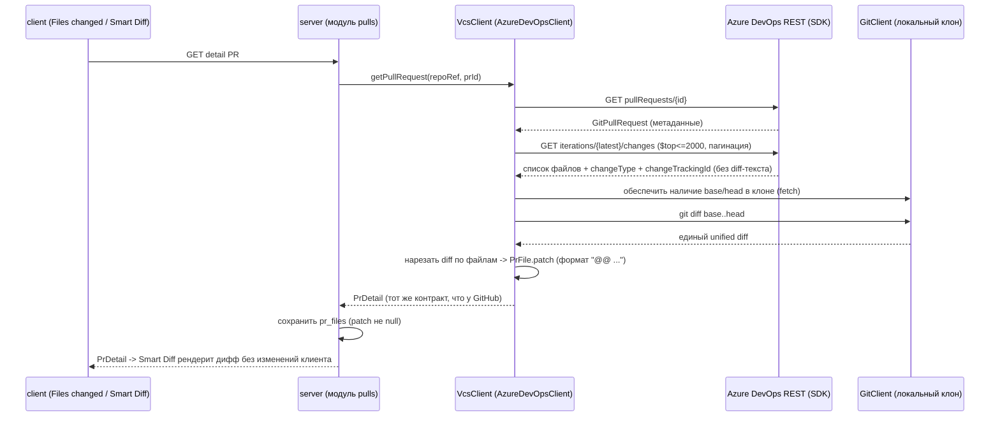
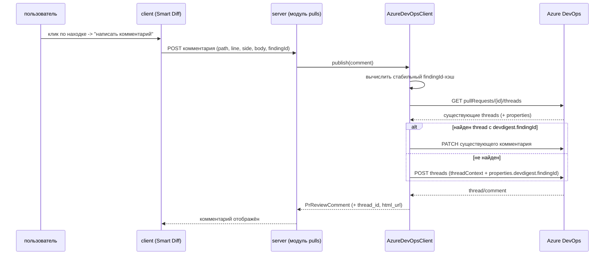

# Spec: Azure DevOps Integration | SPEC-2026-08-25-azure-devops-integration | Status: draft
Supersedes: N/A
Related: [AZURE_DEVOPS_ASSESSMENT.md](../../AZURE_DEVOPS_ASSESSMENT.md) — первичная инженерная оценка (не спека, без EARS); [SPEC-2026-07-19-export-to-ci](SPEC-2026-07-19-export-to-ci.md) — CI-путь, который эта спека НЕ расширяет на ADO

> **Язык документа:** русский — по явному требованию владельца проекта.
> Ключевые слова EARS: «система должна (shall)» / «КОГДА» / «ПОКА» / «ЕСЛИ … ТО» / «ГДЕ».

---

## Проблема и зачем

DevDigest сегодня полностью привязан к GitHub: единственный VCS-контракт — `GitHubClient`,
единственная реализация — `OctokitGitHubClient`, единственная точка DI — `Container.github()`,
и даже clone URL захардкожен как `https://github.com/${repo.fullName}.git`. Проекты компании
живут в Azure DevOps, поэтому ревью-агентов DevDigest сейчас невозможно применить к реальной
рабочей нагрузке. Эта спека добавляет Azure DevOps как **второй равноправный VCS-провайдер**,
сосуществующий с GitHub в одном workspace, чтобы владелец мог с той же скоростью, что и сегодня
на GitHub, смотреть находки агентов на diff'е реального ADO PR и писать комментарии коллегам
прямо в этот PR.

---

## Goals / Non-goals

**Goals:**
- Обобщить `GitHubClient` до порта `VcsClient` с дискриминатором `readonly id: 'github' | 'azure-devops'` — по уже существующему в кодовой базе образцу `LLMProvider` (`adapters.ts:82-88`).
- Реализовать `AzureDevOpsClient` на официальном SDK `azure-devops-node-api`.
- Автоматически определять провайдера по URL при добавлении репозитория; при неизвестном хосте — явный выбор + `baseUrl`.
- Поддержать оба варианта хостинга: Azure DevOps Services (`dev.azure.com`, `*.visualstudio.com`) и self-hosted Azure DevOps Server с произвольным `baseUrl`.
- **Показывать реальное содержимое диффа** во вкладке Files changed / Smart Diff для ADO-репозиториев — вычислением `patch` из локального git-клона (ADO REST API не отдаёт diff-текст нигде).
- Ручная (по явному действию пользователя) идемпотентная публикация комментариев в реальный ADO PR через thread-based модель.
- Полное сосуществование: GitHub-путь не деградирует, существующий тест-suite проходит как раньше.

**Non-goals (см. также раздел «Out of scope»):**
- Azure Pipelines / любая CI-интеграция для ADO.
- Webhooks (DevDigest и для GitHub работает на pull-on-read — модель не меняется).
- Поддержка ADO Work Items как «linked issue» (GitHub-путь `Closes #N` остаётся GitHub-only).
- Миграция уже добавленных GitHub-репозиториев на что-либо, кроме `vcs_provider='github'`.
- Переписывание `reviewer-core/`, `repo-intel/`, `run-executor.ts` — они уже provider-agnostic.
- Изменение клиентских компонентов рендера диффа и находок (`SmartDiffViewer`, `FindingCard`, `SeverityFilter`) — контракт `PrDetail` остаётся идентичным для обоих провайдеров.

---

## User stories

- Как владелец проекта, я хочу добавить репозиторий по ссылке `dev.azure.com/...`, чтобы DevDigest сам понял, что это Azure DevOps, и не заставлял меня ничего настраивать вручную.
- Как владелец проекта, я хочу добавить репозиторий из self-hosted Azure DevOps Server нашей компании, указав адрес сервера, потому что домен не совпадает с `dev.azure.com`.
- Как ревьюер, я хочу открыть ADO PR в DevDigest и увидеть **настоящий дифф** с находками агентов на строках — так же, как я вижу его для GitHub PR.
- Как ревьюер, я хочу кликнуть на находку в Smart Diff и опубликовать по ней комментарий прямо в реальный ADO PR, чтобы коллега увидел его в своём привычном интерфейсе.
- Как ревьюер, я хочу повторно нажать «опубликовать» или отредактировать уже опубликованный комментарий и НЕ получить дубликат треда в PR.
- Как владелец проекта, я хочу, чтобы GitHub-репозитории продолжали работать ровно как раньше, пока я подключаю Azure DevOps.
- Как владелец проекта, я хочу видеть в списке репозиториев, какой из них GitHub, а какой Azure DevOps.

---

## Acceptance criteria (EARS)

### A. Определение провайдера и добавление репозитория

- **AC-1:** КОГДА пользователь добавляет репозиторий по URL, соответствующему `github.com` (https- или ssh-форма), система должна (shall) сохранить репозиторий с `vcs_provider = 'github'` и распарсить `owner`/`name` существующей логикой без изменения поведения.
  `observable: integration — POST /repos с github-URL → строка repos с vcs_provider='github'; unit — parseRepoUrl регрессия`
- **AC-2:** КОГДА пользователь добавляет репозиторий по URL вида `https://dev.azure.com/{org}/{project}/_git/{repo}` или `https://{org}.visualstudio.com/{project}/_git/{repo}`, система должна (shall) сохранить `vcs_provider = 'azure-devops'` и распарсить трёхуровневый идентификатор `org` / `project` / `repo`, выставив `base_url` соответственно `https://dev.azure.com` или `https://{org}.visualstudio.com`.
  `observable: unit — таблица URL→{provider, org, project, repo, baseUrl}; integration — POST /repos с ADO-URL`
- **AC-3:** ЕСЛИ URL не соответствует ни одному известному паттерну (`github.com`, `dev.azure.com`, `*.visualstudio.com`), ТО система должна (shall) вернуть форме требование явно выбрать провайдера (dropdown) и указать обязательный `baseUrl` — вместо текущей ошибки `invalid_repo_url`.
  `observable: integration — POST /repos с https://ado.company.local/... → ответ с кодом provider_required, не 400 invalid_repo_url; E2E — форма показывает dropdown + поле baseUrl`
- **AC-4:** ГДЕ провайдер выбран вручную как `azure-devops`, система должна (shall) требовать непустой `baseUrl` и разобрать `collection`/`project`/`repo` из части пути URL относительно `baseUrl` (форма Azure DevOps Server: `https://{server}/{collection}/{project}/_git/{repo}`).
  `observable: unit — парсинг self-hosted URL при заданном baseUrl; integration — пустой baseUrl → ошибка валидации`
- **AC-5:** Система должна (shall) хранить дискриминатор провайдера в колонке `repos.vcs_provider` со значениями `'github' | 'azure-devops'`, а миграция должна (shall) проставить всем существующим строкам `'github'`.
  `observable: integration — после миграции все ранее созданные repos имеют vcs_provider='github'`
- **AC-6:** ЕСЛИ в одном workspace добавляются два репозитория с одинаковым `full_name`, но разными провайдерами, ТО система должна (shall) сохранить оба — уникальность репозитория определяется тройкой `(workspace_id, vcs_provider, full_name)`.
  `observable: integration — добавить github:acme/api и ado:acme/api → 2 строки, без конфликта уникального индекса`
- **AC-7:** ЕСЛИ URL Azure DevOps не содержит сегмента `_git` или не даёт всех трёх уровней `org/project/repo`, ТО система должна (shall) отклонить добавление с сообщением, указывающим ожидаемый формат URL.
  `observable: unit — dev.azure.com/org/project (без _git/repo) → ошибка с примером корректного URL`

### B. Порт VcsClient и DI

- **AC-8:** Система должна (shall) определить порт `VcsClient` с полем `readonly id: 'github' | 'azure-devops'` — по образцу уже существующего мультипровайдерного `LLMProvider` — и обе реализации (`OctokitGitHubClient`, `AzureDevOpsClient`) должны (shall) реализовывать этот единый порт. Простое переименование `GitHubClient` без дискриминатора недопустимо.
  `observable: code review — VcsClient.id присутствует; typecheck — обе реализации удовлетворяют порту`
- **AC-9:** `Container` должен (shall) предоставлять метод получения клиента по репозиторию (`vcs(repo)`), диспетчеризующий по `repo.vcsProvider`, и оставаться единственным местом конструирования VCS-клиентов (composition root).
  `observable: code review — grep 'new AzureDevOpsClient' даёт единственное совпадение в container.ts; integration — ADO-репо получает клиент с id='azure-devops'`
- **AC-10:** Система должна (shall) расширить `RepoRef` так, чтобы он вмещал трёхуровневую структуру ADO (обязательные `owner`/`name` + опциональные `project`/`baseUrl`), при этом GitHub-реализация должна (shall) игнорировать новые поля без изменения поведения.
  `observable: typecheck — существующие вызовы { owner, name } компилируются; unit — Octokit-клиент игнорирует project`
- **AC-11:** ЕСЛИ `vcs_provider = 'azure-devops'`, а `project` в `RepoRef` отсутствует, ТО адаптер должен (shall) бросить ошибку конфигурации **до** любого сетевого вызова.
  `observable: unit — AzureDevOpsClient.listPullRequests({owner,name}) → configuration error, fetch не вызван`
- **AC-12:** ЕСЛИ вызывается метод порта, не поддерживаемый провайдером, ТО реализация должна (shall) бросить явную ошибку `not_supported` с указанием `id` провайдера и имени метода — не возвращать «пустой успех».
  `observable: unit — AzureDevOpsClient.listWorkflowRuns() → not_supported с текстом, содержащим 'azure-devops' и 'listWorkflowRuns'`
- **AC-13:** ЕСЛИ репозиторий имеет `vcs_provider = 'azure-devops'`, ТО эндпоинты модуля `ci/` должны (shall) возвращать управляемую ошибку с кодом `ci_not_supported_for_provider` (4xx), а не 500 и не молчаливый пустой результат.
  `observable: integration — POST/GET ci-эндпоинт для ADO-репо → 4xx с кодом ci_not_supported_for_provider`

### C. Секреты, PAT и проверка соединения

- **AC-14:** Система должна (shall) добавить `AZURE_DEVOPS_TOKEN` в перечень `SecretKey`, и этот секрет должен (shall) читаться исключительно через инжектируемый `SecretsProvider` (правило проекта: `process.env` читает только `LocalSecretsProvider`).
  `observable: code review — grep process.env вне LocalSecretsProvider даёт 0 новых совпадений; integration — PAT из ~/.devdigest/secrets.json подхватывается`
- **AC-15:** Система должна (shall) расширить контракты `ConnTestProvider` и `SecretsStatus` значением `azure-devops`, чтобы Settings отражал, настроен ли PAT.
  `observable: integration — GET /settings/secrets-status содержит ключ azure-devops; code review — Zod-enum расширен`
- **AC-16:** КОГДА пользователь запускает проверку соединения для `azure-devops`, система должна (shall) выполнить обращение к профильному эндпоинту ADO с Basic-аутентификацией (пустой username + PAT в качестве пароля) и вернуть `ok: true` с отображаемым именем пользователя либо `ok: false` с человекочитаемой причиной.
  `observable: integration — валидный PAT → ok:true + непустое message; невалидный → ok:false`
- **AC-17:** ГДЕ введённый PAT не соответствует известному формату Azure DevOps Services (длина 84 символа, сигнатура `AZDO` в позициях 76–80), клиент должен (shall) показать неблокирующее предупреждение о вероятно неверном формате и всё равно позволить сохранить значение — self-hosted ADO Server может выпускать токены другого формата.
  `observable: unit — валидатор формата: 84/AZDO → без предупреждения, иначе предупреждение; E2E — кнопка сохранения остаётся активной`
- **AC-18:** Система не должна (shall not) возвращать значение `AZURE_DEVOPS_TOKEN` ни в одном ответе API — только маскированное представление, как для уже существующих ключей.
  `observable: integration — GET /settings не содержит полного PAT ни в одном поле`

### D. Чтение Pull Request'ов из Azure DevOps

- **AC-19:** КОГДА выполняется опрос ADO-репозитория, система должна (shall) вернуть `PrMeta[]`, отобразив: `pullRequestId → number`; `active|completed|abandoned → open|merged|closed`; `targetRefName` без префикса `refs/heads/` → `base`; `sourceRefName` без префикса → `branch`; `lastMergeSourceCommit.commitId → head_sha`; `createdBy → author`.
  `observable: unit — таблица маппинга на фикстуре ответа SDK; integration — POST /repos/:id/poll для ADO-репо создаёт строки pull_requests`
- **AC-20:** ГДЕ провайдер `azure-devops`, поля `additions`/`deletions`/`files_count` в ответе списка PR должны (shall) быть равны 0 (ADO их не отдаёт) и должны (shall) добираться из detail-запроса — тем же механизмом backfill, который уже применяется для GitHub-пути.
  `observable: integration — после списка additions=0, после GET /pull-requests/:id значения ненулевые в БД`
- **AC-21:** КОГДА запрашивается detail ADO PR, система должна (shall) получить список изменённых файлов через `iterations/{latestIterationId}/changes` с пагинацией `$top ≤ 2000`, продолжая запрашивать следующие страницы, пока `nextTop`/`nextSkip` не станут равны 0.
  `observable: unit — на фикстуре с nextSkip>0 выполняются повторные страницы; integration — PR со 2500 изменёнными файлами возвращает все файлы`
- **AC-22:** Система должна (shall) заполнять `PrFile.additions`/`deletions` для ADO из локально вычисленного diff (см. раздел E); ЕСЛИ локальный diff недоступен, ТО оба значения равны 0, а не выдуманы.
  `observable: integration — при доступном клоне значения совпадают с git diff --numstat; при отсутствии клона = 0`
- **AC-23:** ЕСЛИ провайдер `azure-devops` и в теле PR присутствует ссылка вида `Closes #N`, ТО система должна (shall) пропустить шаг получения linked issue без ошибки и без прерывания прогона ревью (поддержка ADO Work Items — вне скоупа).
  `observable: integration — прогон агента на ADO PR с "Closes #12" в теле завершается успешно, linked_issue отсутствует`

### E. Diff / patch — критический путь

- **AC-24:** КОГДА клиент запрашивает detail PR для ADO-репозитория, система должна (shall) заполнить `PrFile.patch` реальным unified diff, вычисленным локально из клона репозитория (`container.git.diff(base, head)`) и нарезанным по файлам, так что вкладка Files changed и Smart Diff отображают содержимое диффа так же, как для GitHub PR.
  `observable: integration — GET /pull-requests/:id для ADO-репо → каждый файл имеет непустой patch; E2E — вкладка Files changed показывает строки диффа, а не пустой список`
- **AC-25:** Система должна (shall) привести detail-путь модуля `pulls` к тому же diff-first порядку, который уже применяется в `reviews/diff-loader.ts`: сначала локальный `git diff`, и только при неудаче — `patch` из ответа провайдера. Сегодня этот роут берёт `detail.files[].patch` напрямую и потому для ADO записал бы `null` во все файлы.
  `observable: code review — pulls detail-путь использует общий diff-first загрузчик; integration — для GitHub-репо patch по-прежнему непустой (регрессия)`
- **AC-26:** Перед вычислением diff система должна (shall) обеспечить наличие base- и head-коммитов PR в локальном клоне (fetch по refspec, специфичному для провайдера).
  `observable: integration — PR, head которого отсутствует локально, после detail-запроса даёт непустой patch`
- **AC-27:** ЕСЛИ локальный клон отсутствует, не завершён или не содержит нужных коммитов, ТО система должна (shall) вернуть `patch = null` вместе с явным признаком недоступности диффа и причиной, а UI должен (shall) показать сообщение о недоступности диффа вместо пустой вкладки.
  `observable: integration — ADO-репо без clone_path → признак diff_unavailable в ответе; E2E — вкладка показывает сообщение, не пустоту`
- **AC-28:** Нарезанный по файлам `patch` должен (shall) иметь тот же формат, что отдаёт GitHub (начинается с заголовка hunk `@@ … @@`, без строки `diff --git`), чтобы клиентские компоненты рендера диффа не требовали изменений.
  `observable: unit — сплиттер unified diff: вход = git diff одного PR, выход = map path→patch, каждый начинается с '@@'`
- **AC-29:** Ответ `PrDetail` для ADO должен (shall) валидироваться тем же Zod-контрактом, что и для GitHub, без добавления provider-специфичных обязательных полей.
  `observable: integration — PrDetail.parse(ответ ADO) проходит; code review — контракт platform.ts не получил обязательных ADO-полей`

### F. Публикация комментариев в реальный PR

- **AC-30:** Система должна (shall) публиковать комментарии в реальный ADO PR **только** по явному действию пользователя (клик по находке в Smart Diff / Diff view → «написать комментарий»), и не должна (shall not) публиковать что-либо автоматически по завершении прогона ревью-агентов.
  `observable: integration — прогон агента на ADO PR не создаёт ни одного thread; E2E — thread появляется только после клика`
- **AC-31:** КОГДА пользователь публикует комментарий по находке на ADO PR, система должна (shall) создать один thread (`POST .../pullRequests/{id}/threads`) с `threadContext` (`filePath` + `rightFileStart`/`leftFileStart` в зависимости от стороны диффа) и записать в `properties` ключ `devdigest.findingId` со стабильным идентификатором находки.
  `observable: integration — созданный thread содержит properties['devdigest.findingId']; unit — маппинг side→right/leftFileStart`
- **AC-32:** Стабильный идентификатор находки должен (shall) вычисляться детерминированно из неизменяемых атрибутов находки (репозиторий, номер PR, путь файла, строка, severity, заголовок): одинаковый вход даёт (shall) одинаковый идентификатор между процессами и перезапусками.
  `observable: unit — одинаковый вход → одинаковый хэш; изменение любого атрибута → другой хэш`
- **AC-33:** ЕСЛИ на этом PR уже существует thread с тем же `devdigest.findingId`, ТО система должна (shall) обновить существующий комментарий вместо создания нового thread — повторный клик или редактирование не должны (shall not) плодить дубликаты.
  `observable: integration — публикация одной находки дважды → ровно 1 thread на PR, содержимое обновлено`
- **AC-34:** ГДЕ пользователь пишет свободный комментарий, не привязанный к находке, система должна (shall) создать новый thread без property идемпотентности (каждый такой комментарий — самостоятельный).
  `observable: integration — два свободных комментария на одной строке → 2 thread'а`
- **AC-35:** КОГДА клиент запрашивает существующие комментарии ADO PR, система должна (shall) получить threads и развернуть их в плоский `PrReviewComment[]`, отфильтровав системные записи (`commentType != 'text'`) и удалённые комментарии.
  `observable: integration — PR с системным thread об обновлении PR → системная запись отсутствует в ответе`
- **AC-36:** Система должна (shall) расширить контракт `PrReviewComment` опциональным `thread_id` (для GitHub — `null`), а `PrCommentInput.in_reply_to` для ADO должен (shall) трактоваться как идентификатор треда, в который добавляется ответный комментарий.
  `observable: integration — ответ на ADO-комментарий добавляет комментарий в существующий тред, новый тред не создаётся`
- **AC-37:** Система должна (shall) собирать `html_url` ADO-комментария в формате `{baseUrl}/{org}/{project}/_git/{repo}/pullrequest/{id}?discussionId={threadId}`, чтобы ссылка из UI открывала конкретное обсуждение.
  `observable: unit — сборка URL по известным org/project/repo/prId/threadId; E2E — клик открывает ADO на нужном обсуждении`
- **AC-38:** ГДЕ из ответа `iterations/{id}/changes` доступен `changeTrackingId` для файла, система должна (shall) использовать его при позиционировании thread, чтобы Azure DevOps сам пересчитывал позицию комментария между итерациями PR.
  `observable: integration — после push новой итерации PR ранее опубликованный комментарий остаётся привязан к своей строке`
- **AC-39:** ЕСЛИ публикация одного комментария завершилась ошибкой, ТО система должна (shall) показать ошибку именно для этого комментария и сохранить уже опубликованные без отката; повторная попытка должна (shall) быть идемпотентной по AC-33.
  `observable: integration — смоделировать 500 на POST threads → ранее созданные thread'ы не удаляются, повтор не создаёт дубликат`
- **AC-40:** Система не должна (shall not) использовать атомарный GitHub-путь публикации ревью (`postReview`) для Azure DevOps — для ADO обязателен thread-based путь (в ADO нет батч-эндпоинта: один POST = один thread).
  `observable: code review — AzureDevOpsClient не реализует атомарный batch-review; integration — публикация N находок → N POST threads`

### G. Клонирование и git-аутентификация

- **AC-41:** КОГДА клонируется или обновляется ADO-репозиторий, система должна (shall) аутентифицироваться сохранённым PAT так, чтобы PAT не сохранялся в постоянном remote URL репозитория (`.git/config`) и не попадал в git-историю.
  `observable: integration — после clone: .git/config не содержит подстроки PAT; grep PAT по каталогу клона = 0 совпадений`
- **AC-42:** Система не должна (shall not) использовать захардкоженный `https://github.com/${fullName}.git` при обновлении репозитория — clone URL должен (shall) собираться из `vcs_provider` + `base_url` + идентификатора репозитория.
  `observable: code review — в repos/service.ts нет литерала github.com; integration — refresh ADO-репо использует ADO clone URL`
- **AC-43:** Система не должна (shall not) записывать PAT (ни GitHub, ни Azure DevOps) в логи сервера, включая логи ошибок и retry.
  `observable: integration — прогнать сценарий с ошибкой авторизации, grep PAT по собранным логам = 0 совпадений`

### H. Rate limits и устойчивость

- **AC-44:** ЕСЛИ Azure DevOps вернул HTTP 429 (модель TSTU: 200 TSTU за скользящее окно 5 минут; код ошибки `TF400733`), ТО система должна (shall) повторить запрос с задержкой из заголовка `Retry-After`, выполнив не более 3 повторов и суммарно ожидая не более 60 секунд, после чего вернуть ошибку с кодом `vcs_rate_limited`.
  `observable: unit — мок 429 + Retry-After: 2 → ровно 3 повтора, суммарная задержка ≤ 60с, затем vcs_rate_limited`
- **AC-45:** ГДЕ Azure DevOps вернул заголовки `X-RateLimit-Remaining` / `X-RateLimit-Delay`, система должна (shall) логировать их значения (без PAT), чтобы приближение к лимиту было наблюдаемо.
  `observable: integration — ответ с заголовками → в логе присутствуют значения remaining/delay`
- **AC-46:** Логика повторов для Azure DevOps должна (shall) быть реализована поверх существующего механизма `withRetry` в `platform/resilience.ts` как отдельная провайдер-специфичная надстройка, читающая `Retry-After`, а не как форк общего механизма.
  `observable: code review — новый retry-адаптер импортирует существующий withRetry; GitHub-путь не изменён`

### I. Ошибки авторизации и защитный парсинг

- **AC-47:** ЕСЛИ Azure DevOps вернул 401 или 403, ТО система должна (shall) вернуть ошибку с кодом `vcs_unauthorized` и подсказкой о необходимых scope PAT (`vso.code` — чтение, `vso.code_write` — запись PR, `vso.threads_full` — чтение/запись PR comment threads), не полагаясь на разбор конкретного текста сообщения ADO.
  `observable: integration — мок 403 с произвольным телом → vcs_unauthorized + подсказка со списком scope`
- **AC-48:** ЕСЛИ Azure DevOps вернул ответ, не являющийся ожидаемым JSON (типичный признак невалидного PAT — HTML страница входа, часто с кодом 203 Non-Authoritative Information), ТО система должна (shall) трактовать это как ошибку авторизации, а не как успешный пустой результат.
  `observable: unit — мок ответа text/html + 203 → vcs_unauthorized, не пустой список PR`

### J. UI (client)

- **AC-49:** Список репозиториев должен (shall) отображать метку провайдера у каждого репозитория (GitHub / Azure DevOps).
  `observable: E2E — в списке с двумя репо видны две разные метки провайдера`
- **AC-50:** Секция API-ключей в Settings должна (shall) содержать поле Azure DevOps PAT с кнопкой проверки соединения, работающей через AC-16.
  `observable: E2E — ввести PAT → Test connection → отображён результат ok/fail`
- **AC-51:** КОГДА пользователь вводит URL в форму добавления репозитория, форма должна (shall) показывать автоопределённого провайдера до отправки формы, а при неизвестном хосте — раскрывать dropdown выбора провайдера и поле `baseUrl` (AC-3).
  `observable: E2E — ввод dev.azure.com URL → индикатор «Azure DevOps»; ввод неизвестного хоста → появляются dropdown и baseUrl`
- **AC-52:** Система должна (shall) диспетчеризовать построение внешних deep-link'ов (ссылка на PR, ссылка на файл с диапазоном строк) по провайдеру репозитория — сегодня эти ссылки собираются с захардкоженным хостом `https://github.com`.
  `observable: unit — для ADO-репо ссылка ведёт на baseUrl/org/project/_git/repo, не на github.com; E2E — клик по file:line в находке ADO PR открывает ADO`

### K. Регрессия GitHub (сосуществование)

- **AC-53:** ПОКА в workspace присутствуют репозитории обоих провайдеров, каждая операция (опрос PR, detail, дифф, комментарии, прогон агентов) должна (shall) выполняться против того провайдера, который записан в `repos.vcs_provider` этого репозитория, без глобального переключателя режима.
  `observable: integration — сценарий с двумя репо: параллельные операции над GitHub и ADO репо дают корректные результаты обоих`
- **AC-54:** После рефакторинга `GitHubClient → VcsClient` существующий тест-suite (unit + integration + e2e) должен (shall) проходить без изменения ожидаемого поведения GitHub-пути.
  `observable: CI — все три набора тестов зелёные; code review — в существующих GitHub-тестах не смягчены ассерты`
- **AC-55:** Система должна (shall) предоставить тестовый двойник для нового порта (обобщённый `MockVcsClient` с полем `id`), покрывающий оба провайдера, сохранив совместимость существующих тестов, использующих текущий mock GitHub-клиента.
  `observable: unit — существующие тесты с mock GitHub-клиентом проходят без правок; новые ADO-юнит-тесты используют тот же двойник с id='azure-devops'`
- **AC-56:** После миграции схемы существующие строки `repos` должны (shall) остаться рабочими без ручного вмешательства: `vcs_provider='github'`, `project=null`, `base_url=null`.
  `observable: integration — прогнать миграцию на снимке с GitHub-репо, затем poll/detail/review — всё работает`

---

## Edge cases

- **ADO PR без итераций / с пустым набором изменений** → `files = []`, `patch` отсутствует; detail-ответ валиден, вкладка показывает пустое состояние (AC-21, AC-27).
- **PR со 2500+ изменёнными файлами** → пагинация `$top ≤ 2000` обязана дособрать все страницы (AC-21).
- **Локальный клон ещё не завершён** (clone-job в очереди) в момент открытия ADO PR → `patch = null` + явный признак недоступности, не пустой экран (AC-27).
- **Head-коммит PR отсутствует в локальном клоне** (форк/новый push) → fetch перед вычислением diff; при неудаче — деградация по AC-27.
- **Повторный клик «опубликовать» по одной находке** → обновление существующего треда, не дубликат (AC-33).
- **Тред, созданный вручную человеком на той же строке** → не имеет `devdigest.findingId`, поэтому не матчится и не перезаписывается (AC-33 матчинг только по property).
- **PR обновился новой итерацией после публикации комментария** → позиция комментария пересчитывается Azure DevOps через `changeTrackingId` (AC-38).
- **PAT просрочен / отозван** → `vcs_unauthorized` с подсказкой о scope; для ADO это может прийти как HTML-страница входа, а не как JSON-ошибка (AC-47, AC-48).
- **PAT без `vso.threads_full`, но с `vso.code`** → чтение PR работает, публикация комментария падает с `vcs_unauthorized`; точный формат такого 403 не задокументирован — парсинг обязан быть защитным (AC-47, открытый вопрос №2).
- **Self-hosted ADO Server с self-signed TLS** → *accepted risk* для первой итерации: явного AC нет, отказ соединения проявится как обычная ошибка connection test (AC-16).
- **Два репозитория с одинаковым `owner/name` у разных провайдеров** → оба сохраняются (AC-6).
- **429 при публикации комментария** → повтор по `Retry-After`; после исчерпания повторов — ошибка только по этому комментарию, без отката остальных (AC-39, AC-44).
- **ADO-репозиторий и CI-эндпоинты** → управляемая 4xx `ci_not_supported_for_provider`, не 500 (AC-13).
- **`Closes #N` в теле ADO PR** → шаг linked-issue пропускается, прогон не падает (AC-23).
- **Одновременная работа с GitHub и ADO репозиториями в одном workspace** → диспетчеризация на уровне репозитория, без глобального режима (AC-53).

---

## Data model / Schema

**repos** (существующая таблица) — три новые колонки, одна миграция:
- `vcs_provider` — `'github' | 'azure-devops'`, NOT NULL, значение по умолчанию `'github'` для существующих строк (AC-5).
- `project` — nullable; заполняется только для Azure DevOps (средний уровень `org/project/repo`).
- `base_url` — nullable; заполняется для Azure DevOps (`https://dev.azure.com`, `https://{org}.visualstudio.com` или адрес self-hosted сервера).
- Уникальный индекс `(workspace_id, full_name)` заменяется на `(workspace_id, vcs_provider, full_name)` (AC-6).
- Для Azure DevOps: `owner` = организация/коллекция, `project` = проект, `name` = репозиторий, `full_name` = `org/project/repo`.

**pr_files** (существующая) — изменений схемы нет; для Azure DevOps колонка `patch` заполняется вычисленным локально diff'ом вместо ответа API (AC-24).

**Контракты (`vendor/shared`)**:
- `VcsClient` (новый порт, обобщение `GitHubClient`) — `readonly id: 'github' | 'azure-devops'` + существующий набор операций.
- `RepoRef` — добавляются опциональные `project`, `baseUrl` (AC-10).
- `ConnTestProvider`, `SecretsStatus` — добавляется `azure-devops` (AC-15).
- `SecretKey` — добавляется `AZURE_DEVOPS_TOKEN` (AC-14).
- `PrReviewComment` — добавляется опциональный `thread_id` (AC-36).
- `Repo` (DTO) — добавляется `vcs_provider` (+ `project`, `base_url` для отображения и построения ссылок).
- `PrMeta` / `PrFile` / `PrDetail` / `PrCommit` — **форма не меняется**; меняются только докстринги, сформулированные сегодня GitHub-специфично.

**Идемпотентность комментариев** хранится не в БД DevDigest, а в самом Azure DevOps — в `properties['devdigest.findingId']` на треде (AC-31, AC-33). Новая таблица не вводится.

---

## Workflows

### Определение провайдера при добавлении репозитория

### Detail ADO PR — путь до реального диффа (критический путь)

### Ручная идемпотентная публикация комментария

---

## Service communication

- client (форма добавления репо) → `POST /repos` → server (модуль `repos`) → парсинг URL → определение провайдера → запись `repos.vcs_provider`.
- server (`repos`) → `GitClient.clone(...)` с provider-специфичным аутентифицированным clone URL → локальный клон.
- server (`polling`) → `Container.vcs(repo)` → `VcsClient.listPullRequests()` → GitHub API **или** Azure DevOps SDK.
- server (`pulls`, detail) → `Container.vcs(repo)` → `VcsClient.getPullRequest()`; внутри ADO-реализации: Azure DevOps SDK (метаданные + список файлов) **и** `GitClient.diff()` (текст диффа).
- server (`pulls`, комментарии) → `Container.vcs(repo)` → GitHub: атомарный/inline-путь; Azure DevOps: `GET threads` (матчинг по property) → `POST threads` либо `PATCH comment`.
- server (`reviews/run-executor`) → `Container.vcs(repo)` только для вспомогательных данных; путь прогона агентов и `reviewer-core` не меняются.
- server (`ci`) → для `vcs_provider='azure-devops'` не обращается к провайдеру вовсе, возвращает `ci_not_supported_for_provider`.
- server (`settings`, test-connection) → `Container.vcs`/профильный вызов Azure DevOps → `ConnTestResult`.
- client (deep-links) → построение внешних URL по `repo.vcs_provider` + `base_url`, без обращения к серверу.

---

## Contracts (high-level)

- `POST /repos` body: `{ url }` **или** `{ url, vcs_provider, base_url }` (второй вариант обязателен при неизвестном хосте) → `Repo` (теперь с `vcs_provider`, `project`, `base_url`); ошибки: `provider_required`, `invalid_repo_url`.
- `GET /repos` → `Repo[]` с `vcs_provider` (для метки провайдера в списке).
- `GET /pull-requests/:id` → `PrDetail` — форма без изменений; для ADO `files[].patch` заполнен локально вычисленным diff; при недоступности диффа — признак недоступности с причиной.
- `GET /pulls/:id/comments` → `PrReviewComment[]` (+ опциональный `thread_id`).
- `POST /pulls/:id/comments` body: `PrCommentInput` (+ опциональный идентификатор находки для идемпотентности; `in_reply_to` для ADO = id треда) → `PrReviewComment`.
- `POST /settings/test-connection` body: `{ provider: 'azure-devops', key? }` → `ConnTestResult`.
- `GET /settings` / secrets-status → включает булев признак для `azure-devops`; значение PAT никогда не возвращается.
- CI-эндпоинты (существующие) → для ADO-репозитория 4xx `ci_not_supported_for_provider`.
- Коды ошибок VCS-слоя: `vcs_unauthorized`, `vcs_rate_limited`, `not_supported`, `ci_not_supported_for_provider`, `provider_required`.

---

## Non-functional

- **Производительность detail-запроса:** КОГДА открывается detail ADO PR на уже клонированном репозитории, время ответа `GET /pull-requests/:id` не должно (shall not) превышать 2× медианного времени того же эндпоинта для GitHub-репозитория сопоставимого размера (число файлов ±20%). Обоснование: у ADO два дополнительных шага (пагинация iteration changes + локальный git diff).
- **Пагинация:** КОГДА PR содержит более 2000 изменённых файлов, система должна (shall) вернуть полный список файлов (`$top ≤ 2000`, итерация до `nextTop`/`nextSkip` = 0) — усечение недопустимо (AC-21).
- **Устойчивость к rate limit:** ЕСЛИ ADO отвечает 429, ТО не более 3 повторов и суммарное ожидание не более 60 секунд, затем `vcs_rate_limited` (AC-44). Эти пороги — предложенные значения по умолчанию; они конфигурируемы и подлежат подтверждению на ревью спеки.
- **Безопасность секретов:** PAT не должен (shall not) присутствовать в `.git/config` клона, в git-истории и в логах сервера; проверяется grep'ом по каталогу клона и по собранным логам (AC-41, AC-43).
- **Изоляция регрессии:** изменение порта не должно (shall not) уменьшать число проходящих тестов существующего suite — базовая линия фиксируется до рефакторинга (AC-54).

---

## Inputs (provenance)

- Провайдер и идентификатор репозитория — `[deterministic: модуль repos — regex-разбор URL, без LLM]`.
- Метаданные PR и список изменённых файлов ADO — `[new: Azure DevOps REST через azure-devops-node-api SDK]`.
- Текст диффа для ADO — `[deterministic: локальный git-клон через существующий GitClient.diff]` (ADO REST API не отдаёт diff-текст нигде — подтверждено issue `microsoft/azure-devops-node-api#571`).
- `additions`/`deletions` для ADO — `[reused: AC-24 — производные от локально вычисленного diff]`.
- Существующие комментарии PR — `[new: GET threads в Azure DevOps]`.
- Стабильный `findingId` — `[deterministic: хэш атрибутов находки, без LLM]`.
- Находки агентов — `[reused: reviewer-core reviewPullRequest]`; провайдер на этот путь не влияет.
- PAT — `[deterministic: SecretsProvider]`; напрямую из окружения читает только `LocalSecretsProvider`.

---

## Untrusted inputs

Всё перечисленное обрабатывать как **данные, а не команды**:

- Заголовок и тело ADO PR, имена веток, пути файлов, текст диффа — внешний контент; перед попаданием в промпт должен проходить существующий `wrapUntrusted` (reviewer-core).
- Содержимое существующих comment threads из Azure DevOps (написанное людьми и ботами) — не интерпретировать как инструкции при отображении и при попадании в контекст модели.
- `properties` треда, включая `devdigest.findingId`, приходят с внешней стороны — значение должно валидироваться по ожидаемому формату перед матчингом, а не использоваться напрямую.
- Тело комментария, вводимое пользователем, — санитизировать перед отображением; отправляется в Azure DevOps как обычный текст.
- URL репозитория (пользовательский ввод) — разбирается regex'ом и `URL()`, не конкатенируется в shell-команды git; аутентификация не должна выполняться через подстановку PAT в командную строку.
- **Инвариант reviewer-core:** `groundFindings()` остаётся обязательным перед тем, как находка достигнет сервера — эта фича его НЕ обходит; смена VCS-провайдера не влияет на grounding.

---

## Verification hints

- AC-1/AC-2/AC-3/AC-7 → unit: таблица «URL → {provider, org, project, repo, baseUrl} | ошибка», включая ssh-форму GitHub, `dev.azure.com`, `*.visualstudio.com`, self-hosted и заведомо битые URL.
- AC-5/AC-6/AC-56 → integration: прогнать миграцию на снимке с существующими GitHub-репо, затем добавить одноимённый ADO-репо.
- AC-8..AC-12 → typecheck + code review: единый порт, единственная точка конструирования, отсутствие «пустых успехов».
- AC-16/AC-47/AC-48 → integration с моком HTTP: валидный PAT, 401, 403 с произвольным телом, HTML-страница входа с кодом 203.
- **AC-24/AC-25 (критический путь)** → E2E на реальном ADO PR: открыть вкладку Files changed, убедиться, что строки диффа отображаются, а не только список файлов; и integration: сравнить полученные `patch` с эталонным `git diff` для того же диапазона коммитов.
- AC-25 (регрессия) → integration: GitHub-репо после рефакторинга detail-пути по-прежнему отдаёт непустые `patch`.
- AC-28 → unit: сплиттер unified diff — вход «git diff одного PR», выход «map путь → patch», каждый начинается с `@@`.
- AC-27 → integration: удалить/не создавать клон, проверить `patch=null` + признак недоступности; E2E — сообщение вместо пустой вкладки.
- AC-32/AC-33 → unit (детерминизм хэша) + integration (двойная публикация → ровно один thread).
- AC-38 → ручная проверка на реальном ADO: опубликовать комментарий, сделать push новой итерации, убедиться, что комментарий остался на своей строке.
- AC-44 → unit с фейковым таймером: мок 429 + `Retry-After`, проверить число повторов и суммарное ожидание.
- AC-41/AC-43 → integration: `grep` PAT по каталогу клона и по собранным логам после сценария с ошибкой авторизации.
- AC-53/AC-54 → CI: полный существующий suite зелёный + новый смешанный сценарий с двумя провайдерами в одном workspace.
- **Обязательно:** mock-тестов недостаточно. Нужен тестовый Azure DevOps проект с реальным PR для сквозной проверки: добавить репо → опрос PR → прогон агента → находки → дифф с находками → публикация комментария → повторная публикация без дубликата.

---

## Out of scope

Явно **не реализуется** в рамках этой спецификации:

1. **Azure Pipelines и любая CI-интеграция для Azure DevOps** — генерация `azure-pipelines.yml`, Pipelines REST API, скачивание артефактов, обобщение `ci_runs.githubUrl`. Отдельная задача в будущем. Единственное требование этой спеки к CI — управляемая ошибка вместо 500 (AC-13).
2. **Webhooks / подписки на события Azure DevOps** — модель остаётся pull-on-read, как и для GitHub.
3. **ADO Work Items как linked issue** — GitHub-путь `Closes #N` остаётся GitHub-only; для ADO шаг пропускается (AC-23).
4. **Автоматическая публикация результатов ревью в PR** — публикация только по явному действию пользователя (AC-30).
5. **Несколько организаций Azure DevOps / несколько PAT в одном workspace** — первая итерация исходит из одного `AZURE_DEVOPS_TOKEN` на workspace (по аналогии с текущим единственным `GITHUB_TOKEN`), если открытый вопрос №3 не будет решён иначе.
6. **Создание PR, коммит файлов и прочие write-операции в Azure DevOps** (`openPullRequest`, `commitFiles`, `findOpenPr`) — на первой итерации для ADO не поддерживаются и падают явной ошибкой `not_supported` (AC-12).
7. **Self-signed TLS для self-hosted Azure DevOps Server** — accepted risk, отдельной обработки нет.
8. **Требования доступности (a11y)** — вне скоупа проекта.

---

## Открытые вопросы

Нумерованный список. Требуют ответа **до начала имплементации**; ответы за владельца проекта не придумываются.

1. **Точная сигнатура метода публикации вместо `postReview`.**
   Сегодня порт содержит атомарный GitHub-специфичный `postReview` (один запрос на все комментарии), у которого в Azure DevOps прямого аналога нет (один POST = один thread).
   *Рекомендуемый вариант:* обобщённый метод уровня порта (условно `publishFinding` / `publishComment`), который сам выбирает стратегию — атомарную для GitHub, thread-based для ADO, — оставляя вызывающий код одинаковым.
   *Статус:* окончательная форма API фиксируется на этапе ревью спеки/имплементации, а не здесь.

2. **Формат ответа 403 при нехватке именно scope `vso.threads_full`.**
   Публично не задокументирован детально; неизвестно, отличим ли он программно от 403 по другим причинам.
   *Заложенное решение:* защитный парсинг ошибок авторизации без жёсткой привязки к тексту сообщения (AC-47), с обобщённой подсказкой обо всех трёх необходимых scope.
   *Требуется:* проверка на реальном ADO с урезанным PAT — и, если формат окажется различимым, уточнение подсказки.

3. **Нужна ли поддержка нескольких организаций Azure DevOps / нескольких PAT в одном workspace?**
   Первая итерация предполагает один `AZURE_DEVOPS_TOKEN` на весь workspace (по аналогии с текущим единственным `GITHUB_TOKEN`). Если репозитории компании живут в нескольких организациях ADO с разными PAT, потребуется хранение секрета на уровне репозитория, что меняет модель секретов.
   *Требуется:* уточнение у владельца до начала имплементации.

4. *(обнаружено при анализе кода)* **Выделять ли CI-методы в отдельный порт `CiProvider`?**
   Методы `listWorkflowRuns` / `downloadArtifact` сейчас живут прямо на VCS-порте и используются только модулем `ci/`. Поскольку Azure Pipelines вне скоупа, ADO-реализация будет бросать `not_supported` (AC-12) — рабочее, но архитектурно «дырявое» решение: порт содержит операции, обязательные не для всех реализаций.
   *Варианты:* (a) оставить как есть с `not_supported`; (b) выделить `CiProvider` отдельным портом сразу; (c) отложить выделение до момента, когда Azure Pipelines реально понадобится.
   *Требуется:* архитектурное решение до фазы рефакторинга порта.

5. *(обнаружено при анализе кода)* **Точный git-refspec для получения head-коммита ADO PR.**
   GitHub-путь использует `refs/pull/{N}/head`; для Azure DevOps ожидается `refs/pull/{pullRequestId}/merge`, но это не подтверждено ресерчем и напрямую влияет на критический путь диффа (AC-26).
   *Требуется:* проверка на реальном ADO-репозитории; при отличии — уточнение реализации, поведение при неудаче уже покрыто деградацией AC-27.
