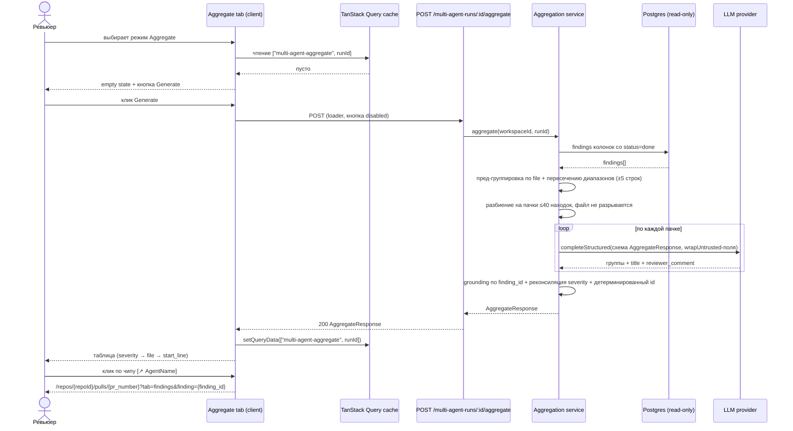

# Spec: Aggregate tab (Multi-Agent Review) | SPEC-2026-09-02-aggregate-tab | Status: draft
Supersedes: N/A
Related: [SPEC-2026-07-12-multi-agent-review](SPEC-2026-07-12-multi-agent-review.md), [SPIKE-2026-09-02-multi-agent-conflict-matching](../SPIKE-2026-09-02-multi-agent-conflict-matching.md)

## Проблема и зачем

Страница Multi-Agent Review показывает находки N агентов в двух режимах — `Columns` и `Tabs` — где одна и та же проблема кода дублируется столько раз, сколько агентов её нашли. Существующая панель «Where Agents Disagree» кластеризует находки детерминированно (`isSameLocation`: точное совпадение `file` + точечное сравнение `start_line` + Jaccard по заголовку) и на реальном прогоне PR #6557 не склеила две находки об одном и том же breaking change только потому, что агенты процитировали строки 10 и 7 (см. SPIKE). Ревьюеру приходится вручную вычитывать N колонок, самому определять дубликаты и самому формулировать текст комментария для PR.

Aggregate tab даёт третий режим просмотра: одна строка = одна уникальная проблема, с указанием какие агенты её нашли и с готовым текстом комментария, который можно скопировать в PR.

## Goals / Non-goals

**Goals:**
- Третий режим просмотра `Aggregate` на странице `/repos/[repoId]/multi-agent-review/[runId]` рядом с `Columns` и `Tabs`.
- Явная генерация агрегата по кнопке (`Generate` / `Regenerate`), без автозапуска.
- Серверная семантическая дедупликация находок всех агентов прогона через LLM с детерминированным пред-группированием и заземлением (grounding) результата на реальные `finding_id`.
- Готовый к вставке в PR текст комментария (`Reviewer Comment`) на каждую агрегированную строку + копирование в буфер обмена.
- Обратные ссылки из агрегированной строки на конкретные карточки исходных находок на странице PR detail.

**Non-goals:**
- Сохранение агрегата в БД (ни таблиц, ни миграций, ни новых полей).
- Автоматическая агрегация при открытии страницы или при завершении прогона.
- Инвалидация/пересчёт агрегата при появлении новых находок — только ручной `Regenerate`.
- Изменение поведения вкладок `Columns` / `Tabs` и панели «Where Agents Disagree».
- Исправление `isSameLocation()` / `computeConflicts()` в существующей панели конфликтов (кандидаты из SPIKE — отдельная работа).
- Публикация комментария в GitHub/ADO прямо из Aggregate tab (только копирование в буфер).
- Добавление hash-якорей (`id="finding-<id>"`) на страницу PR detail — используется уже существующий механизм навигации (см. AC-7).

## User stories

- Как ревьюер, я хочу видеть одну строку на одну уникальную проблему вместо N дублей от N агентов, чтобы не вычитывать одно и то же несколько раз.
- Как ревьюер, я хочу видеть, какие именно агенты нашли эту проблему, чтобы оценивать уровень консенсуса.
- Как ревьюер, я хочу из агрегированной строки перейти к исходной карточке находки конкретного агента, чтобы увидеть полное обоснование и diff.
- Как ревьюер, я хочу скопировать готовый текст комментария одним кликом, чтобы вставить его в PR без ручного переписывания.
- Как ревьюер, я хочу запускать агрегацию явно кнопкой, чтобы не платить за LLM-вызов каждый раз при открытии страницы.

## Acceptance criteria (EARS)

### Клиент — режим просмотра и жизненный цикл данных

- **AC-1:** КОГДА пользователь открывает страницу multi-agent review, система должна (shall) отображать переключатель режимов из трёх опций — `Columns`, `Tabs`, `Aggregate` — с активным `Columns` по умолчанию.
  `observable: E2E/RTL — рендер страницы, в переключателе три кнопки, активна Columns`
- **AC-2:** КОГДА пользователь выбирает режим `Aggregate` и агрегат для этого `runId` отсутствует в кеше, система должна (shall) отобразить пустое состояние с кнопкой `Generate` и не выполнить ни одного сетевого запроса.
  `observable: RTL — клик по Aggregate, кнопка Generate в DOM, fetch не вызван (fetch замокан глобально)`
- **AC-3:** КОГДА пользователь нажимает `Generate`, система должна (shall) отправить ровно один `POST /multi-agent-runs/:id/aggregate`, показать индикатор загрузки на месте таблицы и блокировать повторное нажатие кнопки до завершения запроса.
  `observable: RTL — двойной клик по Generate → fetch вызван один раз; кнопка disabled в состоянии pending`
- **AC-4:** КОГДА запрос агрегации завершился успешно, система должна (shall) отрендерить таблицу с колонками `Severity`, `Category`, `File:Line`, `Finding`, `Cards`, `Reviewer Comment`, отсортированную по severity (CRITICAL → WARNING → SUGGESTION), затем по `file` (лексикографически), затем по `start_line` (по возрастанию).
  `observable: RTL — мок ответа с перемешанным порядком → порядок строк в DOM детерминирован`
- **AC-5:** ПОКА агрегат находится в кеше TanStack Query по ключу `["multi-agent-aggregate", runId]`, система должна (shall) при переключении `Aggregate → Columns → Aggregate` отображать те же данные без нового сетевого запроса.
  `observable: RTL — переключение режимов, fetch вызван один раз`
- **AC-6:** КОГДА пользователь нажимает `Regenerate`, система должна (shall) отправить новый `POST` и полностью заменить содержимое кеша ответом сервера.
  `observable: RTL — второй ответ с другим набором строк полностью вытесняет первый`
- **AC-7:** КОГДА агрегированная строка содержит N исходных находок, система должна (shall) отрисовать ровно N чипов-ссылок с именем агента, каждый из которых ведёт на `/repos/{repoId}/pulls/{pr_number}?tab=findings&finding={finding_id}`.
  `observable: RTL — проверка href каждого чипа; ручная проверка: переход открывает вкладку Findings и подсвечивает нужную карточку`
- **AC-8:** КОГДА пользователь нажимает иконку копирования в колонке `Reviewer Comment`, система должна (shall) записать текст комментария в буфер обмена и показать подтверждение (toast) не позднее чем через 1 с после клика.
  `observable: RTL — мок navigator.clipboard.writeText, проверка аргумента и появления toast`
- **AC-9:** ЕСЛИ запрос агрегации завершился ошибкой, ТО система должна (shall) показать сообщение об ошибке с текстом от сервера и кнопку `Retry`, не затирая ранее полученный успешный агрегат.
  `observable: RTL — успешный ответ, затем 500 на Regenerate → старая таблица остаётся, сверху сообщение об ошибке`
- **AC-10:** ЕСЛИ прогон не содержит ни одной находки ни у одного агента, ТО система должна (shall) отобразить пустое состояние «нет находок» и не показывать кнопку `Generate`.
  `observable: RTL — run с пустыми columns[].findings → кнопки Generate нет в DOM`
- **AC-11:** ПОКА хотя бы одна колонка агента имеет `status === "running"`, система должна (shall) держать кнопку `Generate` неактивной и показывать подсказку о том, что прогон ещё не завершён.
  `observable: RTL — колонка со status=running → кнопка disabled + текст подсказки`
- **AC-12:** Система должна (shall) выводить все пользовательские строки вкладки `Aggregate` через `useTranslations()` (next-intl), без строковых литералов в JSX.
  `observable: ручная проверка/грep — отсутствие хардкода; ключи присутствуют в messages/en/*.json`
- **AC-13:** Система должна (shall) рендерить `title` и `reviewer_comment` как текст, без `dangerouslySetInnerHTML`.
  `observable: unit — строка вида "" в reviewer_comment отображается как текст, элемент img в DOM не создаётся`

### Сервер — эндпоинт и агрегация

- **AC-14:** КОГДА сервер получает `POST /multi-agent-runs/:id/aggregate`, система должна (shall) собрать находки всех колонок прогона со статусом `done` и исключить колонки со статусами `failed` и `running`.
  `observable: интеграционный тест сервиса — прогон с одной failed-колонкой → её находки отсутствуют в sources`
- **AC-15:** Система должна (shall) считать две находки кандидатами на объединение только если совпадает `file` И их диапазоны `[start_line, end_line]` пересекаются либо расстояние между ближайшими границами диапазонов не превышает 5 строк; находки из разных файлов не объединяются никогда.
  `observable: unit-тест чистой функции пред-группировки — кейс из SPIKE (строки 10 и 7-10 в одном файле) даёт одну группу-кандидат; тот же title в разных файлах — две группы`
- **AC-16:** КОГДА группы-кандидаты сформированы, система должна (shall) передать их LLM и принять решение об объединении по правилу: находки объединяются, если описывают одну и ту же первопричину в одном месте кода; различие формулировок основанием для разделения не является, различие первопричины — является.
  `observable: unit-тест с застабленным LLM — промпт содержит правило и все группы-кандидаты; ответ LLM определяет финальные группы`
- **AC-17:** Система должна (shall) назначать агрегированной строке максимальную severity среди её источников (CRITICAL > WARNING > SUGGESTION), а `category` — категорию источника с максимальной severity (при равенстве severity — первого по порядку в прогоне).
  `observable: unit — группа из CRITICAL(security) + WARNING(bug) → severity=CRITICAL, category=security`
- **AC-18:** КОГДА LLM вернул результат, система должна (shall) вернуть для каждой агрегированной строки `title` и `reviewer_comment` от LLM и массив `sources[]` с `finding_id`, `review_id`, `run_id`, `agent_id`, `agent_name`, `severity` каждого исходного findings.
  `observable: curl POST → форма ответа соответствует контракту AggregateResponse`
- **AC-19:** ЕСЛИ LLM вернул `finding_id`, которого нет среди переданных ему находок, ТО система должна (shall) отбросить этот идентификатор; ЕСЛИ после отбрасывания у группы не осталось ни одного источника, ТО эта группа не попадает в ответ.
  `observable: unit — застабленный LLM возвращает выдуманный uuid → он отсутствует в sources, группа-пустышка отсутствует в ответе`
- **AC-20:** Система должна (shall) присваивать каждой агрегированной строке `id`, детерминированно вычисленный из отсортированного набора `finding_id` её источников, чтобы повторная генерация с тем же составом группы давала тот же `id`.
  `observable: unit — две прогонки на одинаковом входе дают одинаковые id`
- **AC-21:** КОГДА число находок прогона превышает 40, система должна (shall) разбивать их на пачки так, чтобы все находки одного файла попадали в одну пачку и одна пачка содержала не более 40 находок, и объединять результаты пачек конкатенацией без дополнительного LLM-вызова.
  `observable: unit — 100 находок по 10 файлам → ≥3 вызова LLM, ни один файл не встречается в двух пачках`
- **AC-22:** ЕСЛИ файл содержит более 40 находок сам по себе, ТО система должна (shall) поместить их в отдельную пачку целиком и не разрывать файл между вызовами.
  `observable: unit — 55 находок в одном файле → один вызов LLM с 55 находками`
- **AC-23:** ЕСЛИ общее число находок прогона превышает 300, ТО система должна (shall) вернуть `422` с сообщением о превышении лимита и не выполнить ни одного LLM-вызова.
  `observable: интеграционный тест — стаб LLM не вызван, статус 422`
- **AC-24:** ЕСЛИ для фичи агрегации не выбрана модель в Settings → Feature Models, ТО система должна (shall) вернуть `422` с сообщением, указывающим на необходимость выбрать модель (поведение `resolveFeatureModelStrict`).
  `observable: интеграционный тест без настроенной модели → 422 с текстом про Settings`
- **AC-25:** ЕСЛИ вызов LLM завершился ошибкой, таймаутом или вернул невалидную по схеме структуру после ретраев, ТО система должна (shall) вернуть `502` с причиной и не изменить ни одной строки в БД.
  `observable: интеграционный тест — стаб LLM бросает ошибку → 502; snapshot таблиц до/после совпадает`
- **AC-26:** Система должна (shall) выполнять агрегацию без записи в БД: обработка запроса не выполняет ни одного INSERT/UPDATE/DELETE.
  `observable: интеграционный тест с логированием запросов Drizzle / сравнение снапшотов таблиц`
- **AC-27:** Система должна (shall) оборачивать `title`, `rationale` и `suggestion` каждой находки через `wrapUntrusted()` перед вставкой в промпт агрегации.
  `observable: unit — захваченный промпт содержит разметку wrapUntrusted вокруг каждого текстового поля находки`
- **AC-28:** Система должна (shall) ограничивать эндпоинт агрегации 10 запросами в минуту, как остальные LLM-роуты модуля reviews.
  `observable: конфиг маршрута config.rateLimit; ручная проверка на production-режиме сервера`
- **AC-29:** ЕСЛИ прогон с указанным `id` не существует или принадлежит другому workspace, ТО система должна (shall) вернуть `404`.
  `observable: curl с чужим/несуществующим id → 404`

## Edge cases

- **Прогон без находок** → AC-10 (клиент не даёт запустить), сервер при пустом входе возвращает `groups: []` без LLM-вызова.
- **Все агенты прогона failed** → находок нет после фильтрации AC-14 → `groups: []`, клиент показывает пустое состояние результата.
- **Часть агентов ещё running** → AC-11 блокирует запуск.
- **Одна находка в группе (нашёл только один агент)** → валидная строка с одним чипом; агрегация не требует ≥2 источников.
- **Все находки уникальны (дедупликация ничего не склеила)** → число строк равно числу находок; это корректный результат, не ошибка.
- **Находки с одинаковым `file` и пересечением диапазонов, но о разных первопричинах** → LLM обязан оставить их отдельными строками (AC-16).
- **LLM вернул больше групп, чем передано находок / продублировал `finding_id` в двух группах** → `finding_id` закрепляется за первой группой в порядке ответа, дубликаты в последующих отбрасываются (частный случай AC-19).
- **Находка удалена/dismissed между открытием страницы и генерацией** → ссылка-чип ведёт на карточку, которой может не быть на странице PR detail; страница PR detail просто не подсветит карточку — *accepted risk*, кеш агрегата ручной по замыслу фичи.
- **Пользователь перезагрузил страницу** → кеш TanStack Query не персистится (см. `client/insights/gotchas.md`), состояние возвращается к AC-2 — ожидаемое поведение.
- **Две вкладки браузера с одним runId** → у каждой свой кеш, агрегаты могут отличаться — *accepted risk* (данные не персистятся).
- **Буфер обмена недоступен (нет `navigator.clipboard`, не-secure context)** → показать ошибку копирования вместо подтверждения; текст остаётся выделяемым вручную.
- **Прогон 300+ находок** → AC-23, 422 без затрат на LLM.

## Data model / Schema

Новых таблиц и миграций нет. Ниже — транспортные сущности (жизненный цикл: ответ эндпоинта → кеш TanStack Query в браузере).

**AggregatedSource** — одна исходная находка внутри агрегированной строки:
`finding_id`, `review_id`, `run_id`, `agent_id`, `agent_name`, `severity`, `file`, `start_line`

**AggregatedFinding** — одна уникальная проблема (одна строка таблицы):
`id` (детерминированный, AC-20), `severity` (реконсилированная, AC-17), `category`, `file`, `start_line`, `end_line`, `title` (заголовок от LLM), `reviewer_comment` (готовый текст комментария от LLM), `sources` (AggregatedSource[], ≥1)

**AggregateResponse** — ответ эндпоинта:
`multi_agent_run_id`, `generated_at`, `model` (provider/model, которым сгенерировано), `source_findings_total`, `groups` (AggregatedFinding[])

Контракты объявляются в `contracts/observability.ts` рядом с `MultiAgentRun` и обновляются синхронно в **двух** независимых копиях: `server/src/vendor/shared/contracts/observability.ts` и `client/src/vendor/shared/contracts/observability.ts`.

## Workflows



## Service communication

```
client (Aggregate tab)
  → POST /multi-agent-runs/:id/aggregate            → server (модуль reviews)
server (routes.ts, тонкий handler)
  → AggregationService.aggregate(workspaceId, runId)
service
  → repository: findings прогона (только чтение)
  → resolveFeatureModelStrict(container, workspaceId, <featureModelId>)
  → container.llm(provider).completeStructured(...)  → LLM provider
server → 200 AggregateResponse                       → client
client → TanStack Query cache (браузер, без персистентности)
client (чип строки) → навигация на /repos/{repoId}/pulls/{pr_number}?tab=findings&finding={id}
```

Слои (onion): `routes.ts` только валидирует params и вызывает один метод сервиса; чистые функции пред-группировки, батчинга, реконсиляции severity и grounding живут в отдельном модуле-хелпере и не знают ни про Fastify, ни про Drizzle, ни про LLM-адаптер; доступ к БД — только через репозиторий; выбор провайдера — только через `container.llm()`.

## Contracts (high-level)

```
POST /multi-agent-runs/:id/aggregate
  params: id (uuid многоагентного прогона)
  body:   отсутствует
  200 →  { multi_agent_run_id, generated_at, model, source_findings_total,
           groups: [ { id, severity, category, file, start_line, end_line,
                       title, reviewer_comment,
                       sources: [ { finding_id, review_id, run_id,
                                    agent_id, agent_name, severity,
                                    file, start_line } ] } ] }
  404 →  прогон не найден / чужой workspace                     (AC-29)
  422 →  превышен лимит находок (>300)                          (AC-23)
  422 →  не выбрана модель в Settings → Feature Models          (AC-24)
  502 →  ошибка/таймаут LLM                                     (AC-25)
  429 →  превышен rate limit (10/мин)                           (AC-28)
```

Клиентский хук: `useAggregateRun(runId)` — `useMutation`, в `onSuccess` кладёт ответ в кеш через `queryClient.setQueryData(["multi-agent-aggregate", runId], data)`; чтение из кеша — `useQuery` с тем же ключом и `enabled: false` (без `queryFn`-запроса), либо прямое чтение `getQueryData` в компоненте. Причина выбора `useMutation` вместо `useQuery(refetch)`: генерация — явное дорогое действие с побочным эффектом (LLM-вызов, деньги), она не должна запускаться автоматически при монтировании, refetch-on-focus, reconnect или сменой ключа; `useQuery` с `enabled: false` в TanStack Query v5 остаётся источником неявных перезапросов и не даёт корректного `isPending` для кнопки.

## Non-functional

- **Perf:** КОГДА прогон содержит ≤ 40 находок (один LLM-вызов), эндпоинт должен (shall) вернуть ответ за ≤ 30 с при доступном провайдере.
- **Perf:** КОГДА требуется несколько пачек, система должна (shall) выполнять не более 3 LLM-вызовов параллельно.
- **Cost:** Система должна (shall) выполнять не более одного LLM-вызова на пачку — повторная сводка/merge-вызов поверх результатов пачек запрещён (AC-21).
- **Security:** Система должна (shall) обрабатывать все тексты находок как данные, а не как инструкции (AC-27), и рендерить вывод LLM как текст (AC-13).
- **Reliability:** ЕСЛИ LLM недоступен, ТО пользователь должен (shall) получить сообщение об ошибке и кнопку Retry не позднее чем через 90 с (таймаут провайдера) — без «вечного» лоадера.

## Inputs (provenance)

- Список находок прогона — `[deterministic: server/reviews repository]` (уже сохранённые `findings` колонок `status=done`).
- `pr_number`, `repo_full_name`, `pr_id` для ссылок-чипов — `[reused: AC-7]`, из уже загруженного `MultiAgentRun` (`useMultiAgentRun`), без дополнительного запроса.
- Группы-кандидаты (file + пересечение диапазонов) — `[deterministic: server, чистая функция]`.
- Финальная группировка, `title`, `reviewer_comment` — `[new: 1 LLM call на пачку ≤40 находок]`.
- Реконсилированная `severity`/`category`, `id` строки — `[deterministic: server, чистая функция]` (AC-17, AC-20).
- Провайдер и модель — `[deterministic: settings/feature-models]`.

## Untrusted inputs

Все текстовые поля находок (`title`, `rationale`, `suggestion`) — производные от diff и описания PR, то есть от внешнего недоверенного контента. Они обязаны попадать в промпт агрегации только внутри `wrapUntrusted()` (AC-27) и трактоваться моделью как данные для сравнения, а не как инструкции. Идентификаторы (`finding_id`) из ответа LLM недоверенны и подлежат заземлению на исходный список (AC-19). Вывод LLM (`title`, `reviewer_comment`) рендерится как текст (AC-13).

## Verification hints

- AC-1..AC-11 → RTL-тесты компонента вкладки с замоканным `fetch` (`src/test/setup.ts`) и обёрткой `QueryClientProvider`; проверять число вызовов `fetch` для кеш-сценариев.
- AC-7 → RTL: сравнение `href` чипов; ручная проверка сквозного перехода на страницу PR detail (вкладка Findings подсвечивает карточку по `data-finding-id`).
- AC-12 → grep по JSX вкладки на строковые литералы + наличие ключей в `messages/en`.
- AC-15, AC-17, AC-19..AC-22 → hermetic unit-тесты чистых функций (пред-группировка, батчинг, реконсиляция, grounding), без LLM.
- AC-16, AC-27 → unit-тест сервиса с застабленным `container.llm()`: перехват промпта и подстановка заранее заданного структурированного ответа.
- AC-14, AC-23..AC-26, AC-29 → интеграционные тесты (`*.it.test.ts`, реальный Postgres) + `curl` для формы ответа.
- AC-15 → регрессионный кейс из SPIKE: `packages/contracts/constants.ts` строки `10` и `7-10` должны попасть в одну группу-кандидат.

## [NEEDS CLARIFICATION]

1. **Путь эндпоинта.** В брифе указан `POST /runs/:id/aggregate`, но `/runs/:id/*` в модуле reviews зарезервирован под `agent_runs` (`/runs/:id/events`, `/runs/:id/trace`, `/runs/:id/cancel`), а агрегируется многоагентный прогон (`multi_agent_runs`). В спеке принят `POST /multi-agent-runs/:id/aggregate` — согласовать.
2. **Формат ссылок на карточки.** Предложенный `#finding-<id>` не поддерживается: на странице PR detail нет hash-якорей, есть `?tab=<...>` + `?finding=<id>` и атрибут `data-finding-id` со `scrollIntoView`. В спеке принят существующий механизм (`?tab=findings&finding=<id>`) — подтвердить, что добавление hash-якорей не требуется.
3. **Модель для агрегации.** Требуется решение: добавить новый `FeatureModelId` (например `review_aggregate`) в оба контракта + UI Settings → Feature Models, или переиспользовать существующий (`review_intent`). От этого зависит объём работ и текст ошибки 422 (AC-24).
4. **Язык `reviewer_comment`.** Предполагается английский (как остальной вывод ревью-агентов). Подтвердить или задать язык явно.
5. **Пороговые значения эвристик** — 5 строк для склейки соседних диапазонов, 40 находок на пачку, 300 находок как жёсткий лимит, 3 параллельных вызова. Числа выбраны консервативно и требуют подтверждения после первого замера на реальном прогоне.
6. **Соотношение с панелью «Where Agents Disagree».** Панель сейчас рендерится под любым режимом просмотра. Оставлять ли её видимой в режиме `Aggregate` (дублирование сигнала) или скрывать?
7. **Отображение консенсуса.** Нужно ли визуально выделять строки, найденные несколькими агентами (например «2/4»), или достаточно количества чипов в колонке `Cards`?
