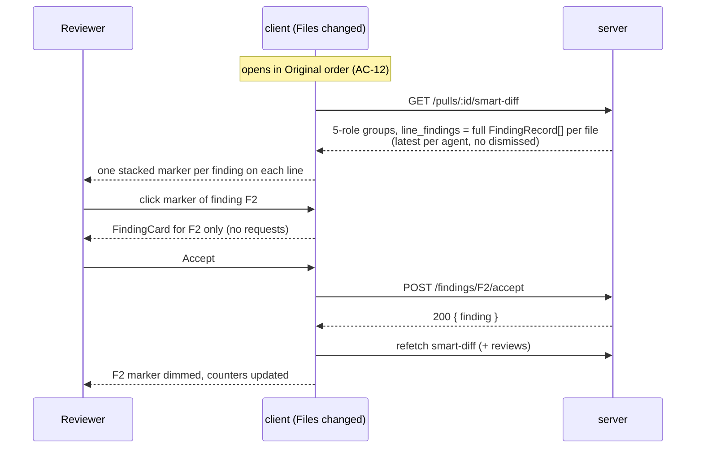
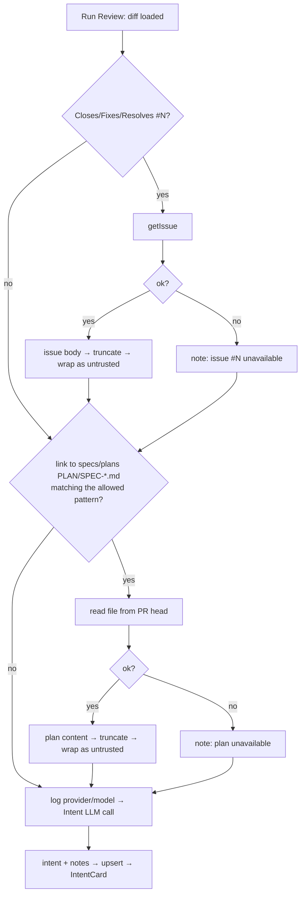

# Spec: Smart Diff HW3 upgrade (5 roles, inline findings) + Intent Layer fixes | SPEC-2026-09-23-smart-diff-hw3-upgrade | Status: draft
Supersedes: N/A
Related: [SPEC-2026-07-12-multi-agent-review](SPEC-2026-07-12-multi-agent-review.md) (AC-52..54: latest-per-agent union in Smart Diff), [SPEC-2026-07-03-pr-why-risk-brief](SPEC-2026-07-03-pr-why-risk-brief.md) (consumes smart-diff groups). Source: `PLAN-smart-diff-hw3-upgrade.md` (repo root).

## Problem and why
Smart Diff still sorts files into 3 roles (core / wiring / boilerplate). It returns only one lightweight finding per line (`line_findings`: id, line, severity, accepted), and clicking a finding badge on a diff line sends the user to the Findings tab (`?tab=findings&finding=…`). The updated HW3 text asks for 5 roles, finding indicators at group and file level, and the full finding card shown inline under the code line, with no tab switch. The working tree also has hardcoded demo placeholders (`● 2` in every group header, a red dot on every file) that must be replaced with real data. Separately, the Intent Layer doesn't log which model it uses, doesn't read a plan/spec file linked from the PR body, doesn't pass the linked issue's body as untrusted text, and silently ignores failed context fetches. After this work, dev-digest matches the HW3 text again and can serve as the reference project when grading students.

## Goals / Non-goals
**Goals:**
- 5 Smart Diff roles (core, tests, wiring, docs, boilerplate), with a fixed pattern-check order and a separate display order for groups.
- One data source for all finding UI in the diff: `GET /pulls/:id/smart-diff`. Its `line_findings` returns every non-dismissed finding of the file as a full `FindingRecord`. The unused `finding_lines` and `severity_counts` fields are removed.
- Finding indicators: a count of files with findings in each group header, a dot on the file card, and one coloured marker per finding on the code line.
- A finding details card that opens in place under the line when its marker is clicked. It is the existing Findings-tab `FindingCard`, reused as-is with all of its actions. All finding UI is shown only in Smart order; Original order is the plain diff.
- Original order stays the default view on the Files changed tab.
- Two new read-only agents: `.claude/agents/security-reviewer.md` and `.claude/agents/brainstorm.md`.
- Intent Layer: log the model; read a plan/spec file linked from the PR body; pass the linked issue body and the plan content to the model as labelled untrusted text; add an explicit note to the Intent when context could not be fetched.

**Non-goals:**
- Any new show/hide toggle for findings, or any change to the existing GitHub-comments show/hide toggle. Finding markers are not tied to any toggle.
- Using `GET /pulls/:id/reviews` for the Files changed tab.
- Changing `FindingCard`'s content, look or actions. The only allowed change is moving it to a shared folder, which changes import paths only.
- Deduplicating or filtering findings by Intent `in_scope` / `out_of_scope`. This needs a separate architecture change (structured Intent in the reviewer-core input; see PLAN).
- Behaviour changes to the Findings tab, apart from the extra smart-diff refresh after finding actions (AC-26).
- New HTTP endpoints. DB schema changes and migrations are not expected, because all needed finding columns already exist; one is allowed only if implementation proves it is really needed.
- Changing the Brief prompt (`brief/service.ts`) for the new roles. Brief reads groups generically and doesn't read the removed fields.
- `pseudocode_summary` for files stays as is.
- Changing existing agents (`implementation-planner.md`, `quick-planner.md`, `spec-creator.md`, etc.) or creating new skills.
- Accessibility requirements (out of scope for this project).

## User stories
- **US-1:** As a reviewer, I want PR files grouped into 5 roles (core, tests, wiring, docs, boilerplate), so I read the substance first and tests, docs and generated files separately.
- **US-2:** As a reviewer, I want the group header and the file card to show where findings are, so I don't have to open every file.
- **US-3:** As a reviewer, I want to see each finding as its own marker on the code line and open its full card in place, with every action the Findings tab offers, so I can handle it without losing context.
- **US-4:** As a reviewer, I want the Files changed tab to open in Original order and let me switch to Smart order, so the default view matches the PR as authored.
- **US-5:** As an instructor grading HW3, I want security-reviewer and brainstorm agents in `.claude/agents/`, so the reference project covers every role in the HW text.
- **US-6:** As a PR author, I want the Intent to use the linked issue and any plan/spec referenced in the PR body, and to say clearly when that context couldn't be fetched, so I know what the Intent is based on.
- **US-7:** As a dev-digest developer, I want the run log to show which model produced the Intent, so I can diagnose quality and cost.

## Acceptance criteria (EARS)

### A. Contract, classifier and smart-diff payload (server + shared contract)

- **AC-1:** The system shall define the Smart Diff file role as exactly one of five values: `core`, `tests`, `wiring`, `docs`, `boilerplate`. Both contract copies (`server/src/vendor/shared/contracts/brief.ts` and `client/src/vendor/shared/contracts/brief.ts`) shall stay byte-identical.
  `observable: unit (zod parse accepts the 5 values, rejects others) + diff of the two files is empty`
- **AC-2:** WHEN the system classifies a file path, the system shall check pattern groups in the order boilerplate → tests → wiring → docs, assign the role of the first group that matches, and assign `core` if none match.
  `observable: unit — "path → role" table`
- **AC-3:** The system shall classify as `boilerplate` at least: `*.lock` and package-manager lock files, `dist/**`, `build/**`, `__snapshots__/**`, `*.snap`, `*.generated.*`, `*.min.js` / `*.min.css`, plus the patterns that exist today (`__generated__`, `*.d.ts`, `migrations/**`, `*.svg`). The exception is `CHANGELOG*`, which moves to docs (AC-6).
  `observable: unit`
- **AC-4:** The system shall classify as `tests` any file matching `*.test.ts(x)`, `*.it.test.ts`, `*.spec.ts(x)`, or located under `test/**`, `tests/**`, `__tests__/**`, `e2e/**` at any depth, if the file did not match boilerplate.
  `observable: unit`
- **AC-5:** The system shall classify as `wiring` the existing wiring patterns (entry points, routes, config, setup, `*.config.*`) plus `.claude/**`, `.env*`, `docker-compose*.yml`, `.eslintrc*`, `tsconfig*.json`, if the file did not match boilerplate or tests.
  `observable: unit`
- **AC-6:** The system shall classify as `docs` any file matching `**/*.md`, `docs/**`, `README*`, `CHANGELOG*`, `LICENSE*`, if the file did not match boilerplate, tests or wiring.
  `observable: unit`
- **AC-7:** The system shall classify the three disputed cases from the HW text as follows: `__tests__/__snapshots__/x.snap` → `boilerplate`, `.claude/skills/security/SKILL.md` → `wiring`, `e2e/README.md` → `tests`.
  `observable: unit (one test case per path)`
- **AC-8:** WHEN the system builds the Smart Diff for a PR, the system shall always return all five groups in the display order core → tests → wiring → docs → boilerplate, including groups with no files (`files: []`). Each group renders its role label and its file count ("0 files" for an empty group). Each group is an accordion: clicking its header collapses/expands its files; a non-empty group starts expanded, an empty group can't be expanded, and a deep-link target inside a group forces it open. The group header shows the AC-14 counter `● N` immediately before `N files`, both right-aligned.
  `observable: unit buildSmartDiff + curl GET /pulls/:id/smart-diff`
- **AC-9:** The system shall classify files deterministically, with no network, DB or LLM calls. The same path always yields the same role.
  `observable: unit (classifier tested with no I/O mocks); review_tokens unaffected by classification`
- **AC-10:** WHEN the system builds the Smart Diff for a PR on which at least one review has run, the system shall set each file's `line_findings` to the full list of that file's non-dismissed findings from the union of each agent's latest review. Each item is a complete `FindingRecord`, the same shape `GET /pulls/:id/reviews` returns and `FindingCard` consumes, including `accepted_at` / `dismissed_at`. Accepted findings are included with their accepted state. All findings on the same line are included; there is no one-finding-per-line reduction. A file with no findings gets `[]`. WHILE no review has run for the PR, `line_findings` shall be `null`.
  `observable: integration — 2 agents, one with 2 runs; a file with 3 findings on one line (1 accepted, 1 dismissed) → response has 2 full FindingRecords for that line, only from each agent's latest run; curl before any review → line_findings null`
- **AC-11:** The system shall not include `finding_lines` or `severity_counts` in the Smart Diff file contract (both contract copies), in the server's smart-diff response, or in tests.
  `observable: grep finding_lines|severity_counts over server/src, client/src → no matches; zod parse of the response has no such keys`

### B. View mode (Files changed tab)

- **AC-12:** WHEN the user opens a PR's Files changed tab, the system shall show the diff in Original order by default. Smart order is shown only after the user picks it with the existing Smart order / Original order switch. This matches the current behaviour (`smartOrder` starts `false` in `client/src/app/repos/[repoId]/pulls/[number]/page.tsx`) and shall be kept.
  `observable: component/E2E — open the tab → Original order button active, plain file list rendered`

### C. Group level (Smart order)

- **AC-13:** The system shall show each of the five groups with its own colour dot and a localised label and description (new `tests` and `docs` keys under `prReview.smartDiff`), with no hardcoded English strings in JSX.
  `observable: component test SmartDiffViewer — 5 groups, 5 distinct labels`
- **AC-14:** WHILE a group has N ≥ 1 files whose `line_findings` contain at least one active finding (not accepted), the system shall show a "● N" counter in the group header before "{count} files". WHILE there are 0 such files, the counter shall not render. The hardcoded demo "● 2" shall be removed.
  `observable: component test (groups with 0, 1, 3 files with active findings; a file with only accepted findings is not counted)`
- **AC-15:** WHEN a `docs` or `boilerplate` group renders, the system shall show its files collapsed by default. The exceptions are files whose `line_findings` is non-empty (including accepted ones) and the deep-link target file (`?file=`).
  `observable: component test — docs file with no findings is collapsed, docs file with a finding is expanded`
- **AC-16:** WHEN a `core`, `tests` or `wiring` group renders, the system shall show its files expanded by default, as core/wiring files are today.
  `observable: component test`

### D. File level (Smart order only)

- **AC-17:** WHILE a file's `line_findings` contain at least one active finding, the system shall show a coloured dot with no number next to the file path. Its colour is the design-system severity colour of the file's most severe active finding. WHILE the file has no active findings, the dot shall not render. The existing severity chips with counts, now computed from `line_findings`, and the GitHub-comment count icon stay visually unchanged. The hardcoded demo dot shall be removed.
  `observable: component test FileCard (0 findings / 1 WARNING / CRITICAL+SUGGESTION / accepted-only)`

### E. Per-finding line markers and the finding card

- **AC-18:** WHILE a diff line has one or more findings in `line_findings`, the system shall render one marker per finding on that line, stacked one under another. Each marker is coloured by its own finding's severity from the design-system severity tokens. Several findings on a line shall never merge into one marker. A marker for an accepted finding shall render dimmed.
  `observable: component test (line with CRITICAL + SUGGESTION → 2 markers in 2 different colours)`
- **AC-19:** The system shall hide and show inline finding annotations (row tint, line markers, open finding cards and the AC-29 block) with the same Show/Hide switch that hides GitHub comment threads — no separate findings toggle. The switch shall be offered WHEN the PR has GitHub comments OR (in Smart order) findings, labelled with both counts (e.g. "Hide comments (3) · findings (5)"). Both are shown by default. WHILE annotations are hidden, the group counter, the file dot and the severity chips stay visible; clicking a severity chip shows the annotations again and jumps to the finding.
  `observable: component test — DiffTab: findings but no comments → switch present; Hide → markers gone, file dot kept; Show → markers back. FileCard: showInline=false → no markers / no AC-29 block, dot + chips kept; chip click → onRevealInline`
- **AC-20:** WHEN the user clicks a finding marker, the system shall open the card for that finding only, directly under the line. It shall not change the `tab` URL parameter and shall not navigate to another tab or page. The card's content comes from the already-loaded `line_findings`, so opening it sends no request.
  `observable: component test (router.push not called, fetch not called, only 1 card for a line with 2 markers) + E2E`
- **AC-21:** The system shall keep each finding's card closed by default. Clicking its marker shall toggle the card open and closed. Opening or closing one finding's card shall not affect any other finding's card, on the same line or elsewhere.
  `observable: component test (click → shown, click → hidden; two markers on one line are independent)`
- **AC-22:** WHEN a finding's card is open, the system shall render the existing Findings-tab `FindingCard` component reused as-is, with full feature parity with the Findings tab and nothing removed or changed. That covers content (severity, category, file:line with VCS link, confidence, title, markdown rationale, suggestion when present) and actions (Accept, Dismiss, Undo, Learn, the Reply thread, and "Turn into eval case", which opens the shared `EvalCaseModal` from `client/src/components/evals/EvalCaseModal` prefilled, wired the way `FindingsPanel` does it). The component may be moved to a shared folder (e.g. `client/src/components/findings/FindingCard/`); that move may change import paths only. *Interpretation note: the user's voice-dictated reference ("подобная, которая сделана на странице Edge In France") is read as "the card on the Findings page/tab".*
  `observable: component test (inline card = FindingCard instance, all action buttons present as on the Findings tab; "Turn into eval case" opens EvalCaseModal) + git diff shows FindingCard changes limited to its location/imports`
- **AC-23:** WHEN the user accepts a finding from its inline card and the action succeeds, the system shall, with no page reload, show that finding's marker dimmed and its card in the accepted state, and stop counting it in the group counter, the file dot and the severity chips.
  `observable: component test with mocked fetch + E2E`
- **AC-24:** WHEN the user dismisses a finding from its inline card and the action succeeds, the system shall, with no page reload, remove that finding's marker and card and exclude it from all counters. Other findings' markers on the same line stay.
  `observable: component test + E2E`
- **AC-25:** WHEN the user undoes a previous accept or dismiss from an inline card and the action succeeds, the system shall, with no page reload, show the finding as active again in its marker, card and counters. After a dismiss, Undo is available in the open card until the smart-diff data is refreshed.
  `observable: component test + E2E`
- **AC-26:** WHEN any finding action (Accept, Dismiss, Undo, Learn, Reply) succeeds, from an inline card or from the Findings tab, the system shall refetch that PR's smart-diff data, as well as the reviews data it refreshes today, so markers, cards and counters in the diff match the server state without a reload.
  `observable: component/hook test — after mutation success, queries ["smart-diff", prId] and ["reviews", prId] are invalidated`
- **AC-27:** IF a finding action from an inline card returns an error, THEN the system shall keep the card and marker in their previous state and show the user an error toast.
  `observable: component test (fetch → 500 → state unchanged, notify.error called)`
- **AC-28:** WHILE an action for a finding is in progress, the system shall stop that card's action buttons from being clicked again, the same as on the Findings tab.
  `observable: component test (pending → buttons disabled)`
- **AC-29:** IF a finding's start_line is not among the rendered new-side lines of the file's diff, THEN the system shall show that finding's marker in a separate block at the end of the file body, labelled with its line number, instead of hiding it. The marker opens the same card (AC-20..22).
  `observable: component test (finding on line 999, patch covers lines 1–20 → marker in the end-of-file block)`
- **AC-30:** The system shall attach finding markers only to lines that have a new-file line number (added and context lines). A deleted line shall not receive a marker, even if its old line number equals a finding's start_line.
  `observable: component test (del line oldNo=5, finding start_line=5 with no new line 5 → shown in the AC-29 block, not on the del line)`
- **AC-31:** The system shall feed all finding UI on the Files changed tab (group counter, file dot, severity chips, line markers, cards, AC-29 block) only from the `GET /pulls/:id/smart-diff` response. The Files changed tab shall not request `GET /pulls/:id/reviews`. The client shall not reimplement the latest-per-agent or dismissed filtering; it uses `line_findings` as the server returns it.
  `observable: component test of DiffTab — fetch called for /smart-diff, never for /reviews; grep: no usePrReviews in DiffTab / diff-viewer / smart-diff`
- **AC-32:** The system shall show finding UI (group counter, file dot, severity chips, line markers, cards and the AC-29 block) only in Smart order. WHILE the tab is in Original order, the system shall render the plain diff with none of this finding UI, even when `line_findings` contain findings. WHEN the user switches from Original to Smart order, the markers shall reflect the current finding state.
  `observable: component test of DiffTab — Original order with findings → 0 markers; Smart order → markers present`
- **AC-33:** WHILE no review has been run for the PR (`line_findings` is `null`), the system shall render the diff with no markers, cards, dots or finding counters, and no console errors.
  `observable: component test (line_findings = null)`
- **AC-34:** IF the smart-diff request is still loading or failed, THEN the system shall render the diff in Original order without finding markers and shall not block code rendering.
  `observable: component test (query pending / error)`
- **AC-35:** WHEN the user opens the Files changed tab with `?file=` and `?line=` deep-link parameters, the system shall still expand the target file and scroll to the target line in both view modes.
  `observable: E2E / manual check (regression)`

### F. Agents (`.claude/agents/`)

- **AC-36:** The system shall include an agent `.claude/agents/security-reviewer.md` whose tools are only Read, Grep, Glob, Bash, Skill (no Write / Edit). It shall use the existing `security` skill, and its description shall say it looks for exploitable vulnerabilities and assigns them a severity without changing code.
  `observable: manual frontmatter check`
- **AC-37:** The system shall include an agent `.claude/agents/brainstorm.md` with read-only tools only and no `skills:` field. Its description shall say it compares implementation approaches/options and does not write code.
  `observable: manual frontmatter check`
- **AC-38:** WHEN the new agents are added, the system shall leave the existing 9 agent files unchanged. `.claude/agents/` shall contain exactly 11 agent definitions (not counting README.md).
  `observable: git diff .claude/agents/ shows only 2 new files (+ optionally README.md)`

### G. Intent Layer (server)

- **AC-39:** WHEN the system is about to make the Intent LLM call, the system shall write the provider and model it will use to the run log.
  `observable: unit intent-deriver.test.ts (runLog.info contains provider and model)`
- **AC-40:** WHEN the linked issue (`Closes|Fixes|Resolves #N` in the PR body) is fetched successfully and has a non-empty body, the system shall pass the issue body to the Intent LLM input truncated to a fixed character limit. The body shall be wrapped and labelled as untrusted data in the same way as the plan file content (AC-41).
  `observable: unit (mocked getIssue with a long body → the LLM user message contains the body inside the untrusted-data wrapper, length ≤ limit)`
- **AC-41:** WHEN the PR body links to a plan or spec file that matches the allowed path pattern (AC-42), the system shall read the content of the first such file from the PR head revision in the local clone, truncate it to a fixed character limit, and pass it to the Intent LLM input wrapped and labelled as untrusted data.
  `observable: unit run-executor/intent-deriver (mocked git → plan content reaches the LLM input messages inside the untrusted-data wrapper)`
- **AC-42:** IF a link found in the PR body does not match the allowed pattern (relative path `[<module>/](specs|plans)/(PLAN|SPEC)-<letters/digits/_/->.md`, no `..`, not absolute, no other extensions), THEN the system shall not read any file for that link.
  `observable: unit (../../etc/passwd, /abs/PLAN-x.md, specs/PLAN-x.txt → readFile not called)`
- **AC-43:** IF fetching the linked issue or reading the plan/spec file fails, THEN the system shall log the reason to the run log and add to the `intent` field of the saved Intent a fixed note about missing context. The note names the source (`issue #N` and/or the file path) and is visible to the user in the Intent card.
  `observable: unit (mocked getIssue → throw → intent contains a note mentioning "#N") + manual check of IntentCard`
- **AC-44:** WHILE the PR body links to neither an issue nor a plan/spec, or all linked sources were fetched successfully, the system shall not add the missing-context note.
  `observable: unit`

## Edge cases
- **A file matches several groups** (e.g. `tests/__snapshots__/a.snap`, `e2e/playwright.config.ts`, `.claude/README.md`) → the first group in AC-2 order wins (boilerplate, tests, wiring respectively). Covered by AC-2/AC-7.
- **`build/**` / `dist/**` used as a real source directory** (e.g. `src/build/compile.ts`) → classified as boilerplate and collapsed. `[accepted risk: patterns come from the HW text; a file with a finding still expands per AC-15]`
- **`.env.example` / `.env.local`** → wiring (AC-5). The diff content is already shown today; this work doesn't change what is shown.
- **CHANGELOG.md** is boilerplate today and becomes docs (AC-3/AC-6). Both groups are collapsed by default, so for the reviewer the UX barely changes.
- **Brief for a docs-only or tests-only PR** → the Brief prompt says "boilerplate-only → low"; a docs/tests-only PR gets whatever risk_level the LLM decides. `[accepted risk: changing the Brief prompt is a non-goal]`
- **Empty PR / all groups empty** → all five groups render with "0 files" and can't be expanded (AC-8), no errors.
- **Smart Diff unavailable** (smart-diff request pending or failed) → the Smart/Original switch isn't shown (existing behaviour), the tab stays in Original order, and no finding markers render because smart-diff is the only source (AC-31/AC-34). Findings stay available on the Findings tab. `[accepted risk]`
- **Larger smart-diff payload** → each finding now carries rationale/suggestion markdown. For a PR with many findings the response grows roughly by the size of those findings' text. `[accepted risk: the same data is already served by /reviews; no pagination in this spec]`
- **A docs/boilerplate group with a finding in 1 of 10 files** → only that file expands (AC-15); counter shows "● 1" (AC-14).
- **Several findings of different severity on one line** → one marker per finding, stacked, each in its own colour (AC-18); each opens only its own card (AC-20).
- **Many findings on one line (e.g. 5+)** → all markers are stacked; the line gets taller. `[accepted risk: no collapsing/overflow control in this spec]`
- **A line with one accepted and one active finding** → two markers, the accepted one dimmed (AC-18). The file still counts as having an active finding (AC-14/AC-17).
- **A file with only accepted findings** → markers dimmed, no file dot, not counted in "● N", but a docs/boilerplate file still expands (AC-15).
- **A finding on a line outside the rendered patch** (truncated/large patch, `patch: null`, finding on a deleted line) → AC-29 block. For a file with no patch (binary / ADO degraded), all of the file's findings go into that block.
- **A finding on a file that isn't in the PR's file list** (rename / stale data) → not shown in the diff; still available on the Findings tab. `[accepted risk]`
- **Double-click on an action** → buttons are blocked while the request runs (AC-28).
- **Dismissing a file's last active finding** → its marker, the file dot and one step of the group counter disappear (AC-24). A docs/boilerplate file stays expanded until reload; it isn't collapsed under the user. `[accepted risk: we don't auto-collapse an open file]`
- **Action taken on the Findings tab, then the user returns to Files changed** → smart-diff was refetched (AC-26), so markers match.
- **A new Run Review finishes while Files changed is open** → markers and counters update once smart-diff data is refreshed; open cards for findings that no longer exist just disappear.
- **GitHub comments hidden, findings present** → finding markers stay visible (AC-19).
- **PR body with several plan links** → only the first one matching the pattern is read (AC-41).
- **Plan file added in the PR itself** (not in the default branch) → must be read from the PR head revision (AC-41), not from the default-branch working copy.
- **Very large plan file or issue body** → truncated to the limit (AC-40/AC-41).
- **Linked issue with an empty body** → only the issue number and title are passed; no missing-context note (the fetch succeeded).
- **Cached Intent** (headSha unchanged) → the cache is returned together with the note saved at the last derivation; the issue/plan isn't fetched again. `[accepted risk: the note can be stale until headSha changes or a forced recalculation]`
- **No model configured for Intent** → Intent is skipped as today; the model log line (AC-39) isn't written because there is no call.

## Data model / Schema
No new entities. No DB changes are expected: every column `FindingRecord` needs already exists in the `findings` table and is already mapped for `GET /pulls/:id/reviews`. The latest-review read used by the smart-diff service currently selects only a subset of finding columns (id, review_id, file, title, severity, start_line, accepted_at, dismissed_at) and must be widened to return full findings. That is a query change, not a schema change.

Contract changes (both copies of `contracts/brief.ts`):

- **SmartDiffRole**: `core | tests | wiring | docs | boilerplate` (was `core | wiring | boilerplate`).
- **SmartDiffFile**: `path`, `pseudocode_summary`, `additions`, `deletions`, `line_findings`.
  - `line_findings`: list of full **FindingRecord** (id, review_id, severity, category, title, file, start_line, end_line, rationale, suggestion, confidence, kind, trifecta fields, accepted_at, dismissed_at), meaning all non-dismissed findings of the file from each agent's latest review; `null` = no review has run. Was: `{ id, line, severity, accepted }` with at most one per line.
  - **Removed:** `finding_lines`, `severity_counts`. Confirmed that nobody else reads them: only the client `SmartDiffViewer` reads `line_findings`, and Brief, MCP and e2e read none of these fields.
- **SmartDiffGroup / SmartDiff**: shape unchanged.
- **Intent** (`intent`, `in_scope`, `out_of_scope`): shape unchanged; the missing-context note (AC-43) is embedded in the `intent` text.

Client-side derived structure (not persisted): for each file, "new-side line number → list of findings", grouped from `line_findings` without further filtering. It is a list because each finding gets its own marker (AC-18).

## Workflows

### Inline finding: click marker → Accept

### Intent with linked issue and plan

## Service communication
- client (DiffTab; finding UI in Smart order only, AC-32) → `GET /pulls/:id/smart-diff` → server `pulls` (classifier + full-finding enrichment via the reviews repository's latest-per-agent read, 0 LLM). This is the only source of finding data for the diff.
- client (inline `FindingCard`) → `POST /findings/:id/<action>` → server `reviews`; on success the client refetches this PR's smart-diff data (and reviews data, as today).
- client (inline `FindingCard`, "Turn into eval case") → the existing eval-case prefill endpoint → shared `EvalCaseModal`, exactly as on the Findings tab.
- client (inline `FindingCard`, reply thread) → existing finding-replies endpoints, fetched only when the thread is opened (existing `FindingCard` behaviour).
- server `reviews` run pipeline → VCS provider `getIssue` (existing) → git adapter: read the plan file from the PR head revision in the local clone → LLM provider (Intent, 1 call, existing)

## Contracts (high-level)
No new endpoints. The existing smart-diff response changes shape:

- `GET /pulls/:id/smart-diff` (same URL) → `200 { groups: [{ role: "core"|"tests"|"wiring"|"docs"|"boilerplate", files: [{ path, pseudocode_summary, additions, deletions, line_findings: FindingRecord[] | null }] }], split_suggestion, review_tokens }`. Groups come in the order core, tests, wiring, docs, boilerplate. `finding_lines` and `severity_counts` are removed.
- `POST /findings/:id/accept|dismiss|undo|learn|reply` → `200 { finding }`: unchanged; new consumer (inline `FindingCard`).
- `GET /pulls/:id/reviews`: unchanged, and not used by the Files changed tab.

## Non-functional
- **Perf:** WHEN the user opens or closes a finding card, the system shall send 0 network requests (the data is already in the smart-diff response). Requests the card makes on explicit user actions (reply thread, eval-case prefill, finding actions) are allowed, as on the Findings tab.
- **Perf:** Building the Smart Diff shall still use 0 LLM tokens (classification and enrichment are deterministic), and the smart-diff service shall load findings with a single batched read for the PR (no per-file or per-finding queries).
- **Security:** Finding rationale and suggestion (LLM output) shall render through `FindingCard`'s existing markdown renderer, with no raw HTML injection.
- **Security:** The system shall read a plan file only from a path that passed the AC-42 pattern check, and only within the PR repository's local clone.
- **Reliability:** IF fetching the issue or reading the plan fails, the system shall continue the review and not fail the run (best-effort, as issue fetching is today).

## Inputs (provenance)
- File role (AC-1..9): `[deterministic: server/pulls classifier]` from the file path.
- `line_findings` (AC-10): `[deterministic: server/pulls + reviews repository latest-per-agent read]`.
- Group counter, file dot, severity chips, markers, cards (AC-14..35): `[reused: AC-10 line_findings]`, with no other data source (AC-31).
- Card actions (AC-22..28): `[deterministic: existing finding-action / reply / eval-case endpoints]`.
- Default view mode (AC-12): `[deterministic: client page state]`.
- Intent model (AC-39): `[deterministic: settings/feature-models]`.
- Issue body (AC-40): `[deterministic: VCS getIssue]`.
- Plan content (AC-41): `[deterministic: git clone, PR head revision]`.
- Intent with note (AC-43): `[reused: the existing single Intent LLM call]` + a fixed note; no new LLM calls.

## Untrusted inputs
- **PR body**: source of the issue and plan links. A file link is accepted only if it matches the strict pattern (AC-42). Body text is never treated as a path outside that pattern or as an instruction.
- **Linked issue body**: arbitrary third-party text. It shall be truncated and passed to the Intent LLM input explicitly wrapped and labelled as untrusted data (AC-40). Today it is passed unwrapped; this spec fixes that.
- **Plan/spec file content**: arbitrary text from the PR author. It shall be truncated and passed to the Intent LLM input explicitly wrapped and labelled as untrusted data (AC-41).
- Both use the same untrusted-data wrapping already used for prompt assembly (`server/src/platform/prompt.ts` / reviewer-core). Instructions inside them shall not change how the Intent classifier behaves.
- **Finding title / rationale / suggestion**: LLM output that may contain markdown/HTML planted by a malicious diff; it now also travels in the smart-diff payload. Rendered only through `FindingCard`'s markdown renderer, with no raw HTML (see Non-functional → Security).
- reviewer-core invariants (`groundFindings()`, `wrapUntrusted()`) are not bypassed: this work doesn't change the path findings take from the LLM to the DB.

## Verification hints
- AC-1, AC-11 → `diff server/src/vendor/shared/contracts/brief.ts client/src/vendor/shared/contracts/brief.ts` is empty; `grep -rn "finding_lines\|severity_counts" server/src client/src` returns nothing; `pnpm typecheck` in server and client.
- AC-2..9 → `cd server && pnpm exec vitest run src/modules/pulls/classifier.test.ts`: "path → role" table, the 3 disputed cases, group order.
- AC-10 → integration test for `GET /pulls/:id/smart-diff`: several agents and runs, several findings on one line, accepted + dismissed mix, full FindingRecord fields present, `null` before any review.
- AC-12 → component test of the PR page / DiffTab: first render shows Original order.
- AC-13..17 → client component tests of SmartDiffViewer / FileCard with a SmartDiff fixture whose `line_findings` are full FindingRecords; grep confirms no `TEMP DEMO` lines remain.
- AC-18..35 → component tests of CodeLine / FileCard / DiffTab with mocked fetch (the global `fetch` mock in `src/test/setup.ts`). Check that `router.push` is never called, `/reviews` is never fetched, a line with 2 findings renders 2 markers and opens 1 `FindingCard` per click, and the smart-diff query is invalidated after each action.
- AC-20, AC-22..25, AC-32, AC-35 → E2E / manual: PR → Run Review → Files changed (Original: plain diff, no markers) → switch to Smart order → click one of the stacked markers → compare the card with the Findings tab card → Accept / Undo / Dismiss / Learn / Reply / Turn into eval case → `?file=&line=` deep link.
- AC-36..38 → manual frontmatter check + `ls .claude/agents/*.md | grep -v README | wc -l` = 11.
- AC-39..44 → `intent-deriver.test.ts`, `run-executor.test.ts` with mocked git adapter, VCS and LLM.

## Resolved decisions (2026-09-23, from user answers)
- **No separate findings toggle.** Findings share the existing GitHub-comments Show/Hide switch (AC-19, revised 2026-09-25); there is no extra toggle. The view switch is Smart order / Original order, and the default is Original (AC-12).
- **Several findings on one line.** One marker per finding, stacked, each in its own severity colour; each marker opens only its own card (AC-18, AC-20, AC-21).
- **Card look.** The card is the Findings-tab card. The user's dictated wording was garbled ("подобная, которая сделана на странице Edge In France"); it is interpreted as "the Findings page/tab card".
- **Issue body.** It is passed to the Intent model as truncated, wrapped, labelled untrusted text, the same way as the plan file (AC-40).
- **Single data source = `GET /pulls/:id/smart-diff`.** All finding UI in the diff comes only from this endpoint (same URL, extended response). The client doesn't use `GET /pulls/:id/reviews` / `usePrReviews` for the diff. `line_findings` becomes the full list of all non-dismissed findings of the file as complete `FindingRecord`s, including accepted ones, and the server's one-finding-per-line reduction is removed. The server keeps the latest-per-agent union and dismissed filter; the client doesn't replicate them. The smart-diff query is refetched after every finding action (AC-10, AC-26, AC-31).
- **`finding_lines` and `severity_counts` are removed** from the contract (both copies), the server and tests. The client derives the group counter, file-dot colour and severity chips from `line_findings`. Nobody else reads these fields (AC-11, AC-14, AC-17).
- **`FindingCard` reused as-is with full feature parity.** Accept, Dismiss, Undo, Learn, the Reply thread and "Turn into eval case" (shared `EvalCaseModal`, wired like `FindingsPanel`) are all available inline. Nothing is cut or changed; moving the component to a shared folder with import-path-only changes is allowed (AC-22).

## Resolved decisions (2026-09-24, from user feedback after implementation)
- **Finding UI only in Smart order.** The earlier AC-32 ("the same way in Smart order and Original order") was a spec error. Original order is the plain diff: no markers, cards, file dots, severity chips or AC-29 block. All finding UI lives in Smart order (AC-32). Deep links still expand and scroll in both modes (AC-35).

- **Always five groups, as accordions.** The earlier AC-8 ("omit groups with no files") contradicted the HW3 acceptance criterion "five groups in the order core → tests → wiring → docs → boilerplate, each with a role label and file count". The server now always returns all five groups; the UI renders each as a collapsible accordion with `● N` (files with findings) right before `N files`. The Brief prompt still lists only non-empty groups.

- **Findings share the comments Show/Hide switch (2026-09-25).** HW3 criterion: finding comments can be hidden by the same switch as GitHub comments, to keep the diff clean. The existing switch now also hides inline finding annotations (tint, markers, cards, AC-29 block); counters, file dots and chips stay. Default is shown, so a finished review is visible immediately (GitHub comment threads are now also shown by default).

## [NEEDS CLARIFICATION]
1. **Reading the plan from the PR head (AC-41).** The existing `GitClient.readFile(repo, path)` reads the clone's working copy. After `sync()` that copy is on the default branch (`reset --hard origin/<branch>`), and `fetchPullHead` only creates the `pr-{n}` ref without checking it out. So a plan added in the PR itself can't be read with the existing method. The requirement is to read from the PR head revision; how (e.g. a new adapter method based on `git show <ref>:<path>`) is for the planner to decide.
2. **Plan link pattern (AC-42). Assumption:** `[<module>/](specs|plans)/(PLAN|SPEC)-*.md`, first match only. The PLAN itself lists only `specs/PLAN-*.md` and `plans/PLAN-*.md`. Not yet decided by the user.
3. **Truncation limits (AC-40/41). Assumption:** about 2000 characters for the plan content (same as `MAX_BODY_CHARS` in `intent-deriver.ts`). For the issue body, keep the current 1000-character cut. Not yet decided.
4. **Missing-context note wording (AC-43).** The Intent is generated in English per the system prompt. Suggested text: `⚠ Context incomplete: linked issue #N could not be fetched; plan specs/PLAN-x.md could not be read.` Not yet decided.
5. **Dot colours for the tests and docs groups (AC-13):** not specified; pick from design-system tokens during implementation. Not yet decided.
6. **Accepted-finding marker (AC-18/23). Assumption:** an accepted finding keeps a dimmed marker on the line. The card itself shows whatever accepted state `FindingCard` already shows. Not yet decided.
