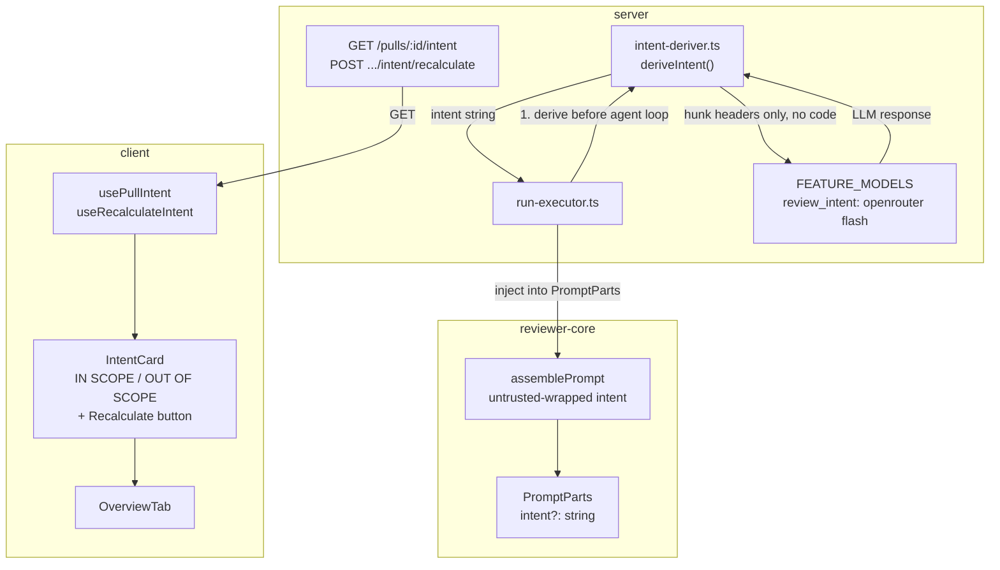
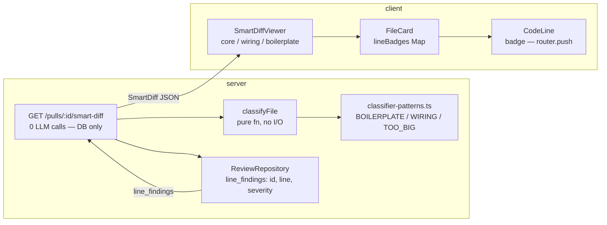
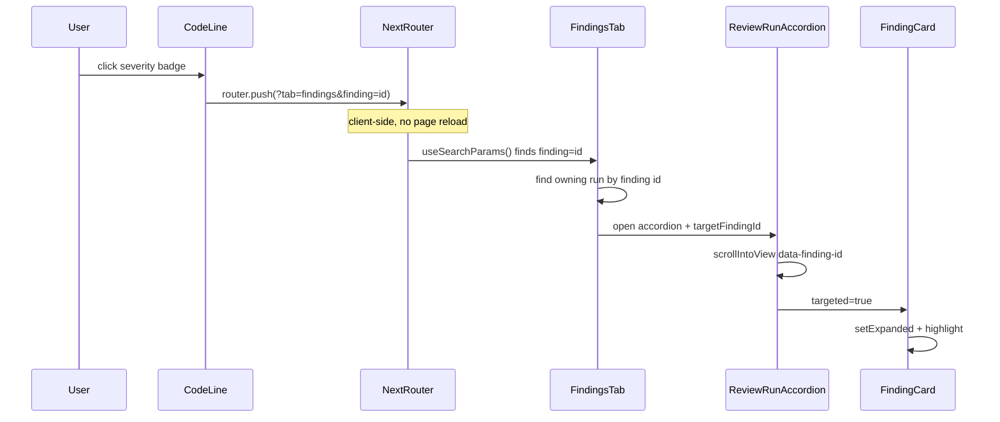
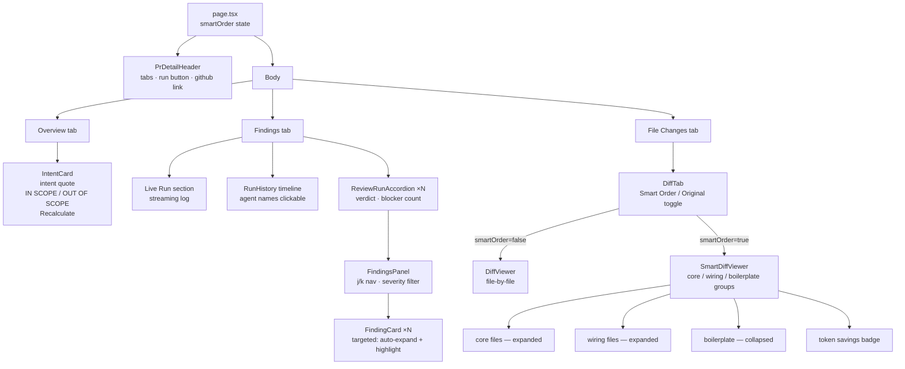
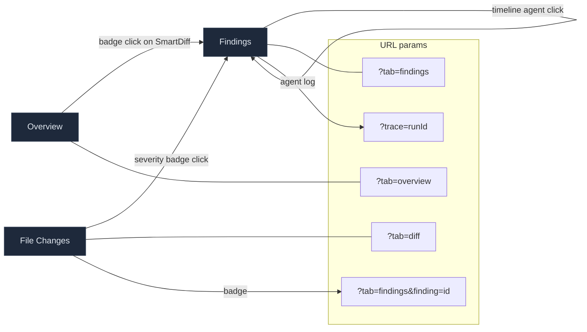

```mermaid
flowchart TD
    subgraph rc [reviewer-core]
        PP["PromptParts<br/>intent?: string"]
        AP["assemblePrompt<br/>untrusted-wrapped intent"]
    end

    subgraph srv [server]
        ID["intent-deriver.ts<br/>deriveIntent()"]
        RE[run-executor.ts]
        RA["GET /pulls/:id/intent<br/>POST .../intent/recalculate"]
        FM["FEATURE_MODELS<br/>review_intent: openrouter flash"]
    end

    subgraph cli [client]
        IH["usePullIntent<br/>useRecalculateIntent"]
        IC["IntentCard<br/>IN SCOPE / OUT OF SCOPE<br/>+ Recalculate button"]
        OT[OverviewTab]
    end

    RE -->|1. derive before agent loop| ID
    ID -->|hunk headers only, no code| FM
    FM -->|LLM response| ID
    ID -->|intent string| RE
    RE -->|inject into PromptParts| AP
    AP --> PP

    RA -->|GET| IH
    IH --> IC
    IC --> OT
```

---

```mermaid
flowchart LR
    subgraph srv2 [server]
        CF["classifyFile<br/>pure fn, no I/O"]
        CP["classifier-patterns.ts<br/>BOILERPLATE / WIRING / TOO_BIG"]
        SD["GET /pulls/:id/smart-diff<br/>0 LLM calls — DB only"]
        RR["ReviewRepository<br/>line_findings: id, line, severity"]
    end

    subgraph cli2 [client]
        SDV["SmartDiffViewer<br/>core / wiring / boilerplate"]
        FC["FileCard<br/>lineBadges Map"]
        CL["CodeLine<br/>badge — router.push"]
    end

    CF --> CP
    SD --> CF
    SD --> RR
    RR -->|line_findings| SD
    SD -->|SmartDiff JSON| SDV
    SDV --> FC
    FC --> CL
```

---

```mermaid
sequenceDiagram
    participant User
    participant CodeLine
    participant NextRouter
    participant FindingsTab
    participant ReviewRunAccordion
    participant FindingCard

    User->>CodeLine: click severity badge
    CodeLine->>NextRouter: router.push(?tab=findings&finding=id)
    Note over NextRouter: client-side, no page reload
    NextRouter->>FindingsTab: useSearchParams() finds finding=id
    FindingsTab->>FindingsTab: find owning run by finding id
    FindingsTab->>ReviewRunAccordion: open accordion + targetFindingId
    ReviewRunAccordion->>ReviewRunAccordion: scrollIntoView data-finding-id
    ReviewRunAccordion->>FindingCard: targeted=true
    FindingCard->>FindingCard: setExpanded + highlight
```

---

```mermaid
flowchart TD
    Page["page.tsx<br/>smartOrder state"]

    Page --> Header["PrDetailHeader<br/>tabs · run button · github link"]
    Page --> Body

    Body --> T1["Overview tab"]
    Body --> T2["Findings tab"]
    Body --> T3["File Changes tab"]

    T1 --> IC2["IntentCard<br/>intent quote<br/>IN SCOPE / OUT OF SCOPE<br/>Recalculate"]

    T2 --> LR["Live Run section<br/>streaming log"]
    T2 --> RH["RunHistory timeline<br/>agent names clickable"]
    T2 --> RRA["ReviewRunAccordion ×N<br/>verdict · blocker count"]
    RRA --> FP["FindingsPanel<br/>j/k nav · severity filter"]
    FP --> FC2["FindingCard ×N<br/>targeted: auto-expand + highlight"]

    T3 --> DT["DiffTab<br/>Smart Order / Original toggle"]
    DT -->|smartOrder=false| DV["DiffViewer<br/>file-by-file"]
    DT -->|smartOrder=true| SDV2["SmartDiffViewer<br/>core / wiring / boilerplate groups"]
    SDV2 --> B1["core files — expanded"]
    SDV2 --> B2["wiring files — expanded"]
    SDV2 --> B3["boilerplate — collapsed"]
    SDV2 --> Stats["token savings badge"]
```

---

```mermaid
flowchart LR
    OV["Overview"]:::tab
    FN["Findings"]:::tab
    FC3["File Changes"]:::tab

    OV -->|badge click on SmartDiff| FN
    FN -->|timeline agent click| FN
    FC3 -->|severity badge click| FN

    subgraph URL [URL params]
        P1["?tab=overview"]
        P2["?tab=findings"]
        P3["?tab=diff"]
        P4["?tab=findings&finding=id"]
        P5["?trace=runId"]
    end

    OV --- P1
    FN --- P2
    FC3 --- P3
    FC3 -->|badge| P4
    FN -->|agent log| P5

    classDef tab fill:#1e293b,color:#e2e8f0,stroke:#334155
```
