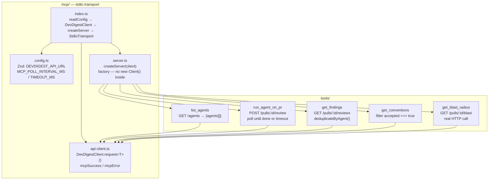
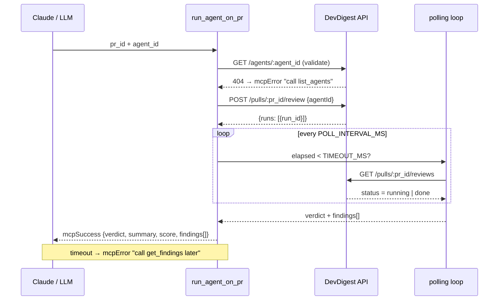
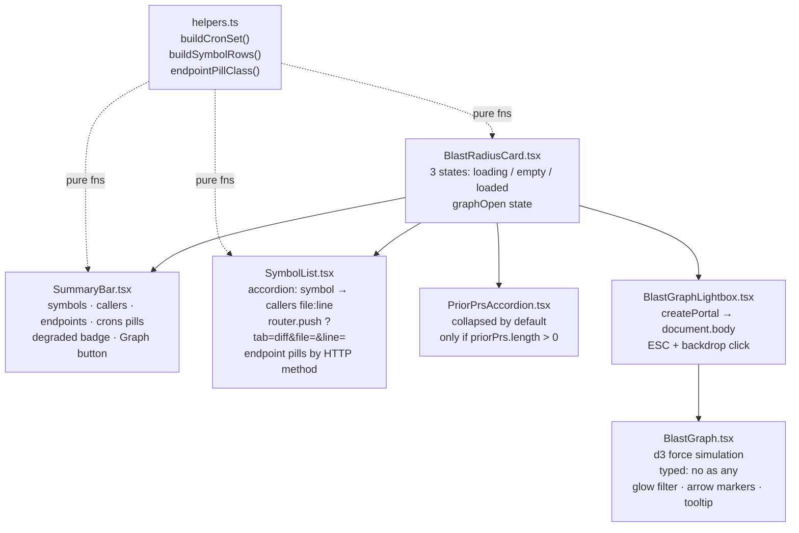

---



---

```mermaid
flowchart LR
    subgraph contract [shared contracts]
        ZOD["brief.ts<br/>BlastRadiusResult<br/>BlastChangedSymbol / BlastCallerRow<br/>BlastDegradedReason enum<br/>PriorPr"]
    end

    subgraph blast [server/modules/blast/]
        REPO["repository.ts<br/>resolvePrAndRepo()<br/>getChangedFilePaths()<br/>findPriorPrsTouchingSameFiles()"]
        SVC["service.ts<br/>getForPr()<br/>→ repoIntel.getBlastRadius()<br/>→ optional LLM summary"]
        RT["routes.ts<br/>GET /pulls/:id/blast<br/>getContext() workspaceId"]
    end

    subgraph frontend [client]
        HK["useBlastRadius()<br/>staleTime 5 min<br/>no retry on 404"]
        CARD["BlastRadiusCard/<br/>8 files"]
    end

    ZOD -->|@devdigest/shared| SVC
    ZOD -->|@devdigest/shared| HK
    RT --> SVC --> REPO
    SVC -->|container.repoIntel| RI["repo-intel facade<br/>(no direct ripgrep/FS)"]
    HK --> CARD
```

---



---

```mermaid
flowchart LR
    subgraph lightbox [BlastGraphLightbox — createPortal]
        OV["overlay div<br/>fixed inset-0 z-50<br/>backdrop-blur-sm"]
        DLG["dialog div<br/>role=dialog aria-modal=true<br/>ResizeObserver → dims"]
        ESC["useEffect<br/>addEventListener keydown ESC"]
        LEG["HTML legend<br/>absolute bottom-4 left-4<br/>symbol / caller / endpoint"]
    end

    subgraph graph [BlastGraph — d3 inside useEffect]
        SIM["forceSimulation&lt;GraphNode&gt;()"]
        GLO["defs filter#glow<br/>feGaussianBlur stdDeviation=4<br/>symbol nodes only"]
        ARR["defs marker#arrow<br/>marker-end on links"]
        TIP["tooltip g<br/>mouseover → label (kind)<br/>mouseout → hide"]
        DRG["drag&lt;SVGCircleElement, GraphNode&gt;()"]
        ZM["zoom&lt;SVGSVGElement, unknown&gt;()<br/>scaleExtent 0.5–3"]
    end

    OV -->|stopPropagation| DLG
    DLG --> ESC
    DLG -->|width/height props| graph
    DLG --> LEG
    SIM --> GLO & ARR & TIP & DRG & ZM
```

---

## Ключові концепції

| Концепція                                                                                                                  | Де                                 |
| -------------------------------------------------------------------------------------------------------------------------- | ---------------------------------- |
| **MCP stdio transport** — обгортка HTTP API без зміни бекенду                                                              | `mcp/src/index.ts` + `server.ts`   |
| **DI factory** `createServer(client)` — тестована фабрика, `new Client()` тільки в `index.ts`                              | `mcp/src/server.ts`                |
| **Discriminated union** `{ok: true; data}` / `{ok: false; result}` — flat error handling без вкладеності                   | `mcp/src/api-client.ts`            |
| **Polling pattern** з timeout + actionable fallback — `run_agent_on_pr`                                                    | `mcp/src/tools/run-agent-on-pr.ts` |
| **Flat args** — тільки `z.string()` / `z.boolean()` з `.describe()` — LLM-friendly tool schema                             | `mcp/src/server.ts`                |
| **Onion layers** routes → service → repository — без Drizzle в service                                                     | `server/src/modules/blast/`        |
| **Zod shared contract** `BlastRadiusResult` — один тип для server/client/mcp boundary                                      | `contracts/brief.ts`               |
| **repoIntel facade** — service не пише логіку аналізу, тільки читає через `container.repoIntel.*`                          | `blast/service.ts`                 |
| **createPortal** — Lightbox рендериться в `document.body` поза React-деревом, `{open && ...}` монтує d3 лише коли відкрито | `BlastGraphLightbox.tsx`           |
| **d3 з TypeScript generics** — `d3.drag<SVGCircleElement, GraphNode>()` нуль `as any`                                      | `BlastGraph.tsx`                   |
| **ResizeObserver** → динамічні `width`/`height` props для d3 — граф перебудовується при зміні розміру                      | `BlastGraphLightbox.tsx`           |
| **`{count > 0 && ...}` guard** — `{0 && <span>}` рендерить `"0"`, explicit boolean guard обов'язковий                      | `SummaryBar.tsx`                   |
