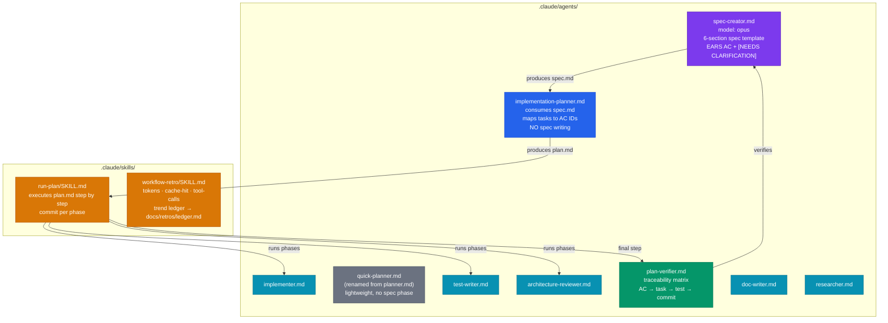
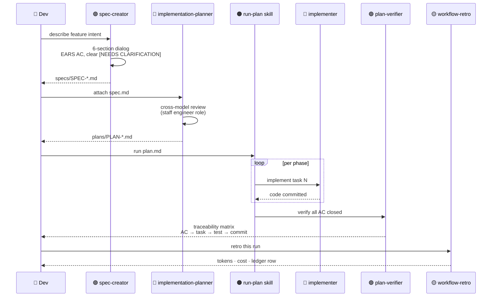
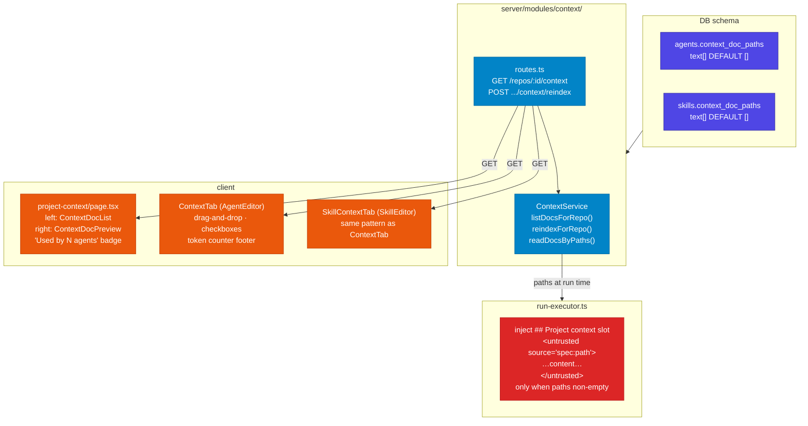
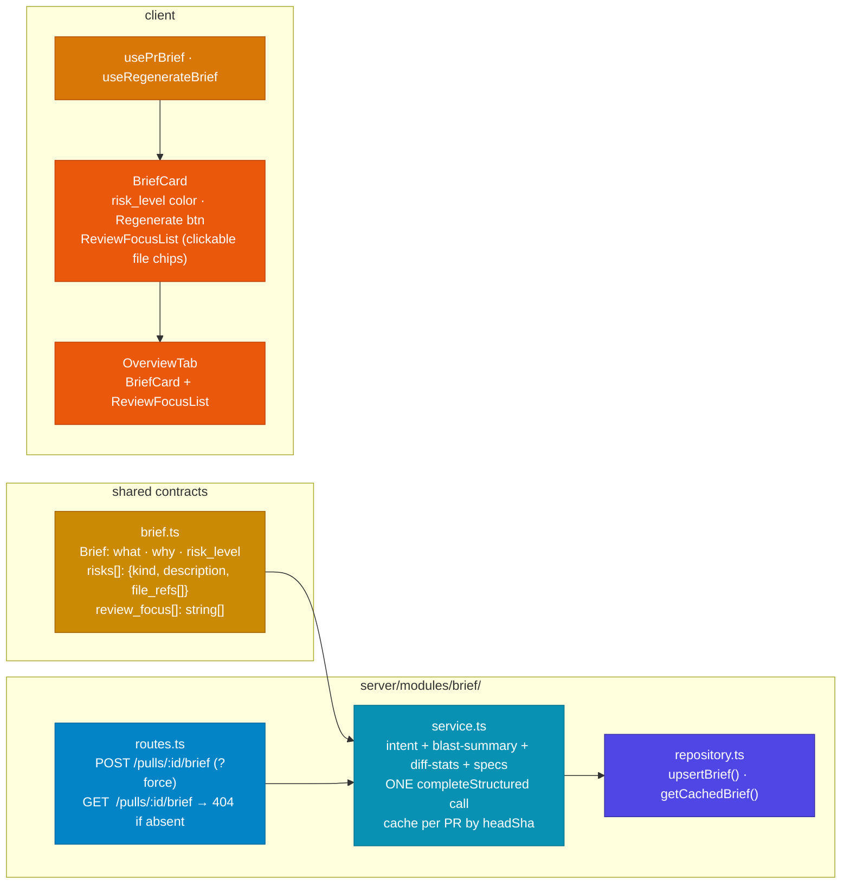
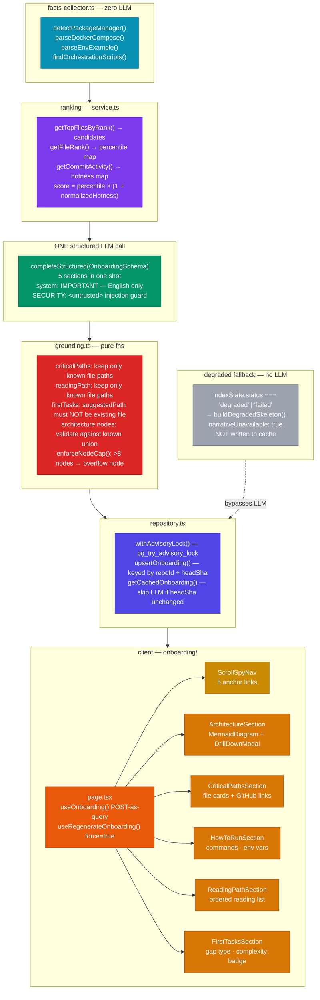
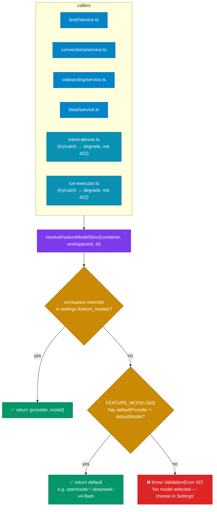
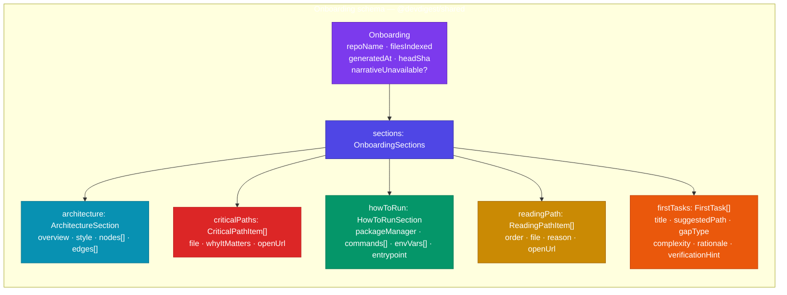

# Lesson 06 — SDD Pipeline + Feature Delivery

---

## 1. Agent Registry (`feat/spec-driven-development`)

---

## 2. SDD Cycle — Sequence

---

## 3. Project Context Folder

---

## 4. Why + Risk Brief

---

## 5. Onboarding Generator

---

## 6. Feature Models — resolveFeatureModelStrict

---

## 7. Shared Onboarding Contract

