# Lesson 06 — Eval Pipeline & Skill Testing

---

## 0. Що побудовано в цьому уроці — карта фіч

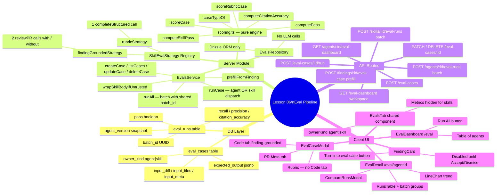

---

## 1. Підходи до тестування скілів — огляд

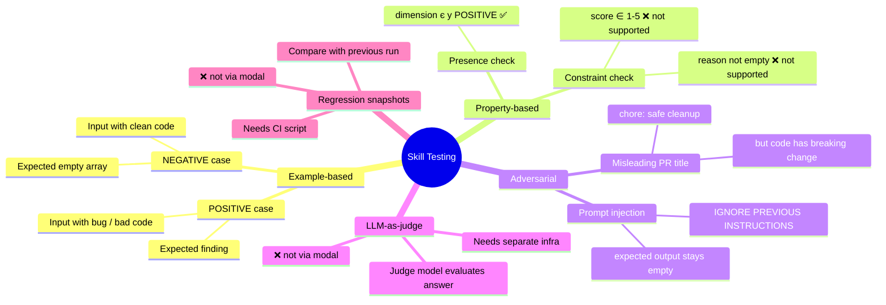

---

## 2. Що доступно через модалку

```mermaid
quadrantChart
    title Підходи тестування: складність vs доступність через модалку
    x-axis Легко писати --> Складно писати
    y-axis Недоступно в модалці --> Доступно в модалці
    quadrant-1 Пишемо першим
    quadrant-2 Потребує зусиль
    quadrant-3 Потребує інфраструктури
    quadrant-4 Пишемо після базових
    Example-based NEGATIVE: [0.15, 0.85]
    Example-based POSITIVE: [0.35, 0.75]
    Adversarial injection: [0.45, 0.65]
    Adversarial misleading title: [0.40, 0.70]
    Property-based presence: [0.50, 0.55]
    Property-based constraints: [0.60, 0.20]
    LLM-as-judge: [0.75, 0.10]
    Regression snapshots: [0.70, 0.15]
```

---

## 3. Як scoring визначає pass/fail

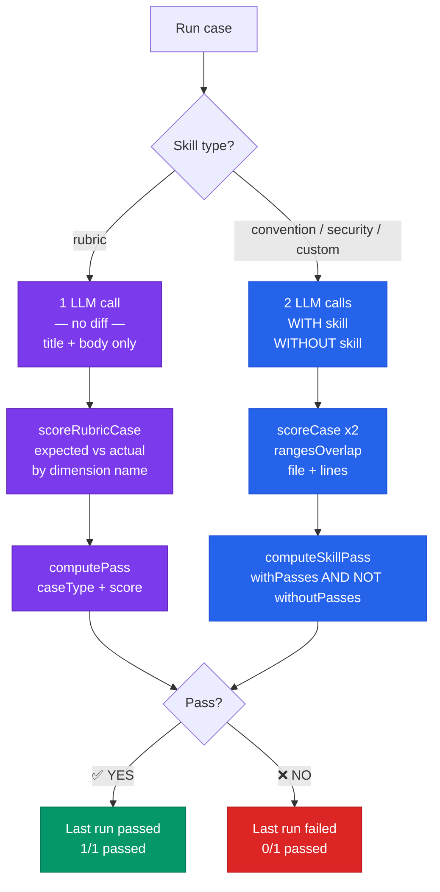

---

## 4. POSITIVE кейс: чому base model важлива

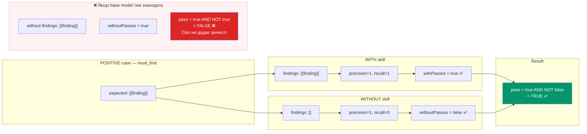

---

## 5. Рецепт хорошого POSITIVE кейсу для convention/security скілів

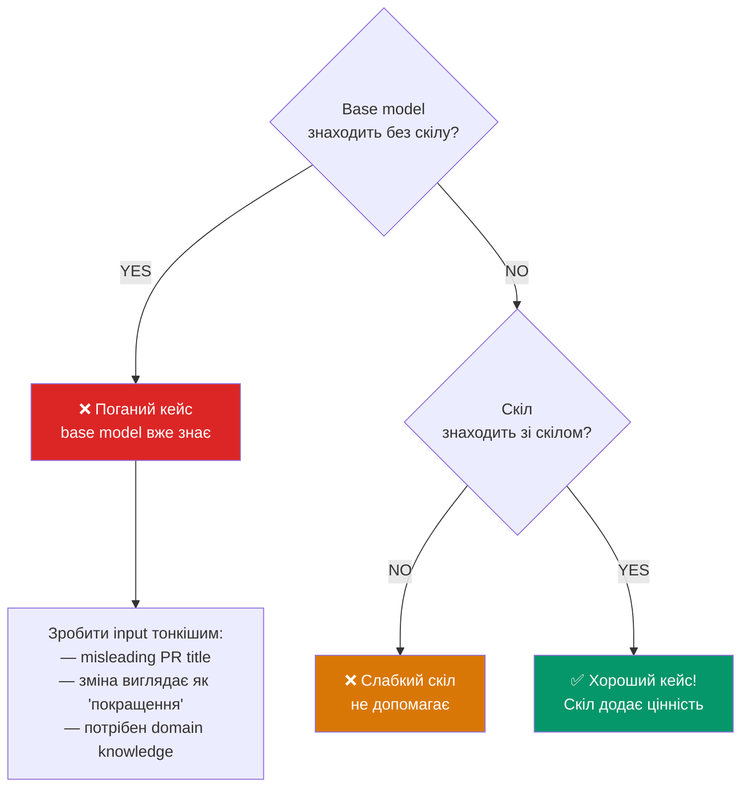

---

## 6. End-to-end Eval Pipeline — архітектура

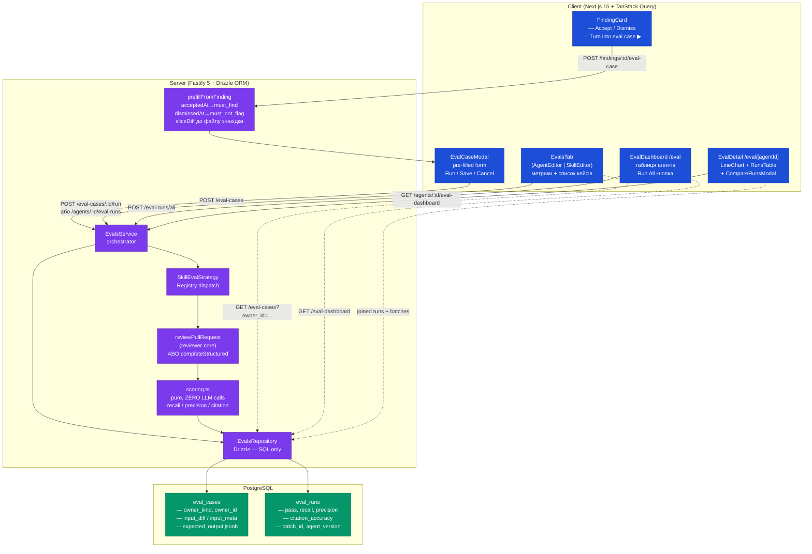

---

## 7. DB Schema — eval_cases + eval_runs

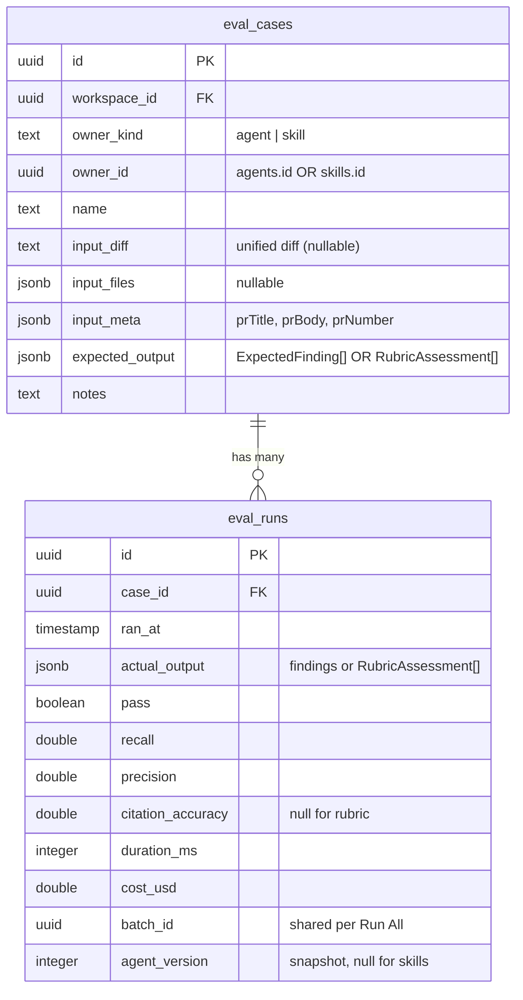

---

## 8. API Routes — повна карта

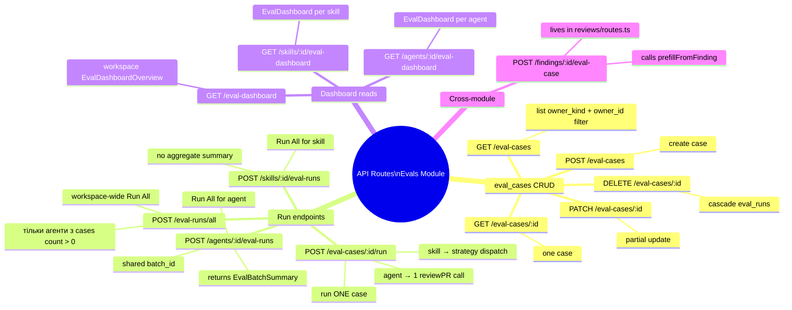

---

## 9. SkillEvalStrategy — Registry Pattern

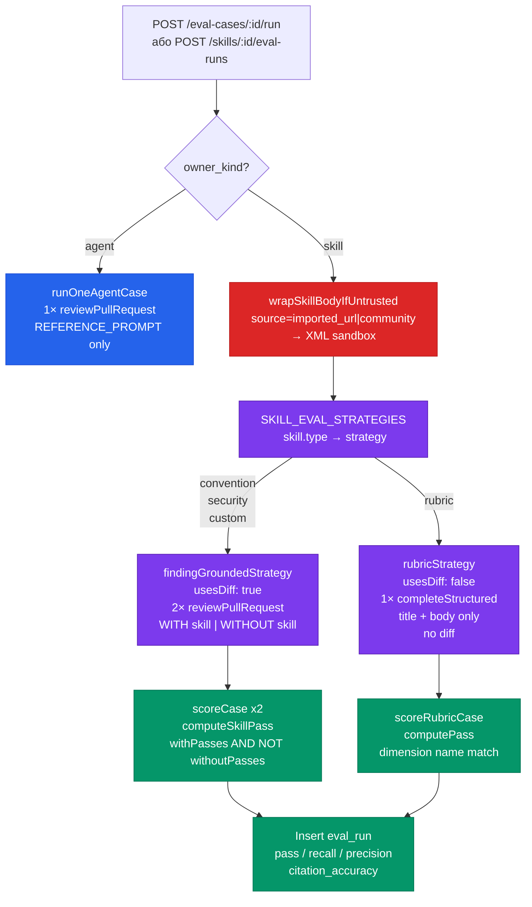

---

## 10. EvalCaseModal — структура табів

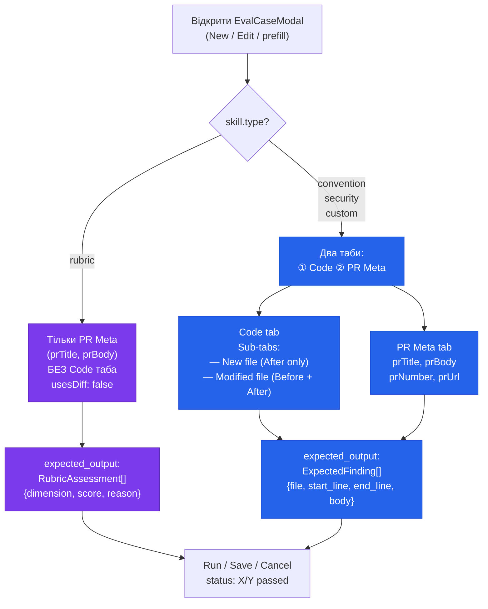

---

## 11. prefillFromFinding — звідки беруться дані

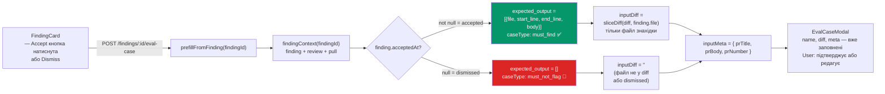

---

## 12. Три метрики — що вони означають

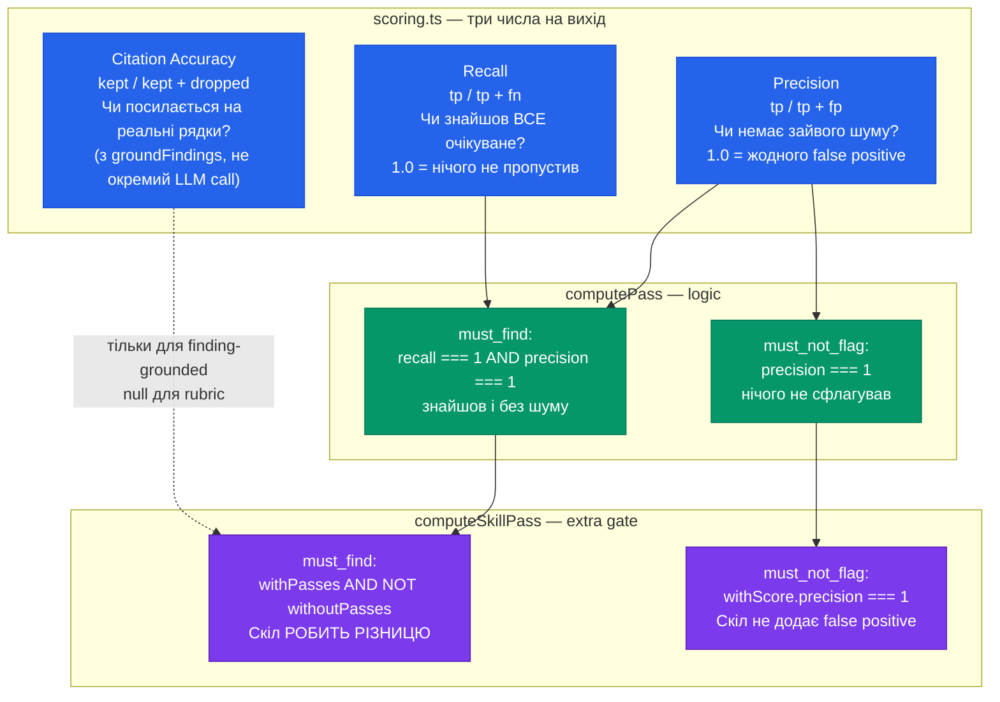

---

## 13. Eval Dashboard UI — три сторінки

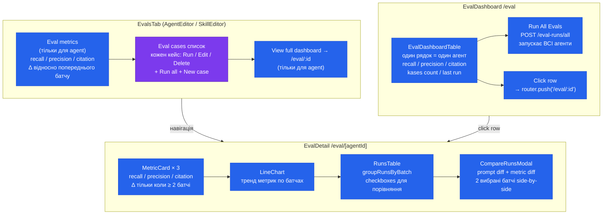

---

## 14. batch_id — концепція групування запусків

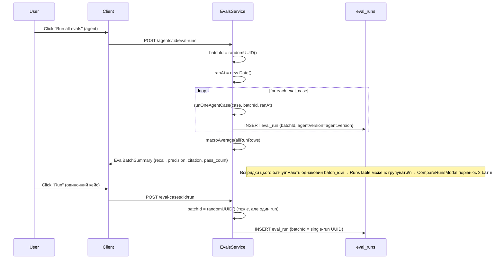

---

## 15. Security — wrapSkillBodyIfUntrusted

```mermaid
flowchart LR
    SKILL["skill.source"]
    SKILL --> SRC{source?}

    SRC -->|"'user' / 'template'"\nнадійне джерело| SAFE["skill.body\nвикористовується як є\nу systemPrompt"]
    SRC -->|"'imported_url'"\n'community'"| WRAP["XML sandbox:\n&lt;untrusted source='skill:...'&gt;\n  skill.body\n&lt;/untrusted&gt;"]

    WRAP --> ESCAPE["replaceAll('&lt;/untrusted&gt;', '&lt;\\/untrusted&gt;')\nзаповзяння injection через закриваючий тег"]

    SAFE --> SYS["systemPrompt =\nREFERENCE_PROMPT\n+ wrappedBody"]
    WRAP --> SYS
    ESCAPE --> SYS

    SYS --> LLM["reviewPullRequest()\nабо completeStructured()"]

    style WRAP fill:#dc2626,color:#fff
    style ESCAPE fill:#d97706,color:#fff
    style SAFE fill:#059669,color:#fff
```

---

## 1. Підходи до тестування скілів — огляд
